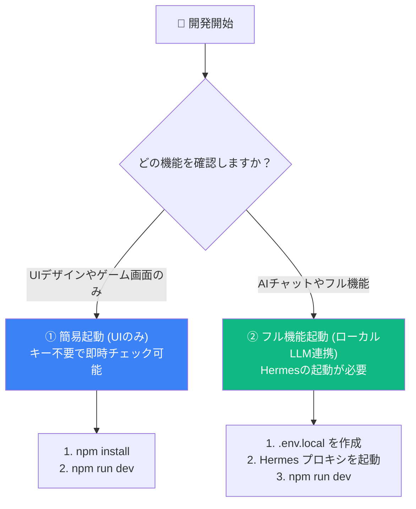

<div align="center">


# Rise Path ラーニングプラットフォーム
### 次世代の没入型学習エクスペリエンス

[English](README.md) | **日本語**
</div>

<br/>

**Rise Path（ライズパス）** は、エンジニアリング、クリエイティビティ、そして言語の学習方法に革命を起こすために設計された、モダンで実験的な学習プラットフォームです。従来のLMS（学習管理システム）とは異なり、Rise Pathは「Vibe（雰囲気）」— すなわち、没入感、フロー、そしてストーリー主導の教育に焦点を当てています。

---

## 🌟 主な機能

### 1. **AIを活用したパーソナライズカリキュラム** ✨
あなたのためだけにパーソナライズされた学習を体験できます。
- **Big5パーソナリティ統合**: AIがユーザーの性格特性（Big5）に基づいて、カリキュラムのトーンや学習スタイルを動的に調整します。
- **リッチなコンテンツ生成**: 単なる要約を超え、「なぜ重要なのか」「主要コンセプト」「アクションステップ」「たとえ話」を豊富に提供します。
- **高度なAIモデル**: 深い推論には **Google Gemini 3.0 Pro**、高速な生成には **Gemini 2.0 Flash** を使用。
- **RAG (検索拡張生成)**: Blenderドキュメントなどの特定のナレッジソースと連携し、AIの回答の正確性を高めます。

### 2. **没入型のオーディオ体験（開発中）** 🎧
- **Kokoro TTS**: ONNXを用いたローカル音声合成（[Kokoro-82M](https://huggingface.co/hexgrad/Kokoro-82M)）を搭載（従来のgTTSやGemini Native TTSから移行）。
- **キャラクターボイス**: AIチューターのペルソナ（Rise Path / Lumina）に応じた日本語・英語のボイス（`jf_alpha`, `af_bella`など）を選択可能。

### 3. **P-School: ブロックプログラミングバトル** ⚔️
- **ゲーム化されたコーディング**: Scratchスタイルのビジュアルブロックを使用し、モンスターと戦いながらプログラミングのロジックを学びます。
- **Phaser 3 エンジン**: Reactアプリケーションに直接統合された、リアルタイム2D RPGバトル。
- **段階的な難易度**: ループ、変数、関数、条件分岐などを学ぶ20以上のステージを用意。

### 4. **多様な学習パス（Path）** 🗺️
- **Vibe Coding Path**: SFの世界観を舞台に、プロンプトエンジニアリングやGitなどの実践的なスキルをストーリー主導で学びます。
- **Dev Campus**: Webの基本（React / TypeScript）から生成AIアプリケーション開発まで。
- **3D Creative Lab**: Blender 3Dモデリングとスカルプト。
- **Art Atelier**: 美術史とデザイン哲学。
- **Global Communication**: グローバルエンジニアのための英語。

### 5. **MCP（Model Context Protocol）サーバー連携** 🔌
ChatGPT、Claude、Cursorなどの外部AIから、Rise Pathを直接操作・連携できます。
- **9つのMCPツール**: 学習進捗の取得、ジャーナル記録、カリキュラム生成、RAG検索など。
- **デュアルトランスポート**: stdio（ローカル）と SSE（リモート/ChatGPT連携）に対応。
- **Bridge Token認証**: セキュアな外部接続を実現。

> 📘 **[詳細な使い方ガイド](doc/usage_guide.md)** — Webアプリ、MCP、カリキュラム作成の完全なガイドブック（日本語/英語）

---

## 🛠 技術スタック

- **フロントエンド**: [React](https://react.dev/) (v19) + [Vite](https://vitejs.dev/)
- **言語**: [TypeScript](https://www.typescriptlang.org/)
- **AI/LLM**: [Google Gemini API](https://ai.google.dev/) (公式 `@google/genai` SDKを使用)
- **ゲームエンジン**: [Phaser 3](https://phaser.io/) (v3.80)
- **ビジュアルコーディング**: [Blockly](https://developers.google.com/blockly) / Scratch Blocks
- **バックエンド/サーバー**: 音声合成やAPIプロキシ用の Node.js (Express)
- **スタイリング**: [Tailwind CSS](https://tailwindcss.com/)

---

## 🚀 開発者のためのクイックスタート

### 簡易起動（フロントエンドUIのみ）
バックエンドサーバーを起動せず、フロントエンドのUIのみを試す場合は以下を実行してください。

```bash
npm install
npm run dev
# フロントエンドURL: http://localhost:3007
```

主要なAI機能（チャットコーチ等）は、ローカルで起動したLLMプロバイダー（**Hermes**など）経由で動作します。直接のGemini API呼び出しは、一部のレガシー機能でのみオプション（フォールバック）として使用されます。

### 🏁 起動モードの選択

開発者の目的に応じて、2つの起動方法が用意されています。



---

### 📋 前提条件

| 必須環境 | 推奨バージョン | 備考 |
|---|---|---|
| **Node.js** | `v20.0.0` 以上 | 開発・ビルドに必須 |
| **npm** | `v10.0.0` 以上 | パッケージ管理に使用 |
| **ローカルLLM (Hermes)** | 任意 | AI機能（チャットコーチ等）を動かす場合のみ必須 |

---

### ⚙️ 環境変数の設定 (`.env.local`)

プロジェクトのルートに [**`.env.local`**](.env.local) ファイルを作成し、必要な設定を記述します。

| 環境変数名 | デフォルト設定値 | 役割・説明 | 必須度 |
|---|---|---|---|
| `HERMES_API_URL` | `http://127.0.0.1:8642` | ローカルLLMプロキシ（Hermes）の接続先URL | **推奨** (AIチャット用) |
| `HERMES_API_KEY` | `change-me-local-dev` | HermesのBearerトークン認証キー | **推奨** (AIチャット用) |
| `VITE_GEMINI_API_KEY` | (未設定でOK) | 直接Gemini APIを叩く場合のクライアントキー | 任意 (レガシー機能用) |

```env
# ローカルLLMプロキシ（Hermes）の設定（標準）
HERMES_API_URL=http://127.0.0.1:8642
HERMES_API_KEY=change-me-local-dev

# Gemini API キー（オプション/レガシー機能用）
# VITE_GEMINI_API_KEY=ここにGeminiのAPIキーを入力
```
> [!WARNING]
> **セキュリティの注意点**:
> `.env.local` には本物のAPIキーが含まれる場合があるため、絶対にGitにコミットしないでください（すでに `.gitignore` で除外されています）。

---

### 🚀 セットアップ手順

#### 1. リポジトリのクローン
```bash
git clone https://github.com/NPO-OpenCoralNetwork/rise-path-demo-game-integration.git
cd rise-path-demo-game-integration
```

#### 2. パッケージのインストール
```bash
npm install
```

#### 3. 開発サーバーの起動
```bash
npm run dev
```
起動完了後、ブラウザで [**`http://localhost:3007`**](http://localhost:3007) にアクセスすると、ゲームのプレイおよび学習UIの確認が可能です。


---

## ⚖️ ライセンス (License)

本プロジェクトは **Apache License, Version 2.0** に基づいてライセンスされています。商用利用、改変、再配布が許諾されていますが、著作権表示および免責事項の保持が必要です。

詳細については [LICENSE](LICENSE) ファイルを参照してください。

Copyright 2026 Naoya Kusunoki / Coral Network
