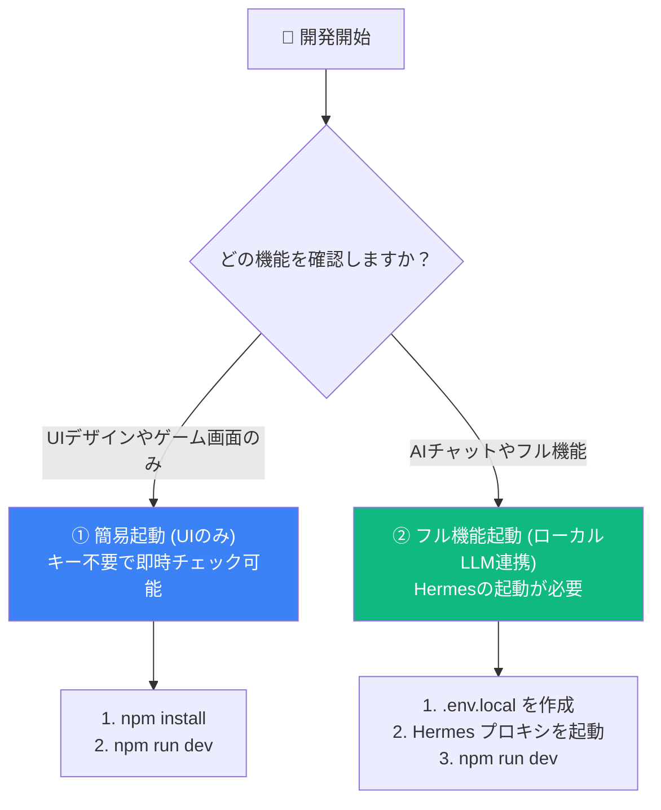

<div align="center">


# Rise Path ラーニングプラットフォーム
### 次世代の没入型学習エクスペリエンス

[English](README.md) | **日本語**
</div>

<br/>

**Rise Path（ライズパス）** は、エンジニアリング、クリエイティビティ、そして言語の学習方法に革命を起こすために設計された、モダンで実験的な学習プラットフォームです。従来のLMS（学習管理システム）とは異なり、Rise Pathは「Vibe（雰囲気）」— すなわち、没入感、フロー、そしてストーリー主導の教育に焦点を当てています。

---

## 🌟 主な機能

### 1. **AIを活用したパーソナライズカリキュラム** ✨
あなたのためだけにパーソナライズされた学習を体験できます。
- **Big5パーソナリティ統合**: AIがユーザーの性格特性（Big5）に基づいて、カリキュラムのトーンや学習スタイルを動的に調整します。
- **リッチなコンテンツ生成**: 単なる要約を超え、「なぜ重要なのか」「主要コンセプト」「アクションステップ」「たとえ話」を豊富に提供します。
- **高度なAIモデル**: 深い推論には **Google Gemini 3.0 Pro**、高速な生成には **Gemini 2.0 Flash** を使用。
- **RAG (検索拡張生成)**: Blenderドキュメントなどの特定のナレッジソースと連携し、AIの回答の正確性を高めます。

### 2. **没入型のオーディオ体験（開発中）** 🎧
- **Kokoro TTS**: ONNXを用いたローカル音声合成（[Kokoro-82M](https://huggingface.co/hexgrad/Kokoro-82M)）を搭載（従来のgTTSやGemini Native TTSから移行）。
- **キャラクターボイス**: AIチューターのペルソナ（Rise Path / Lumina）に応じた日本語・英語のボイス（`jf_alpha`, `af_bella`など）を選択可能。

### 3. **P-School: ブロックプログラミングバトル** ⚔️
- **ゲーム化されたコーディング**: Scratchスタイルのビジュアルブロックを使用し、モンスターと戦いながらプログラミングのロジックを学びます。
- **Phaser 3 エンジン**: Reactアプリケーションに直接統合された、リアルタイム2D RPGバトル。
- **段階的な難易度**: ループ、変数、関数、条件分岐などを学ぶ20以上のステージを用意。

### 4. **多様な学習パス（Path）** 🗺️
- **Vibe Coding Path**: SFの世界観を舞台に、プロンプトエンジニアリングやGitなどの実践的なスキルをストーリー主導で学びます。
- **Dev Campus**: Webの基本（React / TypeScript）から生成AIアプリケーション開発まで。
- **3D Creative Lab**: Blender 3Dモデリングとスカルプト。
- **Art Atelier**: 美術史とデザイン哲学。
- **Global Communication**: グローバルエンジニアのための英語。

### 5. **MCP（Model Context Protocol）サーバー連携** 🔌
ChatGPT、Claude、Cursorなどの外部AIから、Rise Pathを直接操作・連携できます。
- **9つのMCPツール**: 学習進捗の取得、ジャーナル記録、カリキュラム生成、RAG検索など。
- **デュアルトランスポート**: stdio（ローカル）と SSE（リモート/ChatGPT連携）に対応。
- **Bridge Token認証**: セキュアな外部接続を実現。

> 📘 **[詳細な使い方ガイド](doc/usage_guide.md)** — Webアプリ、MCP、カリキュラム作成の完全なガイドブック（日本語/英語）

---

## 📖 教材：リーダー・形式・制作

### レッスンリーダー
- すべてのレッスンは 1 つのリーダー **`/learn/:course/:lesson`**（例: `/learn/vibe-coding/vibe-ch1`）で開きます。左に目次、余白に AI先生と用語集、読みながら答える確認問題、最後に復習カードとふりかえりがあります。進み具合はレッスンごとに保存され、ダッシュボードの「続きから」で再開できます。
- スマートフォンでは、目次・AI先生・練習が画面下のバーに移ります。**Aa** メニューで文字サイズ、行間、テーマ、UD 書体、集中モードを切り替えられます。
- 開発ビルドでは **`/preview/:course/:lesson`**（下書きを優先し、検証結果を表示）と **`/dev/blocks?dev=1`**（全ブロックの見本）も使えます。

### 教材の形式（`risepath.lesson/v1`）
- レッスンは JSON ファイルです: `content/courses/<slug>/course.json` と `lessons/<id>.lesson.json`。下書きは `drafts/` に置き、プレビューにだけ表示されます。
- 定義は `shared/lesson/schema.js`（zod）の 1 か所だけで、リーダー・サーバー・MCP ツール・CLI が共通で使います。JSON Schema は `content/schema/` に書き出します。
- 1 つのレッスンは、Bloom のレベル付きの目標 2〜4 個と、役割（導入 → 説明 → 例題 → 演習 → 確認 → まとめ）を持つセクションでできています。ブロックは 15 種類（本文、コールアウト、表、コード、プロンプト、Mermaid の図、確認問題、復習カード、手順 など）です。

```bash
npm run lessons:catalog                       # コースとレッスンの一覧と状態
npm run lessons:validate                      # 形式と意味のチェック（エラーは JSON パス付き）
npm run lessons:lint -- <file> --strict       # 教え方と読みやすさのチェック
npm run lessons:preview -- vibe-coding vibe-ch1   # スクリーンショットと metrics.json（開発サーバー起動中）
```

### Claude Code やほかの AI で教材をつくる
- **Claude Code**: `/author-lesson <course> <lesson-id> "<依頼>"` で、brief → アウトライン → 下書き → 検証・lint → 独立レビュー（`pedagogy-reviewer`、`ja-editor`）→ スクリーンショットと `visual-qa` → レポート、までを進めます。書くのは下書きだけで、公開はオーナーが決めます。`/review-lesson <file>` で、どのレッスンも `content/schema/rubric.v1.json` に沿って採点できます。
- **MCP**: `.mcp.json` に MCP サーバー `rise-path-learning`（`curriculum-builder` プロファイル）を登録しています（`lesson-schema-get`、`lesson-validate`、`lesson-get`、`lesson-upsert-draft`、`lesson-preview-url`）。Codex、Cursor、Gemini CLI、Claude Desktop、ChatGPT からも同じツールを使えます。共通のルールは `AGENTS.md` にあります。
- 手順書: **[doc/guides/authoring-with-claude-code.ja.md](doc/guides/authoring-with-claude-code.ja.md)**

---

## 🛠 技術スタック

- **フロントエンド**: [React](https://react.dev/) (v19) + [Vite](https://vitejs.dev/)
- **言語**: [TypeScript](https://www.typescriptlang.org/)
- **AI/LLM**: [Google Gemini API](https://ai.google.dev/) (公式 `@google/genai` SDKを使用)
- **ゲームエンジン**: [Phaser 3](https://phaser.io/) (v3.80)
- **ビジュアルコーディング**: [Blockly](https://developers.google.com/blockly) / Scratch Blocks
- **バックエンド/サーバー**: 音声合成やAPIプロキシ用の Node.js (Express)
- **スタイリング**: [Tailwind CSS](https://tailwindcss.com/)

---

## 🚀 開発者のためのクイックスタート

### 簡易起動（フロントエンドUIのみ）
バックエンドサーバーを起動せず、フロントエンドのUIのみを試す場合は以下を実行してください。

```bash
npm install
npm run dev
# フロントエンドURL: http://localhost:3007
```

主要なAI機能（チャットコーチ等）は、ローカルで起動したLLMプロバイダー（**Hermes**など）経由で動作します。レッスン内のAI先生などは、サーバーの LLM ゲートウェイ（キーがなければモック）を使います。ブラウザから直接モデルの API を呼ぶことはありません。

### 🏁 起動モードの選択

開発者の目的に応じて、2つの起動方法が用意されています。


```mermaid
flowchart TD
    Start["🚀 開発開始"] --> Choice{"どの機能を確認しますか？"}
    Choice -->|UIデザインやゲーム画面のみ| Quick["① 簡易起動 (UIのみ)<br>キー不要で即時チェック可能"]
    Choice -->|AIチャットやフル機能| Full["② フル機能起動 (ローカルLLM連携)<br>Hermesの起動が必要"]
    
    Quick --> ExecQuick["1. npm install<br>2. npm run dev"]
    Full --> ExecFull["1. .env.local を作成<br>2. Hermes プロキシを起動<br>3. npm run dev"]

    style Quick fill:#3B82F6,color:#fff
    style Full fill:#10B981,color:#fff
```

---

### 📋 前提条件

| 必須環境 | 推奨バージョン | 備考 |
|---|---|---|
| **Node.js** | `v20.0.0` 以上 | 開発・ビルドに必須 |
| **npm** | `v10.0.0` 以上 | パッケージ管理に使用 |
| **ローカルLLM (Hermes)** | 任意 | AI機能（チャットコーチ等）を動かす場合のみ必須 |

---

### ⚙️ 環境変数の設定 (`.env.local`)

プロジェクトのルートに [**`.env.local`**](.env.local) ファイルを作成し、必要な設定を記述します。

| 環境変数名 | デフォルト設定値 | 役割・説明 | 必須度 |
|---|---|---|---|
| `HERMES_API_URL` | `http://127.0.0.1:8642` | ローカルLLMプロキシ（Hermes）の接続先URL | **推奨** (AIチャット用) |
| `HERMES_API_KEY` | `change-me-local-dev` | HermesのBearerトークン認証キー | **推奨** (AIチャット用) |
| `ANTHROPIC_API_KEY` | (未設定でOK) | LLM ゲートウェイ用のサーバー側キー | 任意（下記参照） |
| `GEMINI_API_KEY` | (未設定でOK) | サーバー側の Gemini キー（ゲートウェイ、旧生成機能、RAG の埋め込み） | 任意 |

```env
# ローカルLLMプロキシ（Hermes）の設定（標準）
HERMES_API_URL=http://127.0.0.1:8642
HERMES_API_KEY=change-me-local-dev

# LLM ゲートウェイのキー（サーバー専用）
# ANTHROPIC_API_KEY=
# GEMINI_API_KEY=
```

> [!WARNING]
> **セキュリティの注意点**:
> `.env.local` には本物のAPIキーが含まれる場合があるため、絶対にGitにコミットしないでください（すでに `.gitignore` で除外されています）。

### 🤖 LLM ゲートウェイ（`/api/v2/llm`）

モデルの呼び出しはすべて `server/llm/` のゲートウェイを通り、ブラウザはモデルのキーを持ちません。**キーを `VITE_*` 変数に入れないでください**（`VITE_*` の値はすべてブラウザに配信されます）。モデル ID は `server/llm/models.config.js` にだけ書きます。キーが 1 つもない場合、本番以外では内蔵のモックが応答します（本番では `LLM_PROVIDER=mock` でない限り 503 を返します）。

| 環境変数 | 役割 |
|---|---|
| `ANTHROPIC_API_KEY` | Anthropic を有効にする（教材作成、AI先生、フィードバックの既定） |
| `GEMINI_API_KEY`（または `GOOGLE_API_KEY`） | Gemini を有効にする。RAG の埋め込みにも使う |
| `LLM_PROVIDER` | すべてのタスクを 1 つのプロバイダーに固定: `anthropic`、`gemini`、`mock` |
| `LLM_TASK_<TASK>` | タスクごとの振り分け `provider[:model]`。例: `LLM_TASK_TUTOR_CHAT=gemini` |
| `LLM_MOCK_FALLBACK` | `false` で、キーがないときのモックへの切り替えを止める |
| `LLM_TIMEOUT_MS` | リクエストのタイムアウト（既定 120000） |
| `LLM_MAX_RETRIES` | プロバイダー呼び出しの再試行回数 |
| `LLM_ANTHROPIC_SERVER_FALLBACKS` | `false` で Anthropic のサーバー側モデルフォールバックを止める |
| `ANTHROPIC_BASE_URL` | Anthropic の別エンドポイント（プロキシなど） |

`GET /api/v2/llm/status` で、有効なプロバイダーとタスクの振り分けを（秘密情報なしで）確認できます。

---

### 🚀 セットアップ手順

#### 1. リポジトリのクローン
```bash
git clone https://github.com/NPO-OpenCoralNetwork/rise-path-demo-game-integration.git
cd rise-path-demo-game-integration
```

#### 2. パッケージのインストール
```bash
npm install
```

#### 3. 開発サーバーの起動
```bash
npm run dev
```
起動完了後、ブラウザで [**`http://localhost:3007`**](http://localhost:3007) にアクセスすると、ゲームのプレイおよび学習UIの確認が可能です。


---

## ⚖️ ライセンス (License)

本プロジェクトは **Apache License, Version 2.0** に基づいてライセンスされています。商用利用、改変、再配布が許諾されていますが、著作権表示および免責事項の保持が必要です。

詳細については [LICENSE](LICENSE) ファイルを参照してください。

Copyright 2026 Naoya Kusunoki / Coral Network
