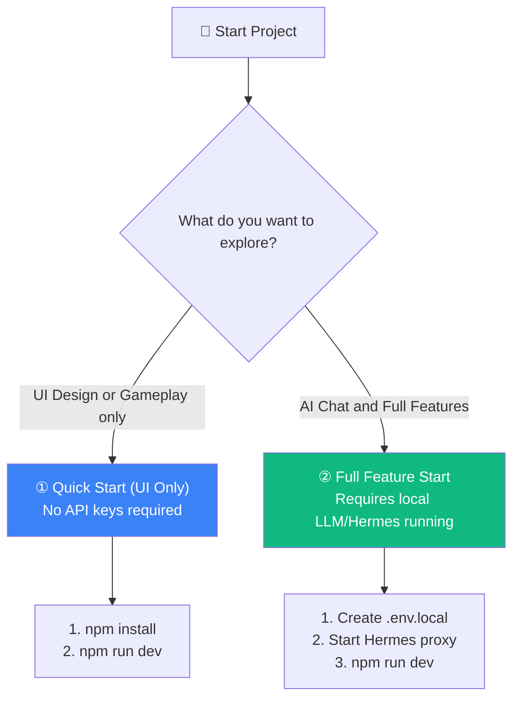

<div align="center">


# Rise Path Learning Platform
### The Next-Gen Immersive Learning Experience

**English** | [日本語](README.ja.md)
</div>

<br/>

**Rise Path** is a modern, experimental learning platform designed to revolutionize how we learn engineering, creativity, and languages. Unlike traditional LMS, Rise Path focuses on **"Vibe"**—the feeling of flow, immersion, and narrative-driven education.

## 🌟 Key Features

### 1. **AI-Powered Personalized Curriculums** ✨
Experience learning tailored just for you.
- **Big5 Personality Integration**: AI dynamically adapts curriculum content, tone, and learning style based on your Big5 personality traits.
- **Rich Content Generation**: Lessons go beyond summaries, providing 'Why It Matters', 'Key Concepts', 'Action Steps', and 'Analogies'.
- **Advanced AI Models**: Utilizing **Google Gemini 3.0 Pro** for deep reasoning and **Gemini 2.0 Flash** for high-speed generation.
- **RAG (Retrieval-Augmented Generation)**: Integrates with specific knowledge domains (like Blender documentation) to ground AI responses.

### 2. **Immersive Audio Experience (In Progress)** 🎧
- **Kokoro TTS**: Local ONNX narration via [Kokoro-82M](https://huggingface.co/hexgrad/Kokoro-82M) (replacing legacy gTTS and Gemini Native TTS).
- **Character-Driven**: Japanese/English voice selection (`jf_alpha`, `af_bella`, etc.) matched to the AI tutor persona (Rise Path / Lumina).

### 3. **P-School: Block Programming Battle** ⚔️
- **Gamified Coding**: Learn programming logic by battling monsters using Scratch-style blocks.
- **Phaser 3 Engine**: Real-time 2D RPG battles integrated directly into the React application.
- **Progressive Difficulty**: 20+ stages teaching loops, variables, functions, and logic.

### 4. **Diverse Learning Paths** 🗺️
- **Vibe Coding Path**: Narrative-driven coding (Prompt Engineering, Git) set in a sci-fi universe.
- **Dev Campus**: Web Basics (React/TS) and Gen AI application development.
- **3D Creative Lab**: Blender 3D modeling and sculpting.
- **Art Atelier**: Art History and Design Philosophy.
- **Global Communication**: English for global engineers.

### 5. **MCP Server — AI アシスタント連携** 🔌
ChatGPT・Claude・Cursor などの AI から Rise Path を直接操作できます。
- **9 つの MCP ツール**: 学習進捗・ジャーナル・カリキュラム生成・RAG 検索
- **Dual Transport**: stdio（ローカル）と SSE（リモート/ChatGPT）
- **Bridge Token 認証**: セキュアな外部接続
- **ヘルスチェック & Graceful Shutdown**: 本番運用対応

> 📘 **[使い方ガイド（詳細）](doc/usage_guide.md)** — Web アプリ・MCP・カリキュラム作成の完全ガイド

---

## 🛠 Tech Stack

- **Frontend**: [React](https://react.dev/) (v19) + [Vite](https://vitejs.dev/)
- **Language**: [TypeScript](https://www.typescriptlang.org/)
- **AI/LLM**: [Google Gemini API](https://ai.google.dev/) via `@google/genai` SDK
- **Game Engine**: [Phaser 3](https://phaser.io/) (v3.80)
- **Visual Coding**: [Blockly](https://developers.google.com/blockly) / Scratch Blocks
- **Backend/Service**: Node.js (Express) for local proxying and audio handling.
- **Styling**: [Tailwind CSS](https://tailwindcss.com/)
- **State/Routing**: React Context + Custom View-based routing.

---

## 🚀 Getting Started for Engineers

### Quick Start (UI Only)
If you want to explore the UI without wiring the full backend, you can run the frontend only:

```bash
npm install
npm run dev
# Frontend: http://localhost:3007
```

You can browse most screens and use the primary AI features (like the Chat Coach) using a local LLM provider or LLM CLI (e.g., **Hermes** running locally). Direct Gemini API calls are only used as an option/fallback for legacy features.

### 🏁 Choose Your Setup Mode

Depending on your goals, you can start the platform in two ways:



---

### 📋 Prerequisites

| Required Environment | Recommended Version | Note |
|---|---|---|
| **Node.js** | `v20.0.0` or higher | Required for development & build |
| **npm** | `v10.0.0` or higher | Package management |
| **Local LLM (Hermes)** | Any | Only required for AI Coach/Chat features |

---

### ⚙️ Environment Configuration (`.env.local`)

Create a [**`.env.local`**](.env.local) file in the root directory to store your environment variables:

| Variable Name | Default Value | Description | Importance |
|---|---|---|---|
| `HERMES_API_URL` | `http://127.0.0.1:8642` | Connection URL for your local LLM proxy (Hermes) | **Recommended** (AI Chat) |
| `HERMES_API_KEY` | `change-me-local-dev` | Bearer authorization token for Hermes | **Recommended** (AI Chat) |
| `VITE_GEMINI_API_KEY` | (Leave blank) | Gemini API Client Key for direct calls | Optional (Legacy features) |

```env
# Local LLM Provider (Hermes) Settings (Standard)
HERMES_API_URL=http://127.0.0.1:8642
HERMES_API_KEY=change-me-local-dev

# Gemini API Key (Optional fallback/legacy)
# VITE_GEMINI_API_KEY=your_gemini_api_key
```
> [!WARNING]
> **Security Reminder**:
> `.env.local` might contain sensitive API keys. Never commit it to git (already added to `.gitignore`).

---

### 🚀 Setup Steps

#### 1. Clone the repository
```bash
git clone https://github.com/NPO-OpenCoralNetwork/rise-path-demo-game-integration.git
cd rise-path-demo-game-integration
```

#### 2. Install dependencies
```bash
npm install
```

#### 3. Run the development server
```bash
npm run dev
```
Once started, open your browser and navigate to [**`http://localhost:3007`**](http://localhost:3007) to explore the UI and play P-School coding battles!


---

## 📂 Project Structure

```
/
├── components/          # React Components
│   ├── common/          # Shared UI (Layouts, Buttons, Modals)
│   ├── features/        # Feature-specific components
│       ├── ai/          # AI Course Generator, Chat, Character Views
│       ├── dashboard/   # Main Dashboard & Learning Hub
│       ├── PSchool/     # Block Programming Game (Phaser + Blockly)
│       └── ...          # Other domain views
├── context/             # Global Contexts (Theme, etc.)
├── public/              # Static assets
├── server/              # Node.js Express Backend
│   ├── graph/           # LangGraph Multi-Agent Workflows
│   ├── geminiBackendService.js # AI Generation Logic
│   ├── ragService.js    # RAG Ingestion & Retrieval
│   └── jobWorker.js     # Async Job Queue Worker
├── scripts/             # Utility scripts (Seeding, Migrations)
├── services/            # Frontend API Clients
├── server.js            # Main Server Entry Point
└── types.ts             # Global TypeScript definitions
```

---

## 🚧 Current Development Focus & Roadmap

We have successfully migrated to a **LangGraph-based Multi-Agent Backend**.

### Completed Features
- **LangGraph Integration**: State-driven workflow for "Requirements -> Roadmap -> Curriculum" generation with user approval loops.
- **RAG Architecture**: Document ingestion (PDF/Txt), chunking with `RecursiveCharacterTextSplitter`, and vector search using `pgvector`.
- **Async Job Worker**: Scalable background processing for document embedding.
- **Real AI Generation**: Powered by **Gemini 2.0 Flash** via `@google/genai` SDK v1.x.
- **Database Persistence**: Full state synchronization with PostgreSQL.

### Active Issues
- **Issue #3**: **Kokoro TTS Implementation**
  - Goal: Replace `gTTS` / `gemini_tts_node.js` with Kokoro-82M ONNX sidecar (`KOKORO_TTS_URL`).
- **Issue #4**: **Voice Selection Feature**
  - Goal: Allow users to select Kokoro `voice_id` personalities (e.g. `jf_alpha`, `jf_tebukuro`, `af_bella`).

### How to Contribute
1. Check the [Issues](https://github.com/t012093/learning-platform-from-gemini/issues) tab.
2. Create a feature branch from `main` (example: `feat/your-topic`).
3. Keep commits scoped and descriptive.
4. Follow the project's coding style (Functional React components, TypeScript, Tailwind).

### Collaboration Tips
- **Keys & secrets**: Use `.env.local` or localStorage; never commit secrets.
- **Large files**: Avoid committing large binaries (PDFs, datasets) unless agreed.
- **Demo vs full stack**: UI-only is fine for quick reviews; full stack is needed for AI generation flows.

### Optional: Full Stack (Advanced)
If you need the full AI generation flow with backend + database, you’ll need:
- `GEMINI_API_KEY` set in `.env.local`
- PostgreSQL with `pgvector`
- DB schema + seed scripts (see `doc/ai-curriculum-spec/local_postgres_phase1.sql` and `scripts/`)

---

<div align="center">
  <sub>Built with ❤️ by the Rise Path Team</sub>
</div>
