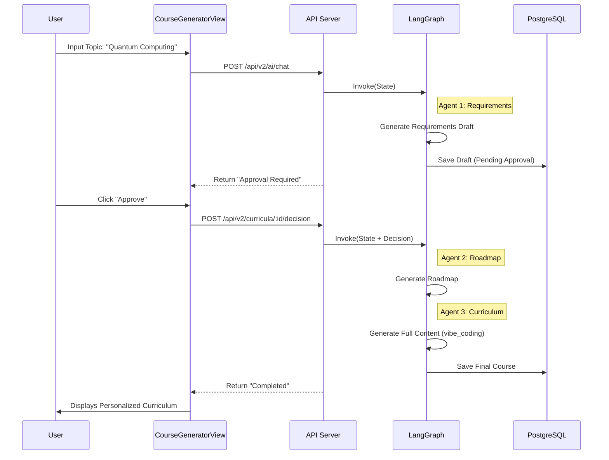

# Architecture Diagram - Rise Path Learning Platform

## Personalized AI Learning Architecture

```mermaid
graph TD
    User[User] -->|Interacts| Frontend[React Frontend]

    subgraph "Frontend Application"
        App[App.tsx (Router)]
        
        subgraph "Features"
            Dashboard[Dashboard Feature]
            Generator[Course Generator UI]
            LessonView[Generated Lesson View]
            StaticModules[Static Modules (Art/Code/Blender)]
        end
        
        subgraph "Common"
            Layout[Layout & Navigation]
            UIComponents[Shared UI]
        end
    end

    subgraph "Backend Service (Node.js/Express)"
        APIServer[server.js]
        LangGraph[LangGraph Workflow]
        JobWorker[Async Job Worker]
        GeminiSvc[geminiBackendService.js]
        RAGSvc[ragService.js]
    end

    subgraph "Data & AI"
        DB[(PostgreSQL + pgvector)]
        GeminiAPI[Google Gemini API]
        ModelFlash[Gemini 2.0 Flash]
    end

    App --> Layout
    Layout --> Dashboard
    Layout --> StaticModules
    Layout --> Generator
    
    Generator -->|/api/v2/ai/chat| APIServer
    APIServer -->|Invoke| LangGraph
    LangGraph -->|Generate| GeminiSvc
    GeminiSvc -->|Retrieve Context| RAGSvc
    
    RAGSvc -->|Search| DB
    GeminiSvc -->|Prompt + Context| GeminiAPI
    GeminiAPI --> ModelFlash
    
    Generator -->|Upload Material| APIServer
    APIServer -->|Queue Job| DB
    JobWorker -->|Poll & Ingest| DB
    JobWorker -->|Embed| GeminiAPI
    
    GeminiAPI -->>|Structured JSON| GeminiSvc
    LangGraph -->>|State Sync| DB
    APIServer -->>|GeneratedCourse| App
    App -->|Render Data| LessonView
```

## Personalization Data Flow (Multi-Agent)


