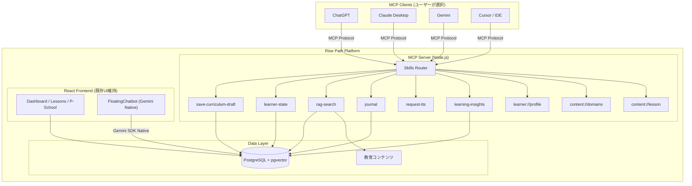
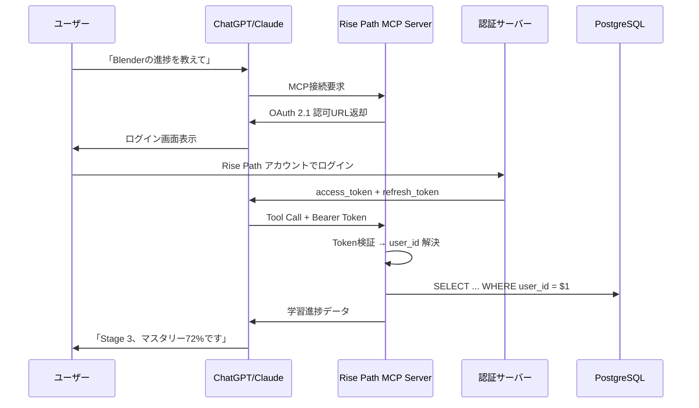

# Rise Path v2 アーキテクチャ仕様書
# MCP + Skills + YAML 宣言型エージェント設計

> 作成日: 2026-04-30  
> 最終更新: 2026-06-22  
> ステータス: 実装済み（MCP Server + Skills 基盤）  
> 前提: `doc/multi_agent_architecture.md` (LangGraph MAS) を本仕様で置き換える  
> **v3 拡張:** LLM ランタイムを Hermes Agent に統一 → [`architecture_v3_hermes_agent.md`](./architecture_v3_hermes_agent.md)

---

## 1. 設計思想

### 1.1 方針転換の背景

| 項目 | v1 (現行: LangGraph MAS) | v2 (本仕様: MCP + Skills) |
|:---|:---|:---|
| AI実行エンジン | 自前でマルチエージェント構築 | 外部LLM (ChatGPT/Claude/Gemini) + **Hermes Agent** (v3) |
| フレームワーク依存 | `@langchain/*` 7パッケージ | `@google/genai`（レガシー内蔵チャット、段階的廃止） |
| ツール公開方式 | Express REST API | **MCP Server** (標準プロトコル) |
| エージェント定義 | JavaScript コード (graph/nodes.js) | **YAML + SKILL.md** (宣言的) |
| モデル依存 | Gemini固定 | **モデル非依存** (MCP経由) |

### 1.2 コアコンセプト: 「側だけ作る」

Rise Pathの価値は「AIの脳」ではなく以下にある:
- 📚 教育コンテンツ (7ドメイン, 100+レッスン)
- 👤 学習者モデル (Big5, マスタリー, ジャーナル)
- 🎯 パーソナライゼーションロジック

これらを **MCP Server** として公開し、LLMの「脳」はユーザーが選んだクライアント(ChatGPT/Claude/Gemini)に任せる。

### 1.3 三位一体モデル

| コンポーネント | 役割 | 例 |
|:---|:---|:---|
| **MCP Server** | ツールとデータへの接続層 (手足) | `get_learner_progress`, `generate_curriculum` |
| **Skills (SKILL.md)** | タスク実行の手順書 (知識) | 「カリキュラム生成はこの手順で」 |
| **YAML (agent.yaml)** | エージェントの人格定義 (ペルソナ) | 「ソクラテス式学習コーチ」 |

---

## 2. システムアーキテクチャ

### 2.1 全体構成図



### 2.2 レイヤー構成

```
rise-path/
├── mcp-server/                    # 【新規】MCP Server
│   ├── index.js                   # FastMCP エントリポイント
│   ├── tools/                     # MCP Tools 定義
│   │   ├── curriculumGenerator.js
│   │   ├── learnerState.js
│   │   ├── ragSearch.js
│   │   ├── journal.js
│   │   ├── ttsGenerator.js
│   │   └── learningInsights.js
│   ├── resources/                 # MCP Resources 定義
│   │   ├── learnerProfile.js
│   │   ├── contentDomains.js
│   │   └── lessonContent.js
│   └── prompts/                   # MCP Prompts 定義
│       ├── socratic-tutor.js
│       └── curriculum-review.js
│
├── skills/                        # 【新規】SKILL.md スキル定義
│   ├── curriculum-generator/
│   │   ├── SKILL.md
│   │   └── references/
│   │       ├── big5_mapping.md
│   │       └── bloom_taxonomy.md
│   ├── learning-coach/
│   │   ├── SKILL.md
│   │   └── references/
│   │       └── socratic_prompts.md
│   ├── progress-tracker/
│   │   └── SKILL.md
│   └── content-search/
│       └── SKILL.md
│
├── agents/                        # 【新規】YAML エージェント定義
│   ├── rise-path-tutor.yaml       # メイン学習コーチ
│   ├── curriculum-architect.yaml  # カリキュラム設計
│   └── content-reviewer.yaml     # 品質レビュー
│
├── server/                        # 既存バックエンド (段階的にMCPへ移行)
├── components/                    # 既存フロントエンド (維持)
├── services/                      # 既存フロントエンドサービス (維持)
└── doc/                           # ドキュメント
```

### 2.3 既存 REST API → MCP Tool マッピング

> ⚠️ 既存のExpressルートは移行期間中も維持し、MCP Toolと内部ロジックを共有する (Dual Mode)

#### chatgptCurriculum.js (937行)

| 既存エンドポイント | MCP Tool | 責務 | 備考 |
|:---|:---|:---|:---|
| `POST /ai/generation-kit` | `get-generation-kit` | テンプレート・スキーマ・ルール取得 | 読み取り専用 |
| `POST /ai/validate-intake` | `validate-intake` | 学習要件のバリデーション | LLMが生成→本ToolでチェックのFV |
| `POST /ai/curriculum-drafts` | `save-curriculum-draft` | カリキュラムJSON検証+保存 | ※旧名 curriculum-generator。LLMが生成しサーバーは検証・保存のみ |
| `POST /ai/personalization/derive` | `derive-personalization` | Big5→学習スタイル変換 | プレビュー(DB保存なし) |
| `POST /learner-profiles/assessments` | `save-assessment` | 診断結果保存+プロフィール派生 | 書き込み (要ユーザー確認) |
| `GET /learner-profiles/latest` | Resource: `learner://profile/{user_id}` | 最新プロフィール取得 | — |
| `GET /curricula/:id/resume` | `get-resume-card` | 次アクション+ギャップ分析 | — |
| `POST /curricula/:id/weekly-load` | `adjust-weekly-load` | 週間学習量調整 | — |
| `GET /curricula/:id/summary-cards` | `get-summary-cards` | レッスン要約カード | — |
| `GET /curricula/:id/weekly-digest` | `get-weekly-digest` | 週間ダイジェスト | — |
| `GET /curricula/:id/encyclopedia` | `get-encyclopedia` | ミニ図鑑 | — |
| `POST /curricula/:id/journal` | `journal.log_entry` | ジャーナル記録 | 書き込み |
| `GET /curricula/:id/journal` | `journal.get_summary` | ジャーナル取得+集計 | — |
| `GET /journal/recent` | `journal.get_recent` | 全カリキュラム横断の最新ジャーナル | — |
| `POST /curricula/:id/publish` | `publish-curriculum` | カリキュラム公開 | 書き込み (要ユーザー確認) |

#### ai.js (317行) — LangGraph依存 → **Phase 4で廃止**

| 既存エンドポイント | MCP Tool | 備考 |
|:---|:---|:---|
| `POST /ai/chat` | **廃止** | LangGraph ワークフロー。MCP経由ではLLM側が対話を管理 |
| `POST /curricula/:id/decision` | **廃止** | 承認フローはLLM側で管理 |

#### user.js (221行)

| 既存エンドポイント | MCP Tool | 備考 |
|:---|:---|:---|
| `GET/PUT /user/profile` | Resource: `learner://profile/{user_id}` | フロントエンド専用として維持 |
| `GET/PUT /user/progress/:courseId` | `learner-state` | 既に仕様に含まれる |
| `GET/POST /user/events` | `learning-events` (新規追加) | 学習イベントログ |
| `GET/POST/PUT /user/notifications` | **MCP対象外** | フロントエンド専用として維持 |

#### server.js

| 既存エンドポイント | MCP Tool | 備考 |
|:---|:---|:---|
| `POST /api/generate-audio` | `request-tts` | URL返却方式に変更 (後述) |
| `GET /api/learning-portals` | Resource: `content://domains` | レガシー互換 |

### 2.4 Dual Mode 設計 (移行期間の共存)

```
┌─────────────────────────────────────────────┐
│            Shared Business Logic             │
│  (tools/core/*.js — 純粋なビジネスロジック)    │
│                                              │
│  validateIntake()  saveDraft()  deriveProfile()  │
│  buildResume()  adjustLoad()  searchRAG()    │
└──────────┬──────────────────────┬────────────┘
           │                      │
    ┌──────▼──────┐       ┌──────▼──────┐
    │ Express API  │       │ MCP Server  │
    │ (既存ルート)  │       │ (新規)       │
    │ → フロントエンド│       │ → ChatGPT等 │
    └─────────────┘       └─────────────┘
```

- Express ルートと MCP Tool は同じ `tools/core/` の関数を呼ぶ
- フロントエンドは引き続き Express API を使用
- 外部LLM は MCP Server を使用
- LangGraph依存の `ai.js` のみ Phase 4 で廃止

---

## 3. MCP Server 仕様

### 3.1 Tools (AIが呼び出せるアクション)

#### `get-generation-kit`
```yaml
name: get-generation-kit
description: "カリキュラム生成に必要なテンプレート・スキーマ・ルールを取得する"
input:
  portal_id: string      # 学習ポータルID
  template_id?: string   # テンプレートID
  locale?: string        # ja | en
  include_personalization?: boolean
  learner_profile_id?: string
output:
  schema_version: string
  policy_version: string
  required_fields: object
  personalization?: object  # Big5派生ルール
```

#### `validate-intake`
```yaml
name: validate-intake
description: "LLMが生成した学習要件(intake)をバリデーションする"
input:
  portal_id: string
  policy_version: string
  intake: object           # LLMが生成した要件JSON
  learner_profile_id?: string
output:
  valid: boolean
  missing_fields: string[]
  conflicts: string[]
  normalized_intake: object
  normalized_personalization?: object
```

#### `save-curriculum-draft`
```yaml
name: save-curriculum-draft
description: "LLMが生成したカリキュラムJSONを検証・変換・保存する。生成自体はLLM側が行う。"
input:
  portal_id: string
  policy_version: string
  intake: object           # バリデーション済みの要件
  curriculum: object       # LLMが生成したカリキュラムJSON
  curriculum_id?: string   # 既存カリキュラムの更新時
  learner_profile_id?: string
  generation_meta?: object # provider, model, session_id
output:
  ok: boolean
  curriculum_id: string
  curriculum_version_id: string
  ui_template_id: string
  status: string           # draft | published
  saved_at: string
```

#### `derive-personalization`
```yaml
name: derive-personalization
description: "Big5生データから学習スタイル・生成ルールを派生する (DB保存なし)"
input:
  raw_profile: object      # { big_five: {O,C,E,A,N}, lifestyle: {...} }
output:
  derived_learning_profile: object
  applied_rules: object
```

#### `save-assessment`
```yaml
name: save-assessment
description: "パーソナリティ診断結果を保存し、学習プロフィールを派生する"
input:
  assessment_type: string  # big_five_v1
  raw_profile: object
output:
  learner_profile_id: string
  profile_version: number
  derived_learning_profile: object
```

#### `get-resume-card`
```yaml
name: get-resume-card
description: "カリキュラムの学習再開カード（次アクション+ギャップ分析）を返す"
input:
  curriculum_id: string
output:
  type: string             # continue | review | completed
  next_action: object
  gap_analysis: object
```

#### `publish-curriculum`
```yaml
name: publish-curriculum
description: "カリキュラムのドラフトを公開状態にする"
input:
  curriculum_id: string
  curriculum_version_id: string
output:
  ok: boolean
  status: string
  published_at: string
```

#### `learner-state`
```yaml
name: learner-state
description: "学習者の現在の進捗・マスタリーレベルを取得・更新する"
actions:
  - get_progress:
      input: { user_id: string, domain: string }
      output: { stage: number, mastery: float, streak: number, last_lesson: date }
  - update_progress:
      input: { user_id: string, domain: string, lesson_id: string, score: float }
      output: { updated: boolean, new_mastery: float }
```

#### `rag-search`
```yaml
name: rag-search
description: "教育コンテンツをベクトル検索する"
input:
  query: string
  domain: string         # 検索対象ドメイン
  max_results: number    # デフォルト: 3
output:
  results: array         # { title, content, relevance_score, source }
```

#### `journal`
```yaml
name: journal
description: "学習ジャーナル (振り返り) の記録・取得"
actions:
  - log_entry:
      input:
        user_id: string
        lesson_id: string
        learned: string
        difficulty: string
        mood: enum [great, good, okay, struggled]
        confidence: int  # 1-5
        time_spent_min: int
      output: { entry_id: string, status: string }
  - get_summary:
      input: { user_id: string, curriculum_id?: string }
      output: { total_entries, mood_distribution, avg_confidence, recent[] }
```

#### `learning-insights`
```yaml
name: learning-insights
description: "学習パターンの分析・推奨を返す"
input:
  user_id: string
output:
  strong_areas: string[]
  growth_areas: string[]
  recommended_next: string
  learning_velocity: string  # fast | steady | slow
  engagement_trend: string   # rising | stable | declining
```

#### `request-tts`
```yaml
name: request-tts
description: "Kokoro-82M ONNX でテキストを音声合成し、音声ファイルのURLを返す。バイナリデータはMCP経由で返さない。"
input:
  text: string
  voice_id?: string      # jf_alpha | jf_tebukuro | af_bella | ... (fallback: KOKORO_TTS_DEFAULT_VOICE_*)
  lang_code?: string     # j | a | b | ... (default: inferred from language)
  language: string       # ja | en
  speed?: number         # 0.5–2.0 (default 1.0)
  output_format?: string # wav | mp3 (default mp3)
  lesson_id?: string     # キャッシュキーとして使用
output:
  audio_url: string      # https://rise-path.example.com/audio/{id}.mp3
  duration_seconds: number
  cached: boolean        # キャッシュヒットした場合 true
  engine: string         # kokoro-82m-onnx
```

> 実装: Express / MCP → `POST ${KOKORO_TTS_URL}/tts/synthesize` → WAV/MP3 を Storage に保存 → URL 返却。
> 仕様詳細: `doc/ai-curriculum-spec/09_content_types_tts.md`

> ⚠️ 設計判断: MCP Tool レスポンスは基本的にテキスト/JSON。audio_base64で返すとトークン消費が膨大になり、ChatGPTのUIで再生もできないため、URL返却方式を採用。

### 3.2 Resources (AIが読めるデータ)

| URI パターン | 説明 |
|:---|:---|
| `learner://profile/{user_id}` | Big5スコア, 学習スタイル, レベル, プリファレンス |
| `content://domains` | 利用可能な学習ドメイン一覧と概要 |
| `content://lesson/{domain}/{lesson_id}` | 特定レッスンの詳細コンテンツ |
| `analytics://insights/{user_id}` | 学習分析サマリー |

### 3.3 Prompts (事前定義テンプレート)

| プロンプト名 | 用途 |
|:---|:---|
| `socratic-tutor` | ソクラテス式対話で学習者を導く |
| `curriculum-review` | 生成されたカリキュラムの品質チェック |
| `progress-summary` | 学習進捗のサマリーを生成 |

---

## 4. Skills 仕様

### 4.1 `curriculum-generator/SKILL.md`

```markdown
---
name: curriculum-generator
description: |
  ユーザーが新しい学習カリキュラムの生成を求めた時に使用する。
  トリガー: "カリキュラムを作って", "学習パスを生成", "〇〇を学びたい"
version: 1.0.0
---

# カリキュラム生成スキル

## 前提条件
- `learner://profile/{user_id}` からBig5プロフィールを取得済みであること

## 手順

### Step 1: 学習者分析
1. `learner-state` ツールで現在の進捗を確認
2. Big5プロフィールに基づき学習スタイルを判定:
   - 外向性 高 → 対話的・協調的コンテンツ重視
   - 開放性 高 → 抽象的・探索的アプローチ
   - 誠実性 高 → 構造的・ステップバイステップ
   - 誠実性 低 → 体験先行型 (成功体験→理論)
   - 詳細は `references/big5_mapping.md` 参照

### Step 2: カリキュラム構造設計
1. `references/bloom_taxonomy.md` を参照し認知レベルを設計
2. 1モジュール = 15-20分で完了できる粒度
3. 各モジュールに必須: whyItMatters, keyConcepts, actionStep, analogy

### Step 3: コンテンツ生成
1. `rag-search` で関連する既存コンテンツを検索
2. `get-generation-kit` → LLMが生成 → `validate-intake` → `save-curriculum-draft`
3. 結果を学習者に提示し、フィードバックを求める

## ルール
- 答えを直接教えず、ソクラテス式の質問を含める
- コード例は実行可能なものにする
- Blenderのショートカットキーは必ず正確に記載する
```

### 4.2 `learning-coach/SKILL.md`

```markdown
---
name: learning-coach
description: |
  学習者がレッスン中に質問した時、つまずいた時に対話で支援する。
  トリガー: "わからない", "助けて", "ヒントが欲しい", レッスン中の質問
version: 1.0.0
---

# 学習コーチスキル

## 対話原則
1. **答えを直接教えない** — 質問で導く (ソクラテス式)
2. **現在地を確認** — 「今どこまで理解していますか？」
3. **小さなヒント** — 段階的に情報を開示
4. **称賛** — 正しい推論には必ず肯定的フィードバック

## 対話パターン (references/socratic_prompts.md 参照)

### つまずき検知時
1. 「ここまでは何がわかっていますか？」
2. 「〇〇と△△の違いは何だと思いますか？」
3. ヒント提示 → 再度考えさせる → 正解に導く

### 成功体験時
1. 「素晴らしい！なぜその答えになるか、自分の言葉で説明できますか？」
2. 発展的な質問で深い理解を促す

## ツール利用
- `rag-search`: 関連する教材を検索して根拠を提示
- `learner-state`: 過去の学習履歴を参照してコンテキスト化
- `journal`: セッション後に振り返りを促す
```

---

## 5. YAML エージェント定義

### 5.1 `agents/rise-path-tutor.yaml`

```yaml
name: rise-path-tutor
description: "Rise Path パーソナライズ学習プラットフォームのAIチューター"
model: gemini-3-flash  # 内蔵チャットボット用 (MCP経由時は不使用)

instructions: |
  あなたはRise Pathの学習コーチ「ルミナ」です。
  
  ## 性格
  - 好奇心旺盛で、学習者の興味を引き出すのが得意
  - 忍耐強く、何度でも違うアプローチで説明する
  - ユーモアを交えながらも、正確さを重視
  
  ## 行動原則
  1. 答えを直接教えず、質問で導く (ソクラテス式)
  2. 学習者のBig5プロフィールに合わせてトーンを調整
  3. 各レッスン後に振り返り (journal) を促す
  4. 具体的な例やアナロジーを多用する
  
  ## 禁止事項
  - 不正確な技術情報の提供
  - 学習者を否定する表現
  - 一度に大量の情報を詰め込む

skills:
  - curriculum-generator
  - learning-coach
  - progress-tracker
  - content-search

tools:
  - get-generation-kit
  - validate-intake
  - save-curriculum-draft
  - derive-personalization
  - learner-state
  - rag-search
  - journal
  - request-tts
  - learning-insights

resources:
  - learner://profile/{user_id}
  - content://domains
  - content://lesson/{domain}/{lesson_id}
```

---

## 6. データベーススキーマ (拡張)

既存の3マイグレーションに加えて:

### `004_mcp_sessions.sql` (新規)

```sql
-- MCP経由のセッションログ
CREATE TABLE IF NOT EXISTS mcp_sessions (
    id UUID DEFAULT gen_random_uuid() PRIMARY KEY,
    user_id UUID REFERENCES user_profiles(id),
    client_type VARCHAR(50) NOT NULL,  -- 'chatgpt', 'claude', 'gemini', 'cursor'
    started_at TIMESTAMPTZ DEFAULT NOW(),
    ended_at TIMESTAMPTZ,
    tool_calls_count INTEGER DEFAULT 0,
    tools_used TEXT[]  -- ['save-curriculum-draft', 'rag-search', ...]
);

-- MCP ツール呼び出しログ
CREATE TABLE IF NOT EXISTS mcp_tool_calls (
    id UUID DEFAULT gen_random_uuid() PRIMARY KEY,
    session_id UUID REFERENCES mcp_sessions(id),
    tool_name VARCHAR(100) NOT NULL,
    input_summary JSONB,         -- PIIなしのサマリー
    output_summary JSONB,
    duration_ms INTEGER,
    status VARCHAR(20) DEFAULT 'success',  -- success | error
    created_at TIMESTAMPTZ DEFAULT NOW()
);
```

---

## 7. 移行計画

### Phase 1: MCP Server 構築 (Week 1-2)

| タスク | 対象ファイル | 備考 |
|:---|:---|:---|
| MCP Server スキャフォールド | `mcp-server/index.js` | `@modelcontextprotocol/sdk` 使用 |
| learner-state Tool | `mcp-server/tools/learnerState.js` | 既存 `server/routes/user.js` のロジック移植 |
| rag-search Tool | `mcp-server/tools/ragSearch.js` | 既存 `server/ragService.js` 移植 |
| journal Tool | `mcp-server/tools/journal.js` | 既存 `server/services/journalService.js` 移植 |
| Resources 定義 | `mcp-server/resources/` | DB読み取り専用 |
| MCP Inspector テスト | — | ローカル動作確認 |

### Phase 2: Skills + YAML 定義 (Week 2-3)

| タスク | 対象 |
|:---|:---|
| curriculum-generator SKILL.md | `skills/curriculum-generator/` |
| learning-coach SKILL.md | `skills/learning-coach/` |
| Big5マッピングルール文書化 | `skills/*/references/big5_mapping.md` |
| rise-path-tutor.yaml | `agents/rise-path-tutor.yaml` |

### Phase 3: 外部LLM連携テスト (Week 3-4)

| タスク | 備考 |
|:---|:---|
| MCP Server リモートホスト | Cloud Run or ngrok |
| ChatGPT Apps & Connectors 接続 | MCP Server URL登録 |
| Claude Desktop 接続テスト | `claude_desktop_config.json` |
| E2E フロー検証 | カリキュラム生成→レッスン→振り返り |

### Phase 4: LangGraph 撤去 (Week 4-5)

| タスク | 対象 |
|:---|:---|
| `@langchain/*` 依存削除 | `package.json` |
| `graph/` ディレクトリ削除 | `server/graph/workflow.js`, `nodes.js` |
| FloatingChatbot 簡素化 | Gemini SDK Native 直接呼び出し |
| 旧ルートのリダイレクト | `/api/v2/ai/chat` → MCP互換 |

---

## 8. 既存ドキュメントとの関係

| 既存ドキュメント | 扱い |
|:---|:---|
| `doc/multi_agent_architecture.md` | **廃止** — 本仕様で置き換え |
| `doc/architecture.md` | **更新予定** — v2構成図に差し替え |
| `doc/detailed_design.md` | **部分更新** — Section 4 (geminiService) をMCP化 |
| `doc/requirements_definition.md` | **維持** — 機能要件は変わらない |
| `doc/implementation_progress.md` | **追記** — Phase 6 として本仕様を追加 |

---

## 9. セキュリティ・認証設計

### 9.1 MCP認証フロー



### 9.2 user_id 解決方式

| 接続元 | user_id の取得方法 |
|:---|:---|
| **ChatGPT** | OAuth 2.1 で Rise Path アカウント認証 → token から user_id 抽出 |
| **Claude Desktop** | MCP Server 起動時の環境変数 or ローカル設定ファイル |
| **Nexloom Bridge** | `x-nexloom-user-id` ヘッダー + Bridge Token 検証 (既存互換) |
| **React Frontend** | `x-user-id` ヘッダー (既存の Express ルート経由、MCP不使用) |

### 9.3 ツール権限マトリクス

| ツール | 読み取り/書き込み | ユーザー確認 | 備考 |
|:---|:---|:---|:---|
| `get-generation-kit` | 読み取り | 不要 | |
| `validate-intake` | 読み取り | 不要 | |
| `save-curriculum-draft` | **書き込み** | **必要** | カリキュラム永続化 |
| `derive-personalization` | 読み取り | 不要 | DB保存なし |
| `save-assessment` | **書き込み** | **必要** | プロフィール永続化 |
| `learner-state.get` | 読み取り | 不要 | |
| `learner-state.update` | **書き込み** | **必要** | 進捗更新 |
| `rag-search` | 読み取り | 不要 | |
| `journal.log_entry` | **書き込み** | 不要 | 低リスク (自分のジャーナル) |
| `journal.get_summary` | 読み取り | 不要 | |
| `publish-curriculum` | **書き込み** | **必要** | 公開状態変更 |
| `request-tts` | 読み取り | 不要 | 生成のみ、状態変更なし |

### 9.4 その他のセキュリティ対策

| 項目 | 対策 |
|:---|:---|
| データ最小化 | ツール呼び出しログにPIIを含めない |
| レート制限 | 100 req/min/user |
| CORS | リモートホスト時はオリジン制限 |
| トークン有効期限 | access_token: 1時間、refresh_token: 30日 |

---

## 10. 成功指標

| 指標 | 目標値 |
|:---|:---|
| MCP Tool 応答時間 | < 500ms (p95) |
| ChatGPT連携 E2E 成功率 | > 95% |
| `@langchain/*` 依存数 | 0 (完全撤去) |
| SKILL.md カバレッジ | 4ドメイン以上 |
| 外部LLM対応数 | 3+ (ChatGPT, Claude, Gemini) |
