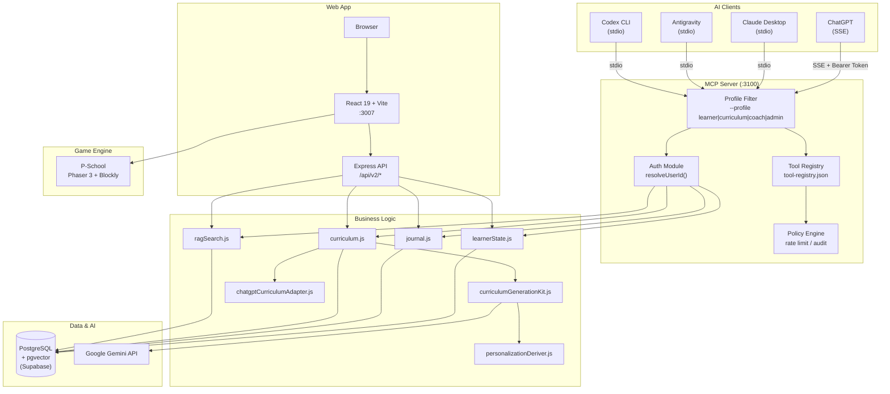
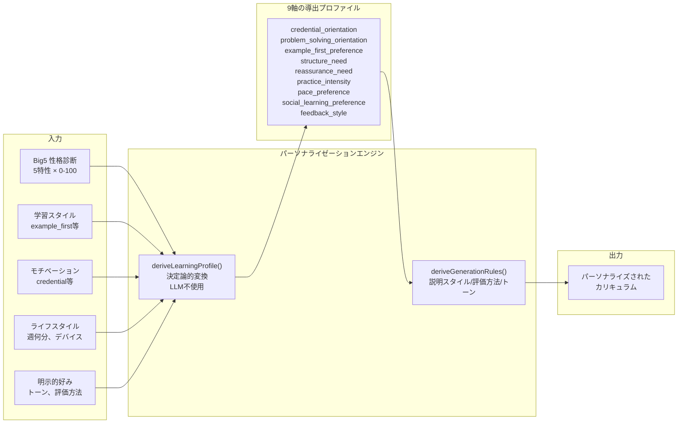
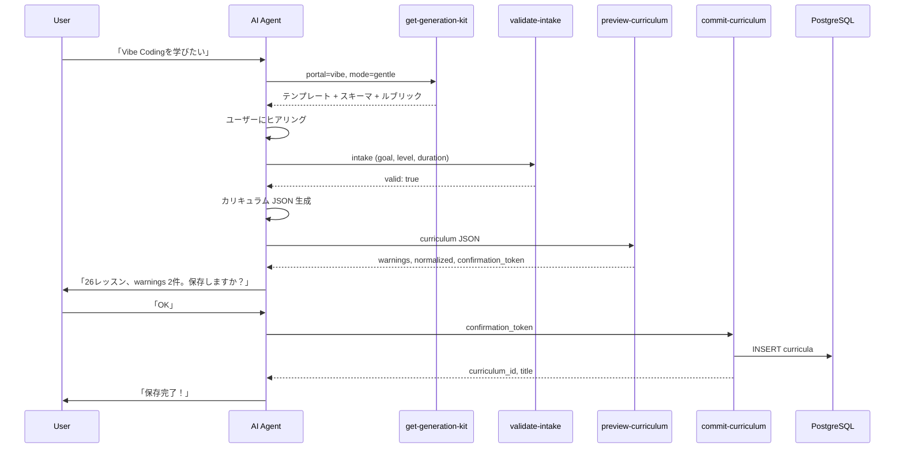
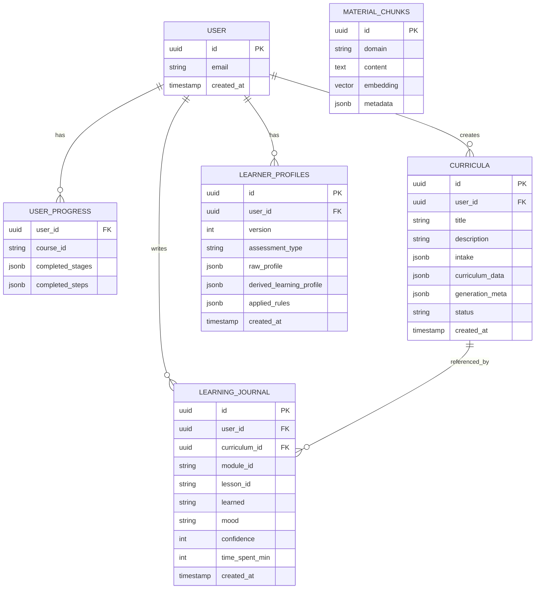

# Rise Path — システムアーキテクチャ v3

> 最終更新: 2026-05-01
> LLM パーソナル学習プラットフォーム

---

## 1. システム全体像



---

## 2. 4層 AI アーキテクチャ

```
┌───────────────────────────────────────────────────────────────┐
│  Layer 4: MCP Tool Exposure                                   │
│  ┌─────────────┐ ┌──────────────┐ ┌────────┐ ┌────────────┐  │
│  │Tool Registry │ │Profile Filter│ │ Policy │ │  Audit Log │  │
│  │ risk/category│ │ fail-closed  │ │ Engine │ │            │  │
│  └─────────────┘ └──────────────┘ └────────┘ └────────────┘  │
├───────────────────────────────────────────────────────────────┤
│  Layer 3: Skills (tool chain 手順化)                          │
│  ┌────────────────┐ ┌──────────────┐ ┌───────────────────┐   │
│  │ curriculum-gen  │ │ lesson-      │ │ journal-coaching  │   │
│  │ 3-step chain   │ │ delivery     │ │                   │   │
│  └────────────────┘ └──────────────┘ └───────────────────┘   │
├───────────────────────────────────────────────────────────────┤
│  Layer 2: Subagents (将来: 権限境界として)                     │
│  ┌──────────────────┐ ┌──────────────────┐                   │
│  │ quality-reviewer  │ │ content-enricher │                   │
│  │ read-only         │ │ rag + write      │                   │
│  └──────────────────┘ └──────────────────┘                   │
├───────────────────────────────────────────────────────────────┤
│  Layer 1: AGENTS.md (coding agent 向け補助)                   │
│  プロジェクト構造 / コマンド / 規約 / 禁止事項               │
└───────────────────────────────────────────────────────────────┘
```

---

## 3. MCP Tool Exposure 設計

### 設計原則

| 原則 | 内容 |
|------|------|
| **fail-closed** | profile 未指定時は `learner`（最小権限） |
| **二重チェック** | ListTools（非表示）+ CallTool（アクセス拒否） |
| **client 非依存** | `_meta.agent_profile` に依存しない。起動時 `--profile` で制御 |
| **preview/commit 分離** | write 操作は dry-run → 確認 → 実行の2段階 |

### Profile → Tool マッピング

```
                    learner  curriculum  coach  admin
                    ───────  ──────────  ─────  ─────
learner-state-get      ✅                  ✅     ✅
learner-state-update   ✅                         ✅
journal-log            ✅                         ✅
journal-recent         ✅                  ✅     ✅
journal-summary                            ✅     ✅
rag-search             ✅       ✅         ✅     ✅
get-generation-kit              ✅                ✅
validate-intake                 ✅                ✅
preview-curriculum              ✅                ✅
commit-curriculum               ✅                ✅
                    ───────  ──────────  ─────  ─────
合計                   5         5         4     10
```

### Tool リスク分類

```
read (安全)                    write (追跡必要)
─────────────                  ──────────────────
learner-state-get              learner-state-update [audit]
journal-recent                 journal-log [audit, private]
journal-summary                commit-curriculum [approval, audit]
rag-search
get-generation-kit
validate-intake
preview-curriculum
```

---

## 4. パーソナライゼーションパイプライン



### 優先度ルール

```
declared_preferences > lifestyle > motivation > big_five > default
```

### 適応ルール例

| 軸 | 値 | 適応 |
|----|-----|------|
| reassurance_need | high | practice を2個に制限、「今日はここまで」を追加 |
| structure_need | high | チェックリスト追加、進捗マイルストーン |
| example_first | high | 例 → 原理 → 応用の順で説明 |
| feedback_style | coach_gentle | 励まし多め、命令口調を避ける |

---

## 5. カリキュラム生成パイプライン



### 4つの学習モード

| モード | セクション順 | 特徴 |
|--------|-------------|------|
| `credential` | achievement → overview → key_points → checklist → practice | 到達目標・確認重視 |
| `practice` | overview → examples → practice → key_points | ハンズオン最優先 |
| `problem_solving` | opening_problem → overview → examples → key_points | 問い→発見 |
| `gentle` | overview → examples → key_points → cautions → reassurance | 励まし・安心感 |

### 品質ルブリック

| ルール | 値 |
|--------|-----|
| レッスン最低セクション数 | 6 |
| explanation 最低文字数 | 220 |
| practice 最低個数 | 2 |
| 必須ブロック | overview, key_points, practice, cautions, takeaway |

---

## 6. データモデル



---

## 7. User Isolation

```
SSE:    client → Bearer Token → MCP → token.sub → DB
                                       ↑ params.user_id 無視

stdio:  client → MCP → params.user_id || PHASE1_USER_ID → DB
(開発)                  ↑ 開発環境のみ許可

stdio:  client → MCP → PHASE1_USER_ID → DB
(本番)                  ↑ 固定
```

---

## 8. ディレクトリ構成

```
rise-path-demo-game-Integration-/
├── AGENTS.md                          # coding agent 向け運用ルール
├── mcp-server/
│   ├── index.js                       # MCP Server 本体 (stdio/SSE)
│   ├── profileFilter.js               # --profile 起動時フィルタ
│   ├── auth.js                        # resolveUserId, assertToolAllowed
│   ├── policy.js                      # rate limit, audit log
│   └── tool-registry.json             # 全ツールメタデータ
├── tools/core/                        # ビジネスロジック (MCP/Express 共用)
│   ├── learnerState.js                # 進捗管理
│   ├── journal.js                     # 学習ジャーナル
│   ├── curriculum.js                  # カリキュラム生成
│   ├── learnerProfile.js              # Big5 プロファイル
│   ├── ragSearch.js                   # セマンティック検索
│   └── domains.js                     # 学習ドメイン定義
├── server/
│   ├── services/
│   │   ├── curriculumGenerationKit.js # 生成Kit (587行)
│   │   ├── chatgptCurriculumAdapter.js# UI 正規化 (549行)
│   │   ├── personalizationDeriver.js  # Big5→9軸変換 (487行)
│   │   ├── schemaValidator.js         # 構造検証
│   │   └── journalService.js          # ジャーナル検証
│   ├── middleware/                    # 認証 (JWT + Bridge Token)
│   └── db.js                         # PostgreSQL 接続
├── components/features/               # React UI
│   ├── ai/                           # AI 学習 UI (11ファイル)
│   ├── PSchool/                      # ゲーム (Phaser + Blockly)
│   ├── dashboard/                    # ダッシュボード
│   └── ...                           # blender, art, programming 等
├── skills/                            # AI スキル設定 (将来)
│   ├── curriculum-generation/SKILL.md
│   ├── lesson-delivery/SKILL.md
│   └── journal-coaching/SKILL.md
└── doc/                               # 仕様書群
    ├── architecture_v3.md             # ← 本文書
    ├── phase11_user_isolation_spec.md # User Isolation 仕様
    └── usage_guide.md                 # 利用ガイド
```

---

## 9. 技術スタック

| レイヤー | 技術 | バージョン |
|---------|------|-----------|
| Frontend | React + Vite + TypeScript | React 19 |
| Backend | Node.js + Express | v20+ |
| Database | PostgreSQL + pgvector | Supabase |
| AI | Google Gemini API | @google/genai SDK |
| MCP | @modelcontextprotocol/sdk | stdio + SSE |
| Game | Phaser 3 + Blockly | v3.80 |
| Auth | Supabase Auth (JWT) + Bridge Token | 4段階認証 |

---

## 10. セキュリティモデル

### 4段階認証

| レベル | 対象 | 方法 |
|--------|------|------|
| Public | ヘルスチェック | 認証なし |
| Session | SSE 接続 | セッション ID |
| Bridge | MCP ツール実行 | `RISE_PATH_BRIDGE_TOKEN` |
| Admin | 管理操作 | Supabase JWT (role=admin) |

### Tool 安全性分類

```
         安全                    注意                   危険
        (read)                  (write)               (将来)
     ──────────             ──────────────          ──────────
     state-get              state-update            外部API呼出
     journal-recent         journal-log             ユーザー削除
     journal-summary        commit-curriculum       課金操作
     rag-search
     generation-kit
     validate-intake
     preview-curriculum

     → 自動実行OK           → audit必須             → approval必須
                            → rate limit            → admin only
```

### lethal trifecta チェック

| 要素 | Rise Path の状況 | リスク |
|------|-----------------|--------|
| private data 読み取り | learner-state, journal（自分のデータ） | 中（user_id 分離で軽減） |
| untrusted content | rag-search（管理者インジェスト済み教材） | 低 |
| external write | commit-curriculum（DB保存のみ） | 中（preview/commit で軽減） |

---

## 11. 将来のスケールパス

### 現在 → 将来

```
現在 (9ツール, 1 MCP Server)
├── 起動時 --profile で十分
├── tool-registry.json で管理
└── policy.js で rate limit

    ↓ MCP Server が増えたら

将来 (30+ ツール, 複数 MCP Server)
├── MCP Gateway 導入
├── Tool search / deferred loading
├── OAuth scope ベースの動的 filtering
└── 監査ログ DB 化
```

### MCP Server 分割計画

| Server | ツール群 | トリガー |
|--------|---------|---------|
| rise-path-learning | 進捗・ジャーナル・カリキュラム | 現在 |
| rise-path-content | 教材管理・RAG・コンテンツ生成 | 教材が100チャンク超 |
| rise-path-analytics | 学習分析・レポート・推奨 | ユーザー10人超 |
| rise-path-admin | ユーザー管理・設定・課金 | 本番運用開始 |
