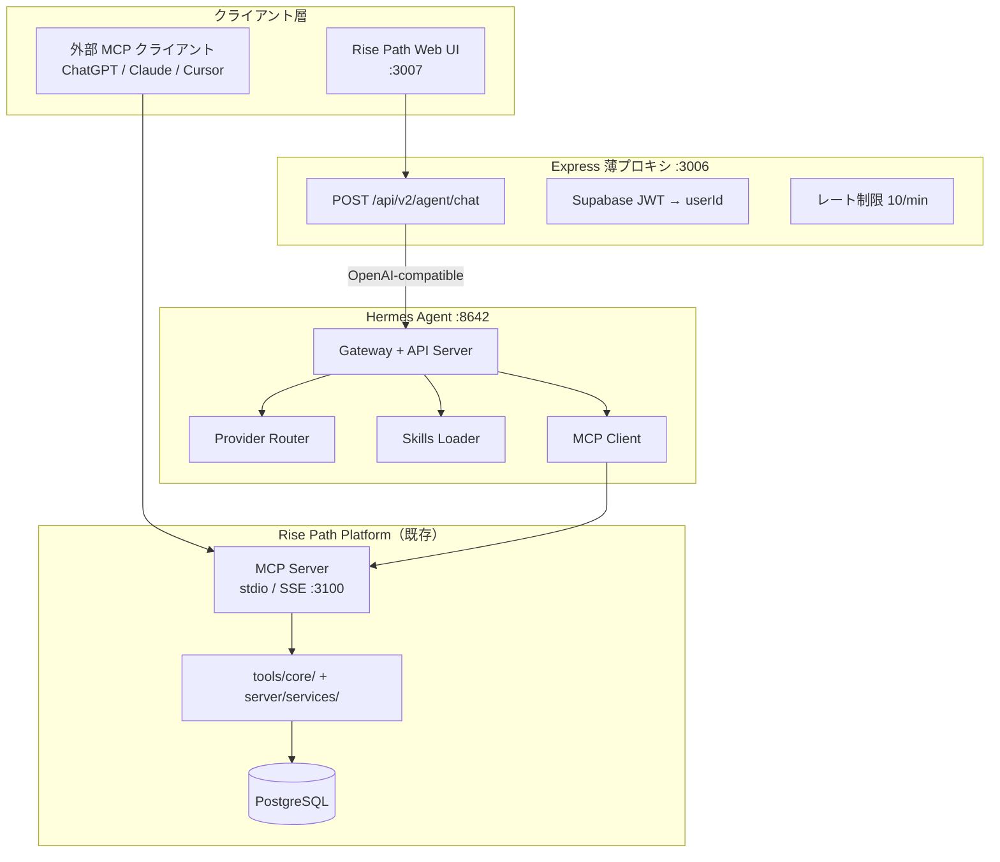
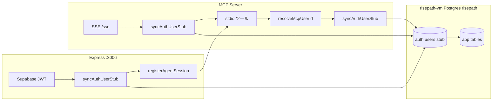

# Rise Path v3 アーキテクチャ仕様書
# Hermes Agent Runtime + MCP + Skills

> 作成日: 2026-06-22  
> 最終更新: 2026-06-24  
> ステータス: 仕様確定（**16-6a〜f + 16-6e + 16-6e-R 実装済み**）
> 本番デプロイ: 専用 VM [`risepath_vm_deployment.md`](./risepath_vm_deployment.md)  
> 前提: [`architecture_v2_mcp_skills.md`](./architecture_v2_mcp_skills.md) を拡張。LLM ハーネスを Hermes Agent に委譲する。

---

## 1. 背景と方針転換

### 1.1 v2 から v3 へ

| 項目 | v2 (2026-04) | v3 (本仕様) |
|:---|:---|:---|
| LLM 実行 | 外部クライアント (ChatGPT/Claude) + 内蔵 Gemini 直結 | **Hermes Agent** を標準ランタイムに統一 |
| Web UI チャット | ~~`FloatingChatbot` → Gemini SDK~~ → **完了**（`learning-coach`） | Express プロキシ → Hermes API Server |
| 機能別 LLM ルート | `POST /ai/generate`, 予定 `POST /life-journal/chat` | **汎用** `POST /api/v2/agent/chat` のみ |
| プロバイダー | Gemini 固定（内蔵） | OpenRouter / Nous Portal 等（Hermes Provider Router） |
| Skills | markdown ドキュメント（外部 LLM 向け） | Hermes `external_dirs` で実行時ロード |
| MCP | Rise Path Server（手足） | 変更なし — **核心は維持** |

### 1.2 設計原則（継承 + 追加）

**v2 の「側だけ作る」は維持する。** Rise Path が所有するものは変わらない:

- 教育コンテンツ（7ドメイン）
- 学習者モデル（Big5、マスタリー、ジャーナル、ライフログ）
- 決定論的パーソナライゼーション・適応ロジック
- MCP Server（ツールとデータの標準公開層）

**v3 で追加するもの:**

- **Hermes Agent** = 推論・プロバイダー選択・ツールループ・セッション管理
- **Skills** = 振る舞い・手順・安全ガード（Hermes が実行時にロード）
- **Express Agent Proxy** = Web UI と Hermes の認証ブリッジ

> Rise Path は LLM ハーネスを持たない。新規の Gemini 直結ルートは作らない。

### 1.3 参考: 2026 年の業界トレンド

- **MCP** がエージェント↔データの標準プロトコル（決定論的ツール呼び出し）
- **Skills** が振る舞い・ワークフローの宣言的定義（agentskills.io 互換）
- **Agent Runtime 分離** — 推論は Hermes / OpenAI Agents SDK 等、データは MCP Server
- **Context Engineering** — 生データではなく集計済みコンテキストを LLM に渡す
- LangGraph 的な自前マルチエージェントは縮小（Rise Path は Phase 6 で撤去済み）

---

## 2. システムアーキテクチャ

### 2.1 全体構成図



### 2.2 レイヤー責務

| レイヤー | 技術 | 責務 |
|:---|:---|:---|
| **データ・分析** | `tools/core/`, `server/services/` | 決定論的集計、相関、ルール、RLS |
| **MCP Server** | `mcp-server/index.js` | ツール公開、profile 制限、監査 |
| **Skills** | `skills/*/SKILL.md` | 対話手順、安全ガード、ツール呼び出し順 |
| **Hermes Agent** | 外部プロセス | モデル選択、ツールループ、セッション、フェイルオーバー |
| **Express Proxy** | `server/routes/agent.js`（予定） | JWT 認証、Hermes API key 秘匿、user scope |
| **Web UI** | React | 薄いチャット UI（LLM ロジックなし） |

### 2.3 起動順序

#### 開発（Mac）

```bash
# Terminal 1: Rise Path（Express + Vite）
npm run dev

# Terminal 2: Hermes Gateway（MCP stdio は config から自動起動）
hermes -p rise-path gateway
# → API Server :8642, MCP rise_path 接続, skills 読み込み
```

**注意:** 開発者個人の `default` Hermes プロファイルや `nexloom-gce` 上の gemini5 gateway は **Rise Path に使わない**。

#### 本番（`risepath-vm` + Docker）

```bash
cd deploy/risepath-vm
docker compose --env-file stack.env up -d
docker compose exec api npm run db:migrate
```

- MCP: **SSE**（`mcp` サービス :3100）。stdio は本番非推奨。
- Hermes: Compose 内 `hermes` サービス、`rise-path` 設定のみ。
- 詳細: [`risepath_vm_deployment.md`](./risepath_vm_deployment.md)

---

## 3. Hermes 統合

### 3.1 プロファイル

Rise Path 専用 Hermes プロファイル `rise-path` を使用する。

```bash
hermes profile create rise-path
hermes model   # OpenRouter または Nous Portal を設定
```

設定テンプレート: [`hermes/config.example.yaml`](../hermes/config.example.yaml)

### 3.2 MCP 接続

Hermes の `mcp_servers.rise_path` で Rise Path MCP Server に接続する。

| 環境 | Transport | 認証・ユーザー解決 |
|------|-----------|-------------------|
| 開発（Hermes 同居） | **stdio** | Express が JWT 検証 → `registerAgentSession` → env `RISE_PATH_ACTIVE_SESSION_KEY` |
| 外部クライアント（ChatGPT 等） | **SSE** | `/sse` で Bearer JWT → セッションに userId を紐付け |
| 本番（Hermes リモート接続時） | **SSE**（推奨） | `url` + `Authorization: Bearer <jwt>`（`hermes/config.example.yaml` 参照） |

いずれの経路でも、DB 書き込み前に GCP `risepath` の `auth.users` **スタブ**へ user UUID を upsert する（[`database_topology.md`](./database_topology.md)）。



**stdio 単体（Claude Desktop 等）**: 開発では `PHASE1_USER_ID`（migration 000 でシード済み）で動作。本番 UUID を使う場合は `RISE_PATH_ACTIVE_SESSION_KEY=rp:user:{uuid}` を設定し、`resolveMcpUserId` がスタブを同期する。

ツールは **allowlist** で露出を最小化する（`daily-life-*` + 学習系のみ）。  
Hermes 側の登録名は `mcp_rise_path_<tool>` 形式（例: `mcp_rise_path_daily_life_chat_context`）。

### 3.3 Skills 連携

```yaml
skills:
  external_dirs:
    - /absolute/path/to/rise-path/skills
```

リポジトリの `skills/` をそのまま参照。新規:

- `life-habit-analyst` — 生活習慣×学習の説明（Phase 16-6）
- 既存: `curriculum-generator`, `learning-coach`, `progress-tracker`, `content-search`

Slash command: `/life-habit-analyst 今月の睡眠と集中の関係は？`

### 3.4 プロバイダー推奨

| 環境 | 推奨 | 理由 |
|:---|:---|:---|
| 本番 | OpenRouter + flash 系 | コスト効率、モデル切替容易 |
| 開発 | Nous Portal | モデル + Tool Gateway 一体 |
| フェイルオーバー | Hermes provider stacking | 可用性 |

### 3.5 セキュリティ制約

Hermes API Server はデフォルトで terminal 等のフルツールセットにアクセス可能。**rise-path プロファイルでは以下を必須とする:**

- MCP `tools.include` で allowlist（terminal/browser 等は Hermes toolset でも OFF）
- `API_SERVER_KEY` は Express のみが保持（ブラウザ非公開）
- `X-Hermes-Session-Key: rp:user:{userId}` でマルチユーザー分離

---

## 4. Web UI 接続（Express Agent Proxy）

### 4.1 エンドポイント

```http
POST /api/v2/agent/chat
```

認証: `requireBridgeOrAuth`（Supabase JWT / Bridge Token）  
レート制限: AI Heavy 10 req/min（既存 `server.js` パターン）

### 4.2 Request

```json
{
  "skill": "life-habit-analyst",
  "message": "今月集中できた日の共通点は？",
  "context": {
    "from": "2026-06-01",
    "to": "2026-06-30",
    "timezone": "Asia/Tokyo"
  },
  "include_diary_excerpts": false
}
```

| フィールド | 説明 |
|:---|:---|
| `skill` | 使用する Skill 名（`life-habit-analyst`, `learning-coach` 等） |
| `message` | ユーザーの質問 |
| `context` | Skill / MCP ツールに渡す期間・TZ 等 |
| `include_diary_excerpts` | サーバー側で強制（クライアント改ざん不可） |

### 4.3 プロキシの内部動作

1. JWT から `userId` を解決
2. Hermes `POST /v1/responses` または `/api/sessions/{id}/chat/stream` に転送
3. `conversation: "rp:user:{userId}:{skill}"` でセッション分離
4. `instructions` に Skill 起動指示を付与（`/life-habit-analyst` 相当）
5. `X-Hermes-Session-Key: rp:user:{userId}` を付与
6. ストリーミング応答を UI に中継

### 4.4 接続先 UI

| コンポーネント | skill | 状態 |
|:---|:---|:---|
| `LifeJournalChatView` | `life-habit-analyst` | ✅ 実装済（`1839c9e`） |
| `FloatingChatbot` | `learning-coach` | ✅ 実装済（16-6e-R: ストリーム UI・`ui_language`・共有エラーマップ） |
| `CourseGeneratorView` | `curriculum-generator` | 中長期移行（当面 `/ai/generate` 維持可） |

---

## 5. MCP ツール拡張（Phase 16-6a）

既存 `journal-log`（レッスン単位）と混同しないよう `daily-life-*` プレフィックスを使う。  
実装は `tools/core/lifeJournal.js` を dual use（Express / MCP 共有）。

| Tool | 目的 | data_class |
|:---|:---|:---|
| `daily-life-log` | 日次ダイアリー/生活習慣保存 | learner_private |
| `daily-life-range` | 期間データ取得 | aggregated |
| `daily-life-analysis` | 決定論的分析取得 | aggregated |
| `daily-life-advice` | ルールベース週次アドバイス | aggregated |
| `daily-life-chat-context` | LLM 用安全コンテキスト生成 | aggregated |

`daily-life-chat-context` は **LLM に渡す唯一の入口**。生の `daily_reflections` 行は渡さない。

---

## 6. 廃止・移行方針

| 対象 | 方針 |
|:---|:---|
| `POST /api/v2/life-journal/chat` | **作らない** — `POST /api/v2/agent/chat` に統合 |
| `FloatingChatbot` → Gemini SDK | **廃止済**（16-6e）。`/ai/generate` 等のみ Gemini レガシー継続 |
| `services/geminiService.ts`（チャット部分） | 段階的廃止 |
| `scripts/gemini_tts_node.js` | Kokoro TTS サイドカーへ置換（Issue #3） |
| `POST /api/v2/ai/generate` | 当面維持。中長期で Hermes + MCP に統合 |
| LangGraph / 自前マルチエージェント | 再導入しない（Phase 6 で撤去済み） |

---

## 7. 実装ロードマップ

| Step | 内容 | 優先度 |
|:---|:---|:---|
| 16-6a | MCP `daily-life-*` 5ツール登録 | ✅ 完了 |
| 16-6b | `skills/life-habit-analyst/SKILL.md` | ✅ 完了 |
| 16-6c | `hermes/` 設定テンプレート + 手順 | ✅ 完了 |
| 16-6d | `server/routes/agent.js` Express プロキシ | ✅ 完了 |
| 16-6e | `LifeJournalChatView` + FloatingChatbot 接続 | ✅ 完了 |
| 16-6e-R | FloatingChatbot レビュー修正（§8.8） | ✅ 完了 |
| 16-6f | `daily-life-chat-context` に `learner_profiles` 注入 | ✅ 完了 |
| 16-6g | `generation-kit` habit_signals（LLM 不要） | ✅ 完了 |
| 16-7 | Privacy export/delete + diary opt-in UI | ✅ 完了 |

---

## 8. 関連ドキュメント

| 文書 | 内容 |
|:---|:---|
| [`architecture_v2_mcp_skills.md`](./architecture_v2_mcp_skills.md) | MCP + Skills 基盤（v2） |
| [`phase16_life_journal_analytics_spec.md`](./phase16_life_journal_analytics_spec.md) | ライフジャーナル詳細仕様 |
| [`system_spec_v4.md`](./system_spec_v4.md) | システム全体仕様 |
| [`hermes/README.md`](../hermes/README.md) | Hermes セットアップ手順 |
| [Hermes MCP Guide](https://hermes-agent.nousresearch.com/docs/guides/use-mcp-with-hermes) | 公式 MCP 連携 |
| [Hermes API Server](https://hermes-agent.nousresearch.com/docs/user-guide/features/api-server) | OpenAI 互換 API |