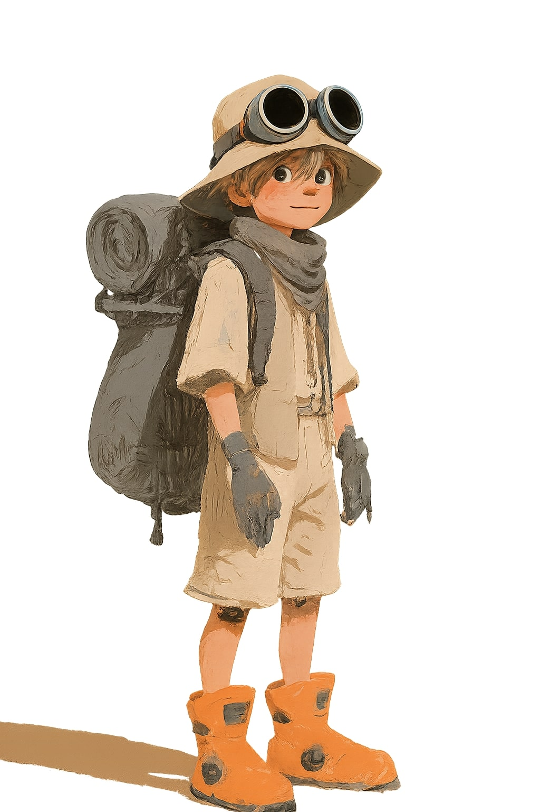
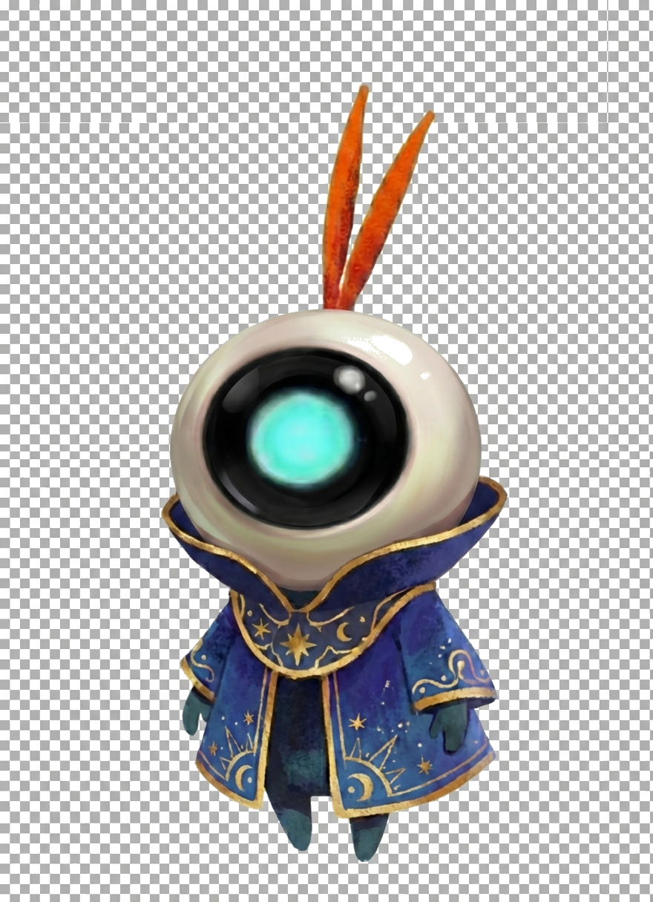
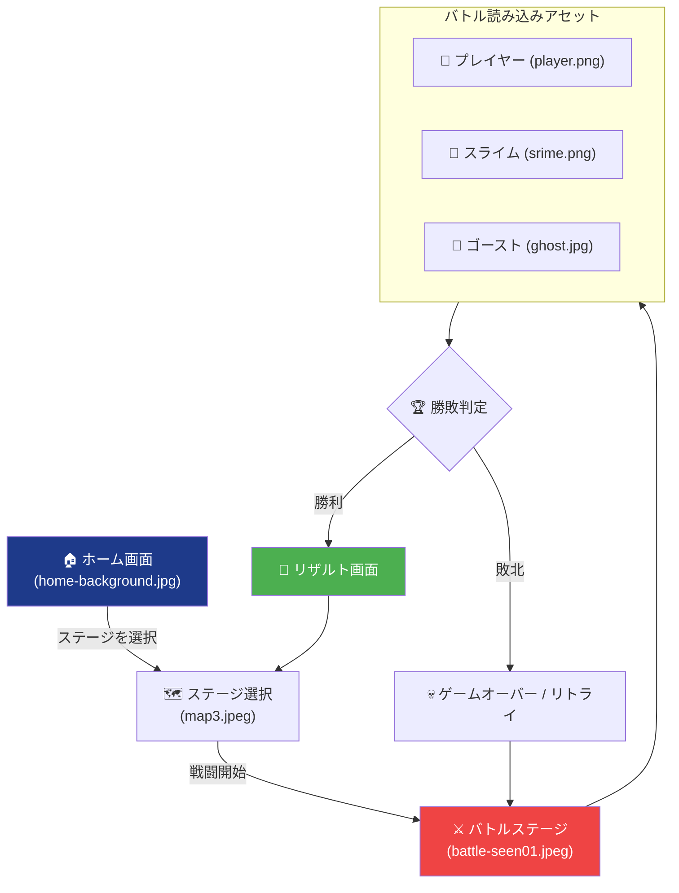

# 🎨 P-School アート＆デザインコンセプト仕様書

本ドキュメントは、P-School（ブロックプログラミング学習ゲーム）における世界観、色彩設計、アセットのスタイル、およびAIによるアセット生成ルールをまとめたデザインコンセプト仕様書です。

---

## 1. デザインコンセプト & 世界観

### 🏰 16-bit レトロファンタジーRPGスタイル
P-Schoolは、子供たちが親しみやすく、かつゲームとして没入しやすい**「王道ファンタジーRPG」**の世界観を採用しています。懐かしさのある16-bit風のドット絵（ピクセルアート）と手描き風イラストを融合させ、ぬくもりがありつつもワクワクする冒険の世界を表現します。

> [!IMPORTANT]
> **デザインのゴール**: 
> 「勉強のためのツール」ではなく「本物の面白いRPGをプレイしている」と感じられるビジュアル水準を維持すること。

---

## 2. キービジュアル

### ⚔️ バトルシーン（メインビジュアル）
ゲームのクライマックスであるプログラミングバトル画面のイメージです。手前にプレイヤー、奥に巨大なモンスターが対峙する構成です。


---

## 3. キャラクター & モンスターデザイン

ゲームに登場する代表的なアセットのデザイン方針です。

| アセット名 | 現行ビジュアル | デザイン特徴・仕様 |
|---|---|---|
| **プレイヤー / 主人公** |  | - 青い髪の王道勇者スタイル。<br>- 剣と盾を装備し、勇敢な表情。<br>- バトル中はアニメーションスプライトとして表示。 |
| **スライム (Slime)** |  | - ゲーム初期のチュートリアルで登場するモンスター。<br>- 透明感のある青いジェル状の身体。<br>- 発光エフェクトを持つ。<br>- *※バリエーション（実在する `srime2.png`, `srime5.png`, `srime7.png`, `srime8.png`）は、属性違いや特殊ステータス（毒・麻痺等）を表現するための別カラーパレットアセット。* |
| **森の精霊 (Seirei)** |  | - 中盤ステージの森エリアで登場。<br>- 葉や木の根をモチーフにした精霊。<br>- 神秘的で温かみのあるトーン。 |

---

## 4. カラーパレット定義

ゲーム全体の色彩統一のためのカラーパレットです。UIデザインやエフェクト作成、Tailwindによるスタイリング時は、必ず以下のカラー定義に準拠してください。

| 用途 | カラーネーム | カラーコード | Tailwind クラス例 | サンプル |
|---|---|---|---|---|
| **プライマリ（メイン）** | フォレスト・グリーン | `#4CAF50` | `text-[#4CAF50]` / `text-green-500` | 🟢 |
| **セカンダリ（UI/枠線）** | ディープ・オーシャンブルー | `#1E3A8A` | `text-blue-900` / `bg-blue-900` | 🔵 |
| **アクセント（強調/警告）**| アクティブ・レッド | `#EF4444` | `text-red-500` / `bg-red-500` | 🔴 |
| **バックグラウンド（ダーク）** | チャコール・シャドウ | `#1F2937` | `bg-slate-800` | ⚫ |
| **テキスト（ハイライト）** | クリーン・ホワイト | `#F9FAFB` | `text-slate-50` | ⚪ |

---

## 5. 画像生成AI (NanoBanana Pro 2) 推奨プロンプト

アセットを新しく生成、またはブラッシュアップする際は、以下のプロンプトテンプレートをコピペして使用してください。

### 👾 敵モンスター・スプライト用（ドット絵）
```text
pixel art sprite of a [MONSTER_NAME], 16-bit retro RPG style, vibrant colors, solid flat white background, clean edges, centered, full body, isolated, detailed shading --aspect 1:1
```
> [!TIP]
> 透過処理（背景の切り抜き）をやりやすくするため、プロンプトには `solid flat white background`（あるいは `solid black background`）を指定し、キャラクターが中央に全身で収まる（`centered, full body, isolated`）ように設定しています。

### 🗺️ バトル背景画像用（手描き風）
```text
hand-drawn fantasy landscape of [AREA_NAME] for an RPG battle background, vibrant lighting, anime style, colorful, detailed concept art --aspect 16:9
```

---

## 6. ゲームフローとアセットロード遷移図

ゲームの進行プロセスにおいて、どの画面でどのアセットが読み込まれるかを表したロードマップです。



---

## 7. 🔊 音響アセット（BGM/SE）の配置・命名規則

ゲーム体験を高めるBGMや効果音（SE）を追加・変更する際の共通ルールです。

- **配置ディレクトリ**: 音声ファイルは必ず [**`public/p_school/assets/audio/`**](file:///Users/2005nk/Works/personal/rise-path-demo-game-integration/public/p_school/assets/audio/) 配下に保存してください。
- **推奨ファイルフォーマット**: 常時ループ再生やクロスプラットフォームに対応しやすい **`.mp3`**（または `.ogg`）形式を標準とします。
- **命名規則**: 小文字の英数字およびアンダースコア（`_`）で記述してください。
  - **BGM**: `bgm_[ステージ名/シーン名].mp3` (例: `bgm_battle_01.mp3`)
  - **効果音**: `se_[アクション名].mp3` (例: `se_damage.mp3`, `se_click.mp3`)

---

## 8. ⚠️ アセット適用の厳格な制約（注意事項）

> [!CAUTION]
> **アセットのファイル名ルールについて**
> 既存の画像を置き換える場合、**必ず元のファイル名と全く同じ名前（小文字）で上書き保存**してください。ファイル名や拡張子を変更すると、プログラム内の画像ロードコードの修正が必要になり、バグの原因になります。

> [!WARNING]
> **透明化処理の必須化**
> キャラクターやモンスターなどのスプライト画像は、背景に黒や白の塗りつぶしが残っていないか（透過PNGになっているか）を配置前に必ず確認してください。

---

## 🔗 関連ドキュメント
- [コンセプトボード作成ガイドライン](guides/concept_board_guidelines.md)
- [アセット安全適用ワークフロー](guides/assets_workflow.md)
- [アセット進行管理リスト](assets_management.md)
