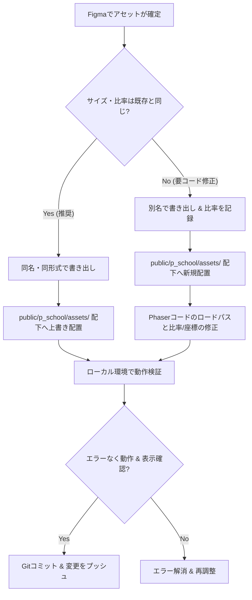

# 🎨 アセット安全適用ワークフロー

本ガイドラインは、Figmaなどのデザインツールからゲームのビジュアルアセット（キャラクター、背景、UI等）を書き出し、プログラムの動作を壊さずにゲーム内に反映（適用）させるための詳細な手順書です。

---

## 🧭 アセット適用の全体フロー



---

## 1. アセットの書き出しと命名ルール

### ① 基本ルール
*   **ファイル名と拡張子**: 全て**半角英数字の小文字**とし、ハイフン `-` またはアンダースコア `_` で繋ぎます（例: `main_chara01.png`, `forest_stage1.jpg`）。
*   **拡張子の統一**: 既存アセットが `.png` であれば新しいものも必ず `.png`（小文字）で書き出します。`.PNG`（大文字）や `.jpg` との混同はパスエラーの原因になります。

### ② アセットサイズとトリミング
*   キャラクターなどのスプライト画像は、**キャラクターの外側の不要な余白をトリミング（最小限にカット）**して書き出してください。余白が大きすぎると、ゲーム内の配置座標がずれたり、当たり判定やエフェクトの位置がずれる原因になります。

---

## 2. 上書き適用（イージーパス）の手順

サイズや縦横比率が既存アセットと同じである場合、プログラム側のコードを一切触らずに適用できます。

1.  Figmaでアセットを選択し、既存のファイルと全く同じ名前（例: `srime.png`）でエクスポートします。
2.  プロジェクトリポジトリの `/public/p_school/assets/` フォルダを開き、既存のファイルを新しいファイルで置き換えます。
3.  ローカルサーバー（`npm run dev`）でゲームを開き、該当のアセットが正常に新しいビジュアルに更新されているか確認します。
    *   ブラウザのキャッシュにより古い画像が表示されたままになる場合は、**スーパーリロード（`Ctrl + F5` または `Cmd + Shift + R`）**を行ってください。

---

## 3. 別名追加・コード修正適用（アドバンスドパス）の手順

画像比率が変わる、あるいは新規アセットとして追加する場合は、Phaser側のコードも変更する必要があります。

### ① アセットの配置
*   `/public/p_school/assets/` に新しいファイル（例: `new_boss_dragon.png`）を配置します。

### ② ロード処理の修正
*   [components/features/PSchool/game/battle.js](file:///Users/2005nk/Works/personal/rise-path-demo-game-integration/components/features/PSchool/game/battle.js) または該当の `BattleScene*.js` を開きます。
*   `preload()` メソッド内で、アセットをロードする処理を追記または書き換えます。
    ```javascript
    // 修正前:
    this.load.image('enemyTexture', '/p_school/assets/goblin.jpg');
    // 修正後:
    this.load.image('enemyTexture', '/p_school/assets/new_boss_dragon.png');
    ```

### ③ 表示比率（Scale）や座標の調整
*   比率が変わった場合、キャラクターが画面外にはみ出したり、地面に埋まったりすることがあります。
*   `create()` メソッド等で、敵やプレイヤーの表示スケール、座標調整値を確認し、適切に数値を書き換えます。
    ```javascript
    // 例: スケール（表示倍率）を調整して画面に収める
    this.enemy.setScale(0.8); 
    ```

---

## 4. ローカル検証とトラブルシューティング

適用後は、必ず以下の検証を行ってください。

1.  **ブラウザ開発者ツール (Console) の確認**:
    *   `F12` キー（または `Cmd + Option + I`）でコンソールを開き、赤色のエラー（`Failed to load resource: net::ERR_FILE_NOT_FOUND` など）が出ていないか確認してください。
2.  **型チェックの実行**:
    *   `npm run typecheck` を実行し、TypeScriptのコンパイルエラーが発生していないか確認します。
3.  **表示確認チェックリスト**:
    *   [ ] アセットが引き伸ばされたり、潰れたり（アスペクト比の異常）していないか？
    *   [ ] モンスターやエフェクトの位置が浮いたり沈んだりしていないか？
    *   [ ] アセットのロード時に一瞬画面がカクつかないか？
