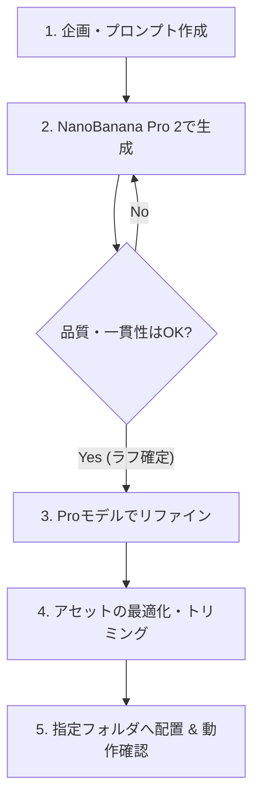

# 🍌 Google NanoBanana Pro 2 を活用したアセット生成・適用ワークフロー

本ガイドラインは、Googleの画像生成AIモデル **NanoBanana Pro 2** を活用して、ブロックプログラミングゲーム『Code of Ruins』（P-School）のビジュアルアセットをブラッシュアップし、安全にゲーム内に適用するための社内共有マニュアルです。

---

## 🧭 全体のワークフロー

---

## 1. Google NanoBanana Pro 2 の活用方法

**NanoBanana Pro 2** は、高品質で精密な画像生成に最適化されたモデルです。以下の手順に従って、ゲームアセットにふさわしい画像を生成します。

### ① 基本的な生成手順と画面遷移
1. Google AI Studio または Vertex AI Image Playground にアクセスし、モデルに `NanoBanana` (または Gemini 連携UI) を選択します。
2. 最初は高速な **NanoBanana 2** でアイデア出しを行い、方向性が決まったら **Pro 2** に切り替えて高精細な画像を生成（リファイン）します。

> 📌 **【社内用操作画面のプレースホルダー】**
> ※ 実際のツール画面のスクリーンショットを撮影し、以下のパスに配置して差し替えてください。
> ``

### ② プロンプト作成のコツ（ゲーム用）
ゲームの世界観（ファンタジー・ピクセルアート・サイバーパンク等）に合わせるため、以下のプロンプトテンプレートを活用してください。

*   **モンスター・キャラクター用**:
    > `pixel art sprite of a [MONSTER_NAME], 16-bit retro RPG style, vibrant colors, solid flat white background, clean edges, centered, full body, isolated, detailed shading --aspect 1:1`
    > *(※背景透過処理をしやすくするため、AI出力時は solid flat white background などの単色背景を指定し、後から切り抜きを行います)*
*   **背景イラスト用**:
    > `hand-drawn fantasy landscape of [AREA_NAME] for an RPG battle background, vibrant lighting, anime style, colorful, detailed concept art --aspect 16:9`

---

## 2. 画像生成スタイルガイドライン & プロンプト実例集

P-Schoolで統一すべき主要なビジュアルスタイル、それぞれの推奨プロンプト、および操作コメントをまとめました。

| ビジュアルスタイル | 推奨プロンプト構成（英語） | スタイルサンプル（プレースホルダー） | 適用時のコメント・注意点 |
| :--- | :--- | :--- | :--- |
| **ドット絵スタイル** (Pixel Art) | `pixel art sprite of a [キャラ名], 16-bit retro RPG style, vibrant colors, solid flat white background, clean edges, centered, full body, isolated, detailed shading --aspect 1:1` | `` | レトロゲーム風の世界観に最適。輪郭がはっきりしており、ドットのサイズ（解像度）がキャラクター間で揃うように調整してください。透過処理用に白背景を指定しています。 |
| **手描きイラスト風** (Hand-drawn) | `hand-drawn illustration of a [キャラ名], whimsical fantasy style, soft coloring, clean background --aspect 1:1` | `` | ぬくもり感のある絵本のようなスタイル。グラデーションが細かくなりすぎず、ゲーム画面で輪郭がぼやけないようにエッジを強めにプロンプトで指示します。 |
| **フラットアイコン** (Flat Vector) | `flat vector icon of a [アイテム名], clean shapes, bold outline, game asset UI, solid colors --aspect 1:1` | `` | 魔法書やバフ・デバフのスキルアイコン用。非常にクリーンで陰影がシンプル、背景が完全に透過されている必要があります。 |

---

## 3. アセットの最適化ルール (書き出し)

生成した画像をそのままゲームに配置すると、ロード遅延やキャラクターの表示ズレの原因になります。適用前に以下の調整を行ってください。

### ① キャラクター（スプライト）画像
*   **透明化**: 背景透過（`.png`）で出力し、キャラクターの周囲の**不要な余白を限界までトリミング**してください。
    *   余白が残っていると、Phaser（ゲームエンジン）上でキャラクターが浮いたり、地面に埋まったりする原因になります。
*   **解像度**: キャラクターは `256x256`〜`512x512` ピクセル程度にリサイズします。

### ② 背景画像
*   **アスペクト比**: ゲーム画面の比率（基本は `16:9`）にリサイズします。
*   **解像度**: `1920x1080` (フルHD) または `1280x720` に調整し、容量削減のため適切な圧縮（WebP または JPEG画質80%程度）を行ってください。

---

## 4. ゲームへの適用・検証手順

アセットの準備ができたら、[アセット安全適用ワークフロー](file:///Users/2005nk/Works/personal/rise-path-demo-game-integration/doc/guides/assets_workflow.md) に従って適用します。

### ① イージーパス (上書き配置)
既存アセット（例: スライム `srime.png`）をブラッシュアップする場合：
1. 作成した新しい画像を、既存のアセットと**全く同じファイル名・拡張子（小文字）**で `/public/p_school/assets/` に上書き保存します。
2. ローカルサーバー（`npm run dev`）を立ち上げ、ブラウザでスーパーリロード（`Ctrl + F5` または `Cmd + Shift + R`）を行い、表示を確認します。

### ② アドバンスドパス (コード修正が必要な場合)
新しいキャラクターの追加や、比率変更により座標調整が必要な場合：
1. 新規ファイル名で `/public/p_school/assets/` に配置します。
2. [components/features/PSchool/game/battle.js](file:///Users/2005nk/Works/personal/rise-path-demo-game-integration/components/features/PSchool/game/battle.js) の `preload()` でアセットパスを変更します。
3. 同ファイルの表示処理箇所で `setScale()` などの表示比率を微調整します。

---

## 5. 進捗状況の共有ルール (チーム連携)

アセットを新しくした、または着手した際は、速やかに以下のドキュメントを更新してメンバーに共有してください。

1.  **[アセット管理リスト (assets_management.md)](file:///Users/2005nk/Works/personal/rise-path-demo-game-integration/doc/assets_management.md)** のステータスを更新。
2.  新アセットの参考用として、Figma/Miroの該当フレームのURL（ディープリンク）を追記。
3.  検証が完了したら Git にコミット（メッセージのプレフィックスに `asset:` を付与）してプッシュ。
