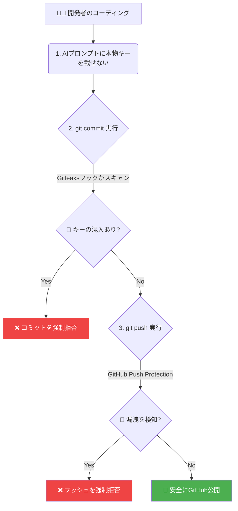

# 🔒 セキュリティガイドライン & 漏洩防止ガードレール

本ドキュメントは、P-School リポジトリをパブリック（OSS）として公開・運用するにあたり、APIキーやトークンなどの機密情報（Secrets）の漏洩を未然に防ぐためのセキュリティ方針と、開発環境へ導入すべき「自動ガードレール」の設定手順を定義したものです。

---

## 1. セキュリティ基本方針

Vibe Coding（AI主導の高速開発）では、AIによって機密情報が予期せずコード内にハードコードされるリスクが急増します。チーム全員が以下の原則を厳守してください。

### 🚨 3大原則
1.  **AIには「キーの型」を教え、「本物の値」は絶対に教えない。**
    - プロンプト内で直接本物のAPIキーを渡さない。常に環境変数（`process.env.XXX`）から読み込むコードを書かせる。
2.  **機密情報は `.env.local` のみで管理し、絶対にGit追跡対象に含めない。**
    - リポジトリにコミットして良いのは、キー名のみを記載した `env.local.template` や `.env.example` のみ。
3.  **「ローカルでのコミット前」および「GitHubへのプッシュ時」の2重ガードレールで検知を自動化する。**
    - 人間のコードレビューだけに頼らず、システムによって強制的にブロックする仕組みを導入する。

---

## 2. 🛡️ 3つのセキュリティガードレール導入手順

漏洩を水際で防ぐため、以下の自動検知・ブロック機能を導入します。



### ガードレール①：Gitleaks によるコミット前自動スキャン（Pre-commit）

ローカル環境で `git commit` コマンドを実行した瞬間に、コミットしようとしている差分にAPIキーが含まれていないかを自動スキャンし、検知した場合はコミットを強制キャンセルします。

#### 設定手順（各開発者のローカルで実行）

1.  **`pre-commit` フレームワークのインストール**:
    ```bash
    brew install pre-commit
    ```
2.  **設定ファイル `.pre-commit-config.yaml` の作成**:
    プロジェクトルートに以下のファイルを配置します。
    ```yaml
    repos:
      - repo: https://github.com/gitleaks/gitleaks
        rev: v8.18.2 # 最新の安定バージョンを指定
        hooks:
          - id: gitleaks
    ```
3.  **Gitフックの有効化**:
    ```bash
    pre-commit install
    ```
    *※これにより、次回以降の `git commit` 時に自動で Gitleaks スキャンが走り、キーが含まれているとコミットがブロックされます。*

---

### ガードレール②：GitHub Push Protection（プッシュ保護）の有効化

Gitleaksフックを回避してローカルでコミットされてしまった場合でも、GitHubへ `git push` するタイミングでGitHubのサーバーが検知し、プッシュを拒否します。

#### 設定手順（リポジトリ管理者）

1.  GitHub上のリポジトリを開き、**「Settings」**タブをクリック。
2.  左メニューの **「Security」** ➔ **「Code security and analysis」** を選択。
3.  **「Secret scanning」** を `Enabled` にする。
4.  その下にある **「Push protection」** の右側にある **「Enable」** ボタンをクリックして有効化する。

> [!IMPORTANT]
> **Push Protection が有効な場合**:
> 誤ってAPIキーを含んだコミットをプッシュしようとすると、ターミナル上にエラーメッセージが表示され、プッシュがブロックされます。開発者はローカルで履歴を修正（`git commit --amend` 等）するまでプッシュできません。

---

### ガードレール③：プロンプトエンジニアリングの徹底

AIアシスタントにコーディングを指示する際、プロンプトの最後に以下の制約を必ず付与します。

> [!TIP]
> **コピペ用：AIへの指示制約文テンプレート**
> ```text
> 【制約事項】
> - APIキー、アクセスキー、パスワードなどの認証情報は絶対にハードコードしないでください。
> - 機密情報はすべて `.env.local` から環境変数（process.env.XXXX）経由で読み込む実装にしてください。
> ```

---

## 3. プルリクエスト（PR）コードレビュー時のチェックリスト

PR統合時の人間の目によるレビューでは、以下の観点を確認してください。

*   [ ] 差分コード内に `figd_` (Figma), `AIzaSy` (Gemini/GCP), `eyJ` (JWT/Supabase) などの典型的なシークレットの文字列パターンが紛れ込んでいないか。
*   [ ] 新たに追加された設定用ファイル（`.env` やバックアップ用の `.bak` 等）が、誤ってコミット対象になっていないか（`.gitignore` に記述されているか）。
*   [ ] テスト用・デバッグ用として一時的に書き込んだ検証用キーが残ったままになっていないか。

---

## 🚨 万が一、機密情報をプッシュしてしまった場合の対応手順

自動ガードレールをすり抜け、万が一パブリックリポジトリにAPIキーが公開されてしまった場合は、**1秒でも早く**以下の手順を実施してください。

1.  **キーの無効化・失効（最優先）**:
    - 対象のサービス（Figma, Google Cloud, Supabase等）の管理画面にアクセスし、漏洩したキーを直ちに**削除・無効化**してください。
    - *※Gitの履歴から削除するよりも、キーそのものを失効させる方が圧倒的に早くて安全です。*
2.  **新キーの発行とローカル差し替え**:
    - 新しいキーを生成し、ローカルの `.env.local` のみを更新します。
3.  **履歴の抹消（必要に応じて）**:
    - コミット履歴からキーの文字列を完全に消去したい場合は、`git-filter-repo` を使って履歴の書き換えを行います。
