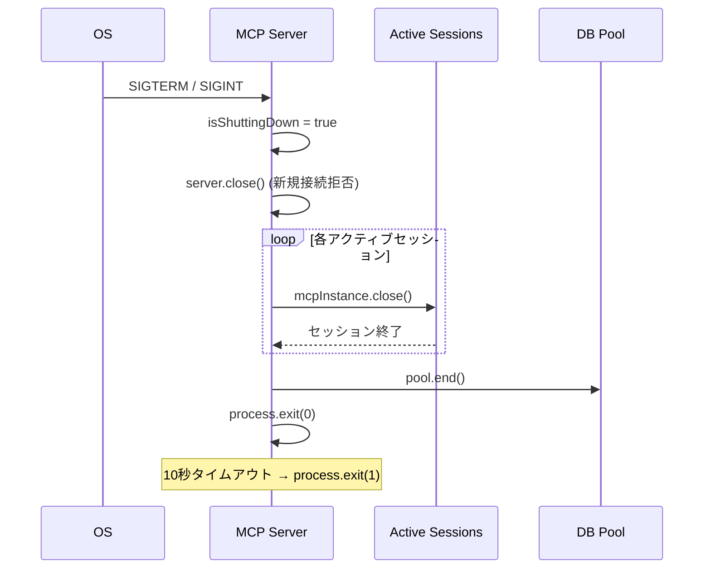

# Phase 10: MCP Server 運用強化仕様書

> Created: 2026-05-01
> Status: 仕様確定
> Depends on: Phase 9 (外部公開), Phase 8 (Rate Limit)

---

## 1. 概要

Phase 9 で MCP Server の外部公開基盤が整った。
本フェーズでは **運用に必要な P0/P1 機能** を実装し、本番稼働に耐える品質に引き上げる。

### 評価結果からの課題

| 優先 | 課題 | カテゴリ |
|------|------|----------|
| P0 | ヘルスチェックエンドポイントがない | 可用性 |
| P0 | Graceful shutdown 未実装 | 信頼性 |
| P1 | POST `/messages/:sessionId` に認証なし | セキュリティ |
| P1 | テストスイート未整備 | 品質保証 |
| P2 | index.js 564行 → モジュール分割 | 保守性 |
| P2 | CORS 設定なし | 拡張性 |

---

## 2. P0: ヘルスチェックエンドポイント

### 2.1 仕様

```
GET /health
```

| 項目 | 値 |
|------|-----|
| 認証 | 不要（公開エンドポイント） |
| Rate Limit | なし（監視ツール向け） |
| レスポンス | JSON |

### 2.2 レスポンス定義

#### 正常時 (200)

```json
{
  "status": "ok",
  "version": "2.0.0",
  "uptime_seconds": 3600,
  "active_sessions": 2,
  "db": "connected",
  "timestamp": "2026-05-01T12:00:00Z"
}
```

#### DB 異常時 (200 — degraded)

```json
{
  "status": "degraded",
  "version": "2.0.0",
  "uptime_seconds": 3600,
  "active_sessions": 0,
  "db": "disconnected",
  "db_error": "Connection refused",
  "timestamp": "2026-05-01T12:00:00Z"
}
```

> **設計判断**: DB 障害時も `200` を返す（サーバー自体は正常）。
> DB 非依存ツール（`get-generation-kit`, `validate-intake`）は引き続き動作する。
> 監視ツールは `status` フィールドで判別する。

### 2.3 実装場所

```
mcp-server/index.js
  └─ SSE モード: app.get('/health', ...)  ← mcpLimiter 適用外
```

### 2.4 DB チェック方法

```javascript
// 軽量クエリで接続確認 (1ms 以下)
const result = await pool.query('SELECT 1');
```

タイムアウト: 3秒。超過した場合は `"db": "timeout"` を返す。

---

## 3. P0: Graceful Shutdown

### 3.1 仕様

| シグナル | 動作 |
|---------|------|
| `SIGTERM` | 新規接続を拒否 → アクティブセッションを閉じる → プロセス終了 |
| `SIGINT` (Ctrl+C) | 同上 |
| タイムアウト | 10秒以内に全セッションが閉じない場合は強制終了 |

### 3.2 シャットダウンフロー



### 3.3 実装

```javascript
// シャットダウンフラグ
let isShuttingDown = false;

async function gracefulShutdown(signal) {
    if (isShuttingDown) return;
    isShuttingDown = true;
    console.error(`[MCP] ${signal} received. Shutting down...`);

    // 1. 新規接続拒否
    // SSE: /sse ハンドラで isShuttingDown チェック → 503 返却
    
    // 2. アクティブセッション閉じる
    const closePromises = [];
    for (const [id, session] of sessions) {
        closePromises.push(
            session.mcpInstance?.close().catch(() => {})
        );
    }
    await Promise.allSettled(closePromises);
    sessions.clear();
    
    // 3. DB プール閉じる
    const pool = getPool();
    if (pool) await pool.end().catch(() => {});
    
    // 4. Express サーバー閉じる
    if (httpServer) httpServer.close();
    
    console.error(`[MCP] Shutdown complete.`);
    process.exit(0);
}

// 10秒タイムアウト
setTimeout(() => {
    console.error('[MCP] Shutdown timeout. Forcing exit.');
    process.exit(1);
}, 10_000);

process.on('SIGTERM', () => gracefulShutdown('SIGTERM'));
process.on('SIGINT', () => gracefulShutdown('SIGINT'));
```

### 3.4 /sse での拒否

```javascript
app.get('/sse', async (req, res) => {
    if (isShuttingDown) {
        return res.status(503).json({ error: 'Server is shutting down' });
    }
    // ... 通常処理
});
```

---

## 4. P1: POST メッセージエンドポイントの認証強化

### 4.1 現状の問題

```
POST /messages/:sessionId   ← 認証チェックなし
```

`sessionId` は UUID v4（122ビットエントロピー）で推測困難だが、
ログに含まれる場合やネットワーク傍受時にリスクがある。

### 4.2 対策

SSE 接続時の Bearer Token を sessionData に保存し、POST 時に照合する。

```javascript
// SSE 接続時
const sessionData = { transport, userId, mcpInstance, token: extractBearerToken(req) };

// POST 時
app.post('/messages/:sessionId', mcpLimiter, async (req, res) => {
    const session = sessions.get(req.params.sessionId);
    if (!session) return res.status(404).json({ error: 'Session not found' });
    
    // Bearer Token 照合（SSE で使ったトークンと同一か）
    const postToken = extractBearerToken(req);
    if (session.token && postToken !== session.token) {
        return res.status(403).json({ error: 'Token mismatch' });
    }
    
    await session.transport.handlePostMessage(req, res);
});
```

> **注意**: ChatGPT の MCP クライアント実装が POST に Bearer Token を
> 送信するかは要検証。送信しない場合はこのチェックをスキップする。

---

## 5. P1: テストスイート

### 5.1 テスト対象

| テスト | 種別 | 対象 |
|--------|------|------|
| MCP プロトコルテスト | E2E | SSE 接続 → initialize → tools/list → tool call |
| 認証テスト | Unit | resolveUserId の 4段階 |
| ツール単体テスト | Unit | tools/core/*.js の各関数 |
| Rate Limit テスト | E2E | 31回目で 429 が返るか |
| Health チェックテスト | E2E | /health レスポンス検証 |

### 5.2 テストランナー

Node.js 組み込み `node --test` を使用（既存の `server/tests/*.test.js` と統一）。

```bash
# 全テスト
npm test

# MCP テストのみ
node --test mcp-server/tests/*.test.js
```

### 5.3 ファイル構成

```
mcp-server/
  tests/
    health.test.js        ← P0
    protocol.test.js      ← P1
    auth.test.js           ← P1
tools/core/
  tests/
    learnerState.test.js  ← P1
    ragSearch.test.js     ← P2
```

---

## 6. P2: モジュール分割

### 6.1 現在の構造

```
mcp-server/index.js  (564行 — 全機能が1ファイル)
```

### 6.2 分割案

```
mcp-server/
  index.js           ← エントリポイント (50行)
  server.js          ← createMcpServer() + ツール定義 (300行)
  sse.js             ← Express SSE transport + 認証 (150行)
  health.js           ← ヘルスチェック (30行)
  shutdown.js         ← Graceful shutdown (30行)
```

### 6.3 判断基準

> 分割は P0/P1 が完了してから実施する。
> 機能追加中にモジュール分割すると diff が大きくなり、レビューが困難になるため。

---

## 7. P2: CORS 設定

### 7.1 必要なケース

ブラウザベースの MCP クライアント（将来の Web UI 等）から
直接 SSE/POST に接続する場合に必要。

### 7.2 設定

```javascript
import cors from 'cors';

app.use(cors({
    origin: process.env.CORS_ORIGIN || '*',
    methods: ['GET', 'POST'],
    allowedHeaders: ['Content-Type', 'Authorization', 'x-nexloom-bridge-token'],
    credentials: true,
}));
```

> **現時点では不要**: ChatGPT/Claude/Cursor はサーバーサイドからSSE接続するため
> CORS は関係ない。将来ブラウザクライアントを追加する際に実装する。

---

## 8. タスク一覧

| # | タスク | 優先 | 工数 | 依存 |
|---|--------|------|------|------|
| 10-1 | `GET /health` エンドポイント | P0 | 15min | — |
| 10-2 | Graceful shutdown (SIGTERM/SIGINT) | P0 | 15min | — |
| 10-3 | `/sse` シャットダウン拒否 (503) | P0 | 5min | 10-2 |
| 10-4 | POST `/messages` Bearer Token 照合 | P1 | 20min | — |
| 10-5 | health.test.js | P1 | 15min | 10-1 |
| 10-6 | protocol.test.js (E2E) | P1 | 30min | 10-1 |
| 10-7 | モジュール分割 | P2 | 45min | 10-1〜10-4 |
| 10-8 | CORS 設定 | P2 | 5min | — |

**合計: P0 = 35min, P1 = 65min, P2 = 50min → 計 2.5時間**

---

## 9. 完了条件

- [ ] `GET /health` が DB 状態を正しく返す
- [ ] `SIGTERM` で全セッションが安全に閉じる
- [ ] POST に不正トークンで 403 が返る
- [ ] `npm test` でヘルスチェック・プロトコルテストが通る
- [ ] `implementation_progress.md` の Phase 10 セクションが更新される
