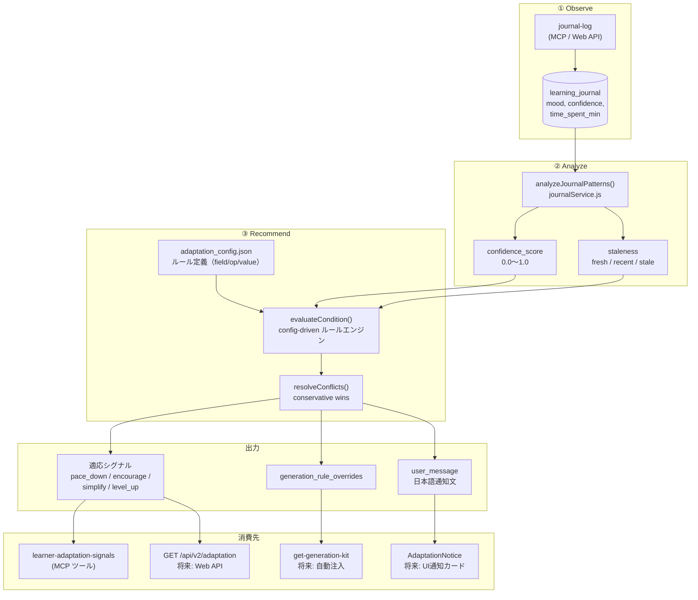

# Phase 12: 学習フィードバック動的適応

> ステータス: Stage 1 実装済み
> 優先度: P1
> 最終更新: 2026-05-01

---

## 1. 背景と課題

### 現状: 初期設定型パーソナライゼーション

```
Big5 診断 → 9軸プロファイル → カリキュラム生成 → レッスン配信
                                                       ↓
                                                 ジャーナル記録
                                                       ↓
                                                 （保存されるだけ）
```

Big5 から9軸への変換は実装済みだが、**学習中のフィードバックが次の体験に反映されない。**

- struggled が連続しても次のレッスンは同じ難易度
- confidence が下がり続けても励ましが増えない
- 得意な領域でもペースが変わらない

### 目標: 適応型パーソナライゼーション

```
Big5 診断 → 9軸プロファイル → カリキュラム生成 → レッスン配信
     ↑                            ↑                  ↓
     │                            │            ジャーナル記録
     │                            │                  ↓
     │                     rule_overrides ← ジャーナル分析
     │                                        ↓
     └──── 明示的再診断のみ          適応シグナル → UI通知
```

---

## 2. 将来ビジョン: 5層フィードバックループ

最終形は以下の閉ループ。ただし **Stage 1 では ①②③ のみ実装。**
④⑤ はユーザーデータが蓄積してから着手する。

```
┌─────────────────────────────────────────────────────────────┐
│                                                             │
│  ① Observe   ジャーナル記録（実装済み）                       │
│       ↓                                                     │
│  ② Analyze   パターン分析 + 信頼度 + 鮮度（Stage 1）         │
│       ↓                                                     │
│  ③ Recommend シグナル生成 + config-driven ルール（Stage 1）   │
│       ↓                                                     │
│  ④ Apply     Kit注入 / AI Coach / UI通知（Stage 2-3）        │
│       ↓                                                     │
│  ⑤ Verify    適応後の効果測定（Stage 3 / N≥10 後）           │
│       │                                                     │
│       └──→ ② に戻る                                         │
│                                                             │
└─────────────────────────────────────────────────────────────┘
```

> **設計判断**: Verify ループ (⑤) は因果推論が困難（N が小さい、交絡因子多い）。
> ユーザーのジャーナルデータが N≥10 を超えるまで実装しない。

---

## 3. アーキテクチャ



---

## 4. Layer 1: ジャーナル分析

### `analyzeJournalPatterns(entries, options)`

**ファイル**: `server/services/journalService.js`

| 入力 | 型 | 説明 |
|------|:---:|------|
| `entries` | Array | ジャーナルエントリ（新しい順） |
| `options.module_id` | string? | モジュール単位フィルタ |
| `options.window` | number? | 分析対象件数（デフォルト: 10） |

| 出力フィールド | 型 | 説明 |
|------------|:---:|------|
| `struggled_streak` | number | 先頭からの struggled 連続数 |
| `low_confidence_streak` | number | 先頭からの confidence≤2 連続数 |
| `mood_distribution` | object | `{ great: N, good: N, okay: N, struggled: N }` |
| `mood_great_good_pct` | number | great+good の割合 (0.0〜1.0) |
| `avg_confidence` | number? | confidence 平均値 |
| `avg_time_spent_min` | number? | 所要時間平均値 |
| `confidence_trend` | string | `increasing` / `stable` / `declining` / `insufficient` |
| `time_trend` | string | 同上 |
| `lessons_without_learned` | number | 「学んだこと」未記入の連続数 |
| `confidence_score` | number | 分析の信頼度 (0.0〜1.0) |
| `staleness` | string | データ鮮度: `fresh` / `recent` / `stale` |

#### 信頼度スコア算出

```
entries >= 10  → 1.0
entries 6-9   → 0.7
entries 3-5   → 0.4
entries < 3   → insufficient_data
```

#### 鮮度 (staleness) 算出

```
最新エントリが 3日以内  → 'fresh'
最新エントリが 7日以内  → 'recent'
最新エントリが 7日超    → 'stale'
```

#### トレンド判定

```
entries >= 6  → 精密判定（直近3件平均 vs 次の3件平均）
entries 3-5  → 簡易判定（最新値 vs 最古値）
entries < 3  → 'insufficient'

差分 < 0.3 → 'stable'
差分 > 0   → 'increasing'
差分 < 0   → 'declining'
```

---

## 5. Layer 2: Config-driven ルールエンジン

### 設計原則

- **ルール定義は JSON のみ** — 新ルール追加にコード変更不要
- **評価ロジックは汎用** — `evaluateCondition(cond, patterns)` が全ルールを処理
- **AND 論理** — 1ルール内の全条件を満たした場合のみ発火

### adaptation_config.json

```json
{
  "version": "2026-05-01-v2",
  "min_entries_for_analysis": 3,
  "rules": [
    {
      "id": "pace_down",
      "conditions": [
        { "field": "struggled_streak", "op": ">=", "value": 2 }
      ],
      "priority": "high",
      "group": "conservative",
      "overrides": { "pace_preference": "steady_small_steps" },
      "user_message": "最近少し難しく感じているようですね。ペースを少しゆっくりにしました。"
    },
    {
      "id": "encourage",
      "conditions": [
        { "field": "avg_confidence", "op": "<", "value": 2.5 }
      ],
      "priority": "high",
      "group": "conservative",
      "overrides": { "reassurance_need": "high", "feedback_style": "coach_gentle" },
      "user_message": "自信がつくまで、もう少し丁寧に進めましょう。"
    },
    {
      "id": "review_needed",
      "conditions": [
        { "field": "confidence_trend", "op": "==", "value": "declining" },
        { "field": "total_entries", "op": ">=", "value": 5 }
      ],
      "priority": "medium",
      "group": "conservative",
      "overrides": { "practice_intensity": "light" },
      "user_message": "前のレッスンの復習を挟むといいかもしれません。"
    },
    {
      "id": "simplify",
      "conditions": [
        { "field": "time_trend", "op": "==", "value": "increasing" },
        { "field": "avg_time_spent_min", "op": ">", "value": 45 }
      ],
      "priority": "medium",
      "group": "conservative",
      "overrides": {},
      "user_message": "1回の学習が長くなっています。小さく区切って進めましょう。"
    },
    {
      "id": "engagement_drop",
      "conditions": [
        { "field": "lessons_without_learned", "op": ">=", "value": 3 }
      ],
      "priority": "low",
      "group": "neutral",
      "overrides": {},
      "user_message": "振り返りを書くと、学びが定着しやすくなりますよ。"
    },
    {
      "id": "level_up",
      "conditions": [
        { "field": "mood_great_good_pct", "op": ">", "value": 0.8 },
        { "field": "avg_confidence", "op": ">", "value": 4 }
      ],
      "priority": "medium",
      "group": "progressive",
      "overrides": { "structure_need": "low", "practice_intensity": "heavy" },
      "user_message": "順調です！少しチャレンジングな内容に進みましょう。"
    }
  ],
  "conflict_resolution": "conservative_wins"
}
```

### evaluateCondition

```javascript
// 対応演算子: ==, !=, <, >, <=, >=
// null 安全: actual が null の場合は != null 以外すべて false
function evaluateCondition(cond, patterns) {
    const actual = patterns[cond.field];
    if (actual === null || actual === undefined) {
        return cond.op === '!=' && cond.value === null;
    }
    switch (cond.op) {
        case '==': return actual === cond.value;
        case '!=': return actual !== cond.value;
        case '<':  return actual < cond.value;
        case '>':  return actual > cond.value;
        case '<=': return actual <= cond.value;
        case '>=': return actual >= cond.value;
        default: return false;
    }
}
```

### 競合解決

```
group: conservative（pace_down, encourage, review_needed, simplify）
group: progressive （level_up）
group: neutral     （engagement_drop）

conservative と progressive が同時発火 → progressive を除去
```

### シグナルのフィルタ

```
staleness == 'stale' → シグナルを全て抑制（user_message で「久しぶりですね」のみ返す）
confidence_score < rule.min_confidence → そのルールをスキップ（将来拡張用）
```

---

## 6. 出力構造

```javascript
{
  signals: [
    {
      type: 'pace_down',
      reason: 'struggled_streak >= 2 (actual: 3)',
      priority: 'high',
      confidence: 0.7,
      user_message: '最近少し難しく感じているようですね。...',
    }
  ],
  generation_rule_overrides: {
    pace_preference: 'steady_small_steps',
  },
  analysis: {
    based_on: 10,
    period_days: 14,
    module_id: null,
    confidence_score: 0.7,
    staleness: 'fresh',
    analyzed_at: '2026-05-01T03:00:00Z',
  },
  next_review_after: 5,
}
```

---

## 7. MCP ツール

### `learner-adaptation-signals`

| 項目 | 値 |
|------|-----|
| category | personalization_read |
| risk | read |
| exposure_profiles | learner, coach, admin |
| readOnlyHint | true |

| 引数 | 型 | 必須 | 説明 |
|------|:---:|:---:|------|
| user_id | string | No | SSEモードでは自動解決 |
| curriculum_id | string | No | 省略時は全カリキュラム |
| module_id | string | No | 省略時は全モジュール |

---

## 8. AI コーチへのトーン指示

MCP 経由で AI コーチが `learner-adaptation-signals` を呼び、プロンプトに反映。

```
現在の学習者の状態:
- 適応シグナル: pace_down (confidence: 0.7)
- 推奨トーン: coach_gentle
- 注意: struggled が2連続。
  説明を丁寧にし、小さなステップで進めてください。
  正解したら明確に称賛してください。
```

---

## 9. 実装ステージ

### Stage 1: 実装済み ✅

| ファイル | 内容 | 状態 |
|---------|------|:---:|
| `adaptation_config.json` | ルール定義（field/op/value） | ✅ |
| `journalService.js` | `analyzeJournalPatterns()` | ✅ |
| `personalizationDeriver.js` | `deriveAdaptationSignals()` + ルールエンジン | ✅ |
| `tools/core/journal.js` | `getAdaptationSignals()` | ✅ |
| `mcp-server/index.js` | `learner-adaptation-signals` ツール | ✅ |
| `tool-registry.json` | ツールメタデータ（10ツール） | ✅ |

**Stage 1 追加修正** (confidence_score + staleness):

| ファイル | 変更 |
|---------|------|
| `journalService.js` | `analyzeJournalPatterns` に `confidence_score`, `staleness` 追加 |
| `personalizationDeriver.js` | stale 時のシグナル抑制、シグナルに confidence 継承 |
| `adaptation_config.json` | encourage の冗長条件削除 |

### Stage 2: ユーザーデータ N≥10 後

| 項目 | 内容 |
|------|------|
| `adaptation_signals` テーブル | シグナル履歴の永続化 |
| ユーザー override | `POST /adaptation/dismiss` + cooldown |
| Web API | `GET /api/v2/adaptation` |
| Kit 自動注入 | `get-generation-kit` にシグナル付加 |

### Stage 3: レッスン配信稼働後

| 項目 | 内容 |
|------|------|
| Verify ループ | 適応後の効果測定（因果推論の限界に注意） |
| AdaptationNotice UI | フロントエンド通知カード |
| AI Coach 連携 | プロンプト自動注入 |

---

## 10. 変更しないもの

| 項目 | 理由 |
|------|------|
| Big5 プロファイルの自動更新 | ジャーナルでは Big5 を変えるべきでない。明示的な再診断で行う |
| カリキュラム JSON の自動変更 | 既存カリキュラムを壊すリスク。シグナルとして「次回」に反映 |
| LLM による分析 | 決定論的ルールが予測可能・デバッグ可能・コスト0 |
| Verify ループ（現時点） | N が小さく因果推論が困難。データ蓄積後に着手 |
