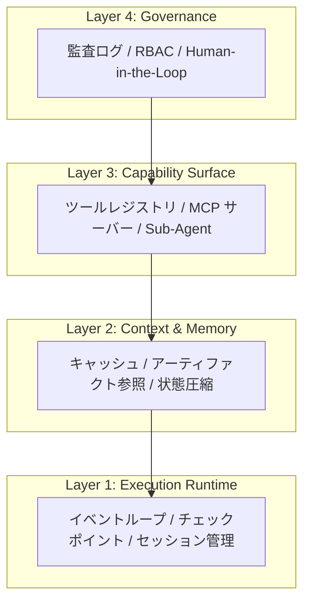
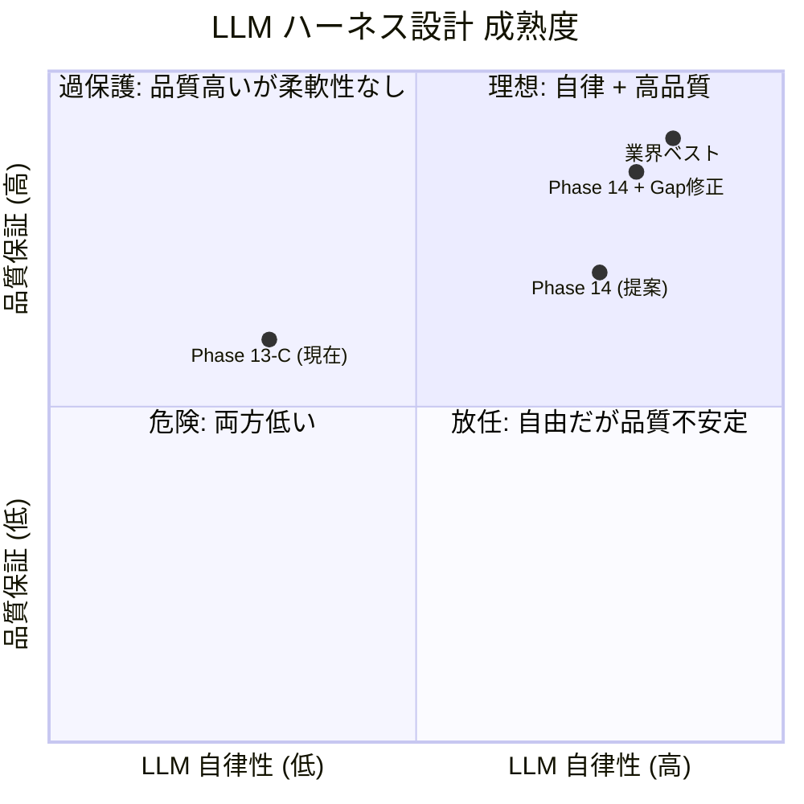

# LLM ハーネス設計 リサーチ分析 & Phase 14 仕様評価

## 1. リサーチソース

| # | テーマ | 主要ソース |
|---|--------|-----------|
| 1 | エージェント・オーケストレーション設計 | Tungsten Automation, GitHub (Claude Code), CodeAnt AI |
| 2 | MCP ツール設計原則 | Anthropic公式, Speakeasy, modelcontextprotocol.info |
| 3 | ReAct + 反復改善 | arXiv (VGCO, IMPROVE, ToolACE-R, CoTools) |
| 4 | 品質バリデーション・フィードバックループ | ByteByteGo, DeepLearning.AI, Towards Data Science |
| 5 | エージェント自律性 vs 制御 | Gravitee, IBM, getknit.dev |
| 6 | MCP エージェント・エルゴノミクス | Anthropic, philschmid.de, Speakeasy |

---

## 2. 業界トレンド分析 (2025-2026)

### 2.1 ハーネス4層アーキテクチャ

2026年のコンセンサスとして、エージェント・ハーネスは以下の4層で構成される：



**Rise Path の現状**: Layer 1 (JobWorker), Layer 3 (MCP tools), Layer 4 (policy.js + audit) は実装済み。**Layer 2 (Context & Memory)** が弱い。

---

### 2.2 核心原則: 8つの設計パターン

リサーチから抽出した、2025-2026年のLLMハーネス設計における8つの核心原則：

| # | 原則 | 出典 | 概要 |
|---|------|------|------|
| **P1** | Small, Focused Actions | Claude Code, IMPROVE | タスクを最小の離散ステップに分割。1回の巨大タスクより、小さく予測可能なステップのチェーン |
| **P2** | Meaningful Feedback Loops | DeepLearning.AI, Anthropic | ツールは構造化された実行可能な結果を返す。失敗時は「何が・なぜ」をエージェントに通知 |
| **P3** | Outcomes Over Operations | Speakeasy, Anthropic | REST API の1:1マッピングではなく、エージェントの「目標」に合わせたツール設計 |
| **P4** | Agent-First Ergonomics | Anthropic MCP ガイド | ツール名は明確で一貫性あり。パラメータはフラットに。レスポンスは簡潔に |
| **P5** | Reflection / Self-Correction | ToolACE-R, VGCO | エージェントが自身の出力を評価し、フィードバックに基づいて修正するループ |
| **P6** | Context Efficiency | Claude Code, philschmid | コンテキストウィンドウの膨張を防ぐ。大きな出力はアーティファクトに外部化 |
| **P7** | Deterministic Guardrails | 業界コンセンサス | 安全性・ポリシー・バリデーションはプロンプトではなくランタイムで実装 |
| **P8** | Discoverability | Anthropic, MCP仕様 | エージェントがツールを動的に発見できる。全ツールを一度にロードしない |

---

### 2.3 反復改善の最新研究

| 論文/手法 | 年 | 核心アイデア | Phase 14 への示唆 |
|-----------|:---:|------------|-----------------|
| **VGCO** (arXiv 2025) | 2025 | LLM-as-Editor: ツール文書を反復的に改善し精度向上 | Kit の `generation_hints` を品質結果に基づき動的に更新 |
| **IMPROVE** (arXiv 2025) | 2025 | マルチエージェントが個々のパイプラインコンポーネントを自律最適化 | モジュール単位生成は「コンポーネント単位最適化」と同じ思想 |
| **ToolACE-R** (arXiv 2025) | 2025 | Self-refinement + 停止判断の自律化 | LLM が品質十分と判断したら修正ループを自分で終了 |
| **Toolscaler** (ACL 2025) | 2025 | 構造認識トークン化で大規模ツール使用を効率化 | ツール数が増えた場合の Context 効率化戦略 |

---

## 3. Phase 14 仕様の評価

### 3.1 スコアカード

| 原則 | Phase 14 の対応 | スコア | 根拠 |
|------|----------------|:---:|------|
| **P1** Small Actions | `save-module-draft` でモジュール単位分割 | ⭐⭐⭐⭐⭐ | **業界ベストプラクティスに完全合致**。一括生成→分割生成は最も推奨されるパターン |
| **P2** Feedback Loops | `quality_warnings` + `hint` を返却 | ⭐⭐⭐⭐ | 良い。ただし **修正ループの上限** が未定義 |
| **P3** Outcomes over Ops | `research-topic` が RAG+Web を統合 | ⭐⭐⭐⭐⭐ | エージェントの「調べたい」という目標に1ツールで対応 |
| **P4** Agent Ergonomics | `generation_hints` で提案型ガイダンス | ⭐⭐⭐⭐ | 良い。ただし **ツール名の一貫性** に改善余地あり |
| **P5** Self-Correction | LLM が warnings を見て修正→再保存 | ⭐⭐⭐ | 仕組みは整っているが **品質スコアの定義** が曖昧 |
| **P6** Context Efficiency | モジュール分割で Context 節約 | ⭐⭐⭐⭐ | 良い。ただし `get-generation-kit` のレスポンスが 541行 (14KB) と大きい |
| **P7** Guardrails | `max_calls_per_session`, バリデーション | ⭐⭐⭐⭐⭐ | policy.js + tool-registry.json の既存基盤が堅固 |
| **P8** Discoverability | `recommended_flow` ヒント | ⭐⭐⭐ | ツール数が増えるなら On-Demand Discovery が必要 |

**総合: 33/40 (82.5%)** — 業界水準を上回る設計。改善の余地は4点。

---

### 3.2 ✅ 優れている点 (5件)

#### 1. 「ハーネス ≠ レール」の哲学

```
仕様: "コードは安全網だけ提供。順序はLLMが決める"
業界: "Small, focused actions" + "Outcomes over operations"
```

**評価**: Phase 14 の核心思想は **2026年の業界コンセンサスと完全一致**。Anthropic の MCP 設計原則「Outcomes Over Operations」をそのまま体現している。

#### 2. モジュール単位生成 (`save-module-draft`)

IMPROVE 論文 (2025) の「コンポーネント単位最適化」と同じアプローチ。トークン限界の回避だけでなく、**品質フィードバックの粒度向上** にも寄与。

#### 3. `research-topic` の RAG+Web 統合

Anthropic の原則 "Curate ruthlessly — 5-15 focused tools" に従い、RAG と Web を **1ツール** に統合した設計は正しい。

#### 4. `generation_hints` の提案型ガイダンス

Kit レスポンスに `recommended_flow` を含めつつ「これはヒントです」と明記。LLM の自律性を尊重しながらガイドする、**Agentic 設計の理想形**。

#### 5. 既存 `save-curriculum-draft` との後方互換性

破壊的変更なしで新ツールを追加。小規模カリキュラムは一括保存、大規模はモジュール分割、とLLMが選択可能。

---

### 3.3 🔶 改善が必要な点 (4件)

#### Gap 1: 品質スコアの定量化が不足 🟡

**問題**: `quality_score: 0.85` が仕様にあるが、算出ロジックが未定義。

**業界参照**: ToolACE-R の「自律的停止判断」には、明確な品質メトリクスが必要。

**改善案**:
```json
{
  "quality_score": 0.85,
  "quality_breakdown": {
    "explanation_depth": 0.7,   // 文字数 / 最低文字数
    "practice_coverage": 1.0,   // practice数 / 最低数
    "caution_presence": 1.0,    // cautions有無
    "key_points_depth": 0.8     // key_points数 / 最低数
  },
  "pass_threshold": 0.75,
  "auto_accept": true           // LLMが修正するか判断する材料
}
```

> LLM は `auto_accept: true` を見て「修正不要」と判断できる。`false` なら修正ループに入る。

---

#### Gap 2: 修正ループの発散防止策がない 🟡

**問題**: LLM が品質警告を受けて修正→再度警告→また修正…の無限ループに入る可能性。

**業界参照**: ToolACE-R は「自己精製の停止判断」を学習モデルに委ねつつ、テストタイム計算量を最適化。

**改善案**:
```json
// save-module-draft のレスポンスに追加
{
  "revision_count": 2,           // この module の保存回数
  "max_revisions": 5,            // 上限
  "recommendation": "accept"     // "accept" | "revise" | "escalate"
}
```

> `revision_count >= max_revisions` の場合、ツールが `recommendation: "escalate"` を返し、LLM に「ユーザーに相談してください」と促す。

---

#### Gap 3: `get-generation-kit` のレスポンスが大きすぎる 🟡

**問題**: Kit が 541行 (14KB) あり、LLM のコンテキストを圧迫。

**業界参照**: Anthropic "Context Efficiency" — 大きなデータはアーティファクト化し、コンテキストには要約のみ。

**改善案**: Kit レスポンスに `compact_mode: true` オプションを追加。

```json
// compact_mode: true の場合
{
  "quality_minimums": { "explanation_min_chars": 220, ... },
  "required_slots": ["goal", "target_audience", ...],
  "lesson_template_fields": ["title", "objective", "explanation", ...],
  "generation_hints": {...},
  "full_kit_url": "/api/v2/generation-kit/general?full=true"
}
```

> 初回は compact で取得。LLM が詳細が必要と判断した場合のみフル版を取得。

---

#### Gap 4: `research-topic` の Web 検索の実装詳細が不足 🟡

**問題**: "Web 検索 API を呼ぶ" とあるが、具体的にどの API を使うか、フォールバック戦略が未定義。

**業界参照**: Enterprise Gateway パターンでは、複数検索ソースのフォールバックとコスト最適化が必須。

**改善案**:
```
Web 検索の実装戦略:
1. MCP クライアント側 (Claude/ChatGPT) が web_search ツールを持つ場合
   → research-topic は RAG 結果 + "web_search_suggested: true" を返す
   → LLM が自分の web_search ツールを呼ぶ（MCP サーバーは Web 検索しない）

2. MCP サーバー側で検索する場合
   → Google Custom Search API / Brave Search API
   → 日次100件の無料枠を活用
```

> **推奨**: 選択肢1。MCP サーバーは「Web 検索が有用そう」とヒントを出すだけで、実際の検索は LLM クライアントに委ねる。これが「ハーネス設計」の思想と一致。

---

## 4. 最終評価

### Phase 14 仕様の位置づけ



### まとめ

| 観点 | 評価 |
|------|------|
| **設計哲学** | ⭐⭐⭐⭐⭐ — 業界のベストプラクティスと完全合致 |
| **ツール設計** | ⭐⭐⭐⭐ — 3新ツールは適切。命名と粒度が良い |
| **品質保証** | ⭐⭐⭐ — スコア定量化と発散防止が必要 |
| **Context効率** | ⭐⭐⭐ — Kit の圧縮モードが必要 |
| **実装可能性** | ⭐⭐⭐⭐⭐ — 既存基盤 (policy.js, curriculum.js) を活用可能 |

### 推奨アクション

1. **Gap 1 (品質スコア)** と **Gap 2 (発散防止)** を仕様に追加 → `save-module-draft` のレスポンス仕様を拡張
2. **Gap 3 (Kit 圧縮)** → `get-generation-kit` に `compact_mode` を追加
3. **Gap 4 (Web 検索)** → `research-topic` は RAG + ヒント型に変更。Web 検索はクライアント側に委譲
4. Gap 修正後に実装フェーズへ移行
