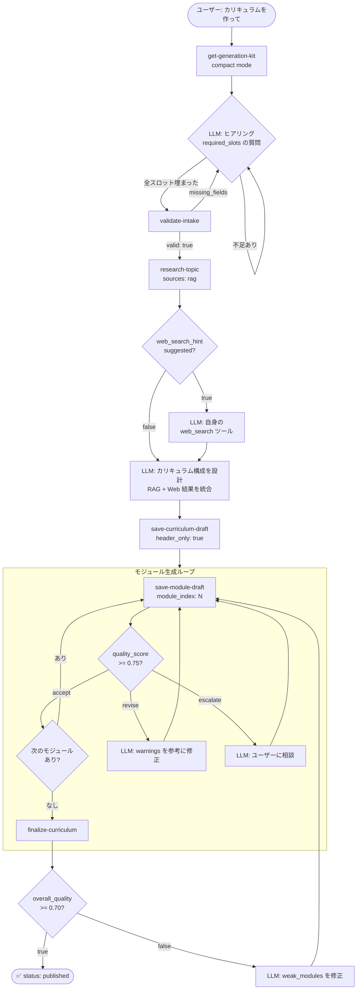

# Phase 14: MCP カリキュラム生成ハーネス設計仕様

> Version: 1.1 (2026-05-01) — 評価フィードバック反映版
> Status: Draft
> 前提: Phase 13-C (AI Chat 復活), Phase 11-12 (MCP/Policy/Personalization)

---

## 1. 概要

### 1.1 背景

現在の MCP カリキュラム生成は以下の課題がある:

| 課題 | 影響 |
|------|------|
| 一括生成でトークン上限に到達 | 5モジュール以上のカリキュラムが生成不可 |
| 品質最低基準 (explanation 220文字等) を LLM が守れない | `quality_warnings` 大量発生 |
| Web 検索なしで生成 | 最新トレンドが反映されない |
| RAG 検索が自動実行 (LLM が制御不能) | 不要な検索コスト、または必要な検索の欠落 |

### 1.2 設計哲学

```
ハーネス設計 = 安全網 + フィードバック装置 + 自由度
```

- **コード**は「何ができるか」と「品質基準」を宣言するだけ
- **LLM** が「どの順序で」「何回」ツールを使うかを決める
- **バリデーション**はランタイムで実行 (プロンプト依存しない)

業界根拠: Anthropic MCP "Outcomes Over Operations", IMPROVE (arXiv 2025), ToolACE-R (arXiv 2025)

---

## 2. アーキテクチャ

### 2.1 全体像

```
┌─────────────────────────────────────────────────────────┐
│                    LLM クライアント                       │
│               (Claude / ChatGPT / Cursor)                │
│                                                         │
│  ┌──────────┐  ┌──────────┐  ┌────────────────────────┐ │
│  │ ヒアリング │→│ 調査判断  │→│ 生成 (モジュール単位)    │ │
│  │ (対話)    │  │ (RAG/Web) │  │ → 品質チェック → 修正   │ │
│  └──────────┘  └──────────┘  └────────────────────────┘ │
│       │              │                    │               │
│       │   web_search  │                    │               │
│       │   (LLM自身)   │                    │               │
└───────┼──────────────┼────────────────────┼───────────────┘
        │ MCP          │ MCP               │ MCP
        ▼              ▼                    ▼
┌─────────────────────────────────────────────────────────┐
│               Rise Path MCP Server                       │
│                                                         │
│  ┌─────────────────────────────────────────────────────┐ │
│  │ Layer 4: Governance                                 │ │
│  │  policy.js — レート制限 / RBAC / 監査ログ             │ │
│  └─────────────────────────────────────────────────────┘ │
│  ┌─────────────────────────────────────────────────────┐ │
│  │ Layer 3: Capability Surface (ツール群)                │ │
│  │                                                     │ │
│  │  [読み取り]                                          │ │
│  │  ├── get-generation-kit   (Kit + hints)              │ │
│  │  ├── validate-intake      (要件検証)                  │ │
│  │  ├── research-topic ★NEW  (RAG + Web hint)           │ │
│  │  ├── rag-search           (ベクトル検索)               │ │
│  │  └── learner-state-get    (進捗確認)                  │ │
│  │                                                     │ │
│  │  [書き込み]                                          │ │
│  │  ├── save-curriculum-draft (ヘッダー / 一括保存)       │ │
│  │  ├── save-module-draft ★NEW (モジュール単位保存)       │ │
│  │  └── finalize-curriculum ★NEW (結合 + 公開)           │ │
│  └─────────────────────────────────────────────────────┘ │
│  ┌─────────────────────────────────────────────────────┐ │
│  │ Layer 2: Context & Memory                           │ │
│  │  Kit Cache (5min TTL) / learner_profiles / curricula │ │
│  └─────────────────────────────────────────────────────┘ │
│  ┌─────────────────────────────────────────────────────┐ │
│  │ Layer 1: Execution Runtime                          │ │
│  │  Express + SSE / stdio / Session管理 / DB Pool       │ │
│  └─────────────────────────────────────────────────────┘ │
└─────────────────────────────────────────────────────────┘
        │
        ▼
┌─────────────────────┐
│   PostgreSQL (Supabase)  │
│   curricula / material_chunks / learner_profiles │
└─────────────────────┘
```

### 2.2 MCP 経由 vs Web UI 経由

```
                MCP 経由                          Web UI 経由
             (Claude/ChatGPT)                 (CourseGeneratorView)
            ──────────────                    ────────────────────

Step 1   LLM がユーザーにヒアリング            ユーザーが1行入力
         (Kit の required_slots に基づく)
              │                                      │
Step 2   research-topic (RAG + Web hint)      ragService (内部自動)
         + LLM の web_search                         │
              │                                      │
Step 3   validate-intake                      POST /ai/generate (stage=requirements)
              │                                      │
Step 4   save-curriculum-draft (header_only)   POST /ai/generate (stage=roadmap)
              │                                      │
Step 5   save-module-draft × N                POST /ai/generate (stage=curriculum)
         (品質チェック + 修正ループ)                    │
              │                                      │
Step 6   finalize-curriculum                  curricula status → published
              │                                      │
         ✅ 公開                               ✅ 公開
```

### 2.3 カリキュラム生成フロー (MCP 経由・詳細)



---

## 3. 新規ツール仕様

### 3.1 `research-topic`

RAG 検索を実行し、Web 検索の必要性を判断してヒントを返す。

```
Category: content_read | Risk: read | Rate: 10/session
```

**入力**:
| パラメータ | 型 | 必須 | 説明 |
|-----------|:--:|:---:|------|
| query | string | ✅ | 検索クエリ |
| sources | string[] | - | `["rag"]` (デフォルト) |
| max_results | number | - | 最大結果数 (デフォルト: 5) |

**出力**:
```json
{
  "rag_results": [
    { "title": "...", "content": "...", "relevance_score": 0.82, "source_id": "..." }
  ],
  "rag_count": 3,
  "web_search_hint": {
    "suggested": true,
    "reason": "RAG に 2026年の最新情報がありません",
    "suggested_queries": ["Blender 4.x new features 2026"]
  },
  "context_summary": "RAG: 3件の教材を発見。最新バージョン情報は不足。"
}
```

**Web ヒント判定ロジック**:
```javascript
function shouldSuggestWebSearch(ragResults, query) {
  // 1. RAG 結果が 0 件 → Web 検索を強く推奨
  if (ragResults.length === 0) return { suggested: true, reason: 'RAG に関連資料がありません' };
  // 2. クエリに年号/トレンド系キーワード → Web 推奨
  if (/202[4-9]|トレンド|最新|new|latest/i.test(query))
    return { suggested: true, reason: '最新情報はWebで検索するのが効果的です' };
  // 3. RAG の relevance が全体的に低い → Web 推奨
  const avgRelevance = ragResults.reduce((s, r) => s + r.relevance_score, 0) / ragResults.length;
  if (avgRelevance < 0.5) return { suggested: true, reason: 'RAG の関連度が低いです' };
  // 4. 十分な RAG 結果 → Web 不要
  return { suggested: false };
}
```

---

### 3.2 `save-module-draft`

1モジュール分のデータを保存し、品質スコアを返却。

```
Category: curriculum_write | Risk: write | Rate: 30/session | Audit: true
```

**入力**:
| パラメータ | 型 | 必須 | 説明 |
|-----------|:--:|:---:|------|
| curriculum_id | string | ✅ | 対象カリキュラムID |
| module_index | number | ✅ | 0-indexed。**前のインデックスが存在すること** (連続性チェック) |
| module | object | ✅ | モジュールデータ (title, goal, lessons[]) |

**セキュリティ**: `curriculum_id` の所有権を `user_id` で検証。他ユーザーのカリキュラムは操作不可。

**module_index 連続性チェック**:
```javascript
// module_index は 0 から連続でなければならない
// index=0 は常に OK。index=2 は index 0,1 が存在する場合のみ OK。
const existing = currentModules?.length || 0;
if (module_index > existing) {
  return { error: `module_index ${module_index} is out of range (current modules: ${existing})` };
}
```

**出力**:
```json
{
  "saved": true,
  "module_index": 0,
  "lesson_count": 3,
  "quality_score": 0.85,
  "quality_breakdown": {
    "explanation_depth": 0.78,
    "practice_coverage": 1.0,
    "caution_presence": 1.0,
    "key_points_depth": 0.80,
    "example_richness": 0.60
  },
  "pass_threshold": 0.75,
  "quality_passed": true,
  "revision_count": 1,
  "max_revisions": 5,
  "recommendation": "accept",
  "quality_warnings": [],
  "hint": ""
}
```

**品質スコア算出**:
```
score = explanation_depth × 0.30
      + practice_coverage × 0.25
      + key_points_depth  × 0.20
      + caution_presence  × 0.15
      + example_richness  × 0.10

各軸: min(1.0, 実績値 / 最低基準値)
```

**recommendation 判定**:
| 条件 | recommendation | LLM の行動 |
|------|:---:|------|
| score >= 0.75 | `accept` | 次のモジュールへ |
| score >= 0.50 & revision < 5 | `revise` | warnings を見て修正 |
| score < 0.50 | `restructure` | レッスン構成を再設計 |
| revision >= 5 | `escalate` | ユーザーに相談 |

**revision_count の永続化**: 各モジュールの `_meta` フィールドに保存。DDL 変更不要。
```json
// modules_json[0] の実際のデータ構造
{
  "title": "...",
  "goal": "...",
  "lessons": [...],
  "_meta": { "revision_count": 2, "last_quality_score": 0.85 }
}
```

---

### 3.3 `finalize-curriculum`

全モジュールを結合し、最終品質チェック後に公開。

```
Category: curriculum_write | Risk: write | Rate: 5/session | Audit: true
```

**入力**:
| パラメータ | 型 | 必須 | 説明 |
|-----------|:--:|:---:|------|
| curriculum_id | string | ✅ | 対象カリキュラムID |

**セキュリティ**: `curriculum_id` の所有権を `user_id` で検証。

**処理**:
1. DB から全モジュールを取得 (`modules_json`) + 所有権チェック
2. モジュール間整合性チェック (下記4項目)
3. 全体品質スコア算出 (各モジュールの `_meta.last_quality_score` の加重平均)
4. score >= 0.70 なら `status: 'draft_building' → 'published'`
5. score < 0.70 なら `finalized: false` + `weak_modules` 返却

**整合性チェック (4項目)**:
| # | チェック | ロジック | 失敗時メッセージ例 |
|---|---------|---------|------------------|
| 1 | モジュール数 | `modules.length >= 2` | "最低2モジュール必要です" |
| 2 | レッスン存在 | `each module has >= 1 lesson` | "Module 2 にレッスンがありません" |
| 3 | タイトル重複 | `new Set(titles).size === titles.length` | "Module 1 と 3 のタイトルが重複" |
| 4 | 品質平均 | `avg(quality_scores) >= 0.70` | "全体品質スコア 0.62 は基準 0.70 以下" |

> 「難易度段階」「前提知識依存」チェックは v2 以降で追加。v1 では上記4項目に限定。

**出力 (成功時)**:
```json
{
  "finalized": true,
  "curriculum_id": "uuid",
  "title": "Blender 3D入門",
  "status": "published",
  "total_modules": 3,
  "total_lessons": 8,
  "overall_quality_score": 0.88,
  "roadmap": [
    { "index": 1, "title": "...", "lessons": 2, "quality": 0.90 },
    { "index": 2, "title": "...", "lessons": 3, "quality": 0.85 }
  ]
}
```

---

## 4. 既存ツール改修

### 4.1 `save-curriculum-draft` — `header_only` 追加

`header_only: true` の場合:
- `modules: []` でもバリデーションエラーにしない
- `curriculum_id` を返却
- LLM はこの ID で `save-module-draft` を呼ぶ

### 4.2 `get-generation-kit` — compact mode

**デフォルト: compact** (約 2KB)。フル版は `compact: false` で取得。

compact 版に含まれるもの:
- `quality_minimums` — 品質最低基準
- `required_slots` / `optional_slots` — ヒアリング項目
- `lesson_fields` — レッスンのフィールド一覧
- `writing_rules` — 執筆ルール (5件に圧縮)
- `generation_hints` — 推奨フロー + 品質戦略

compact 版に含まれないもの:
- `personalization_axes` の全定義 (9軸分)
- `adaptation_rules` の全ルール
- `content_blueprint` のフル定義
- → 必要時は `get-generation-kit(compact: false)` で取得

`generation_hints`:
```json
{
  "recommended_flow": [
    "1. research-topic で関連資料を調査（rag-search ではなくこちらを使用）",
    "2. web_search_hint が true なら web_search で最新トレンドも調査",
    "3. validate-intake で要件を検証",
    "4. save-curriculum-draft(header_only) でヘッダー作成",
    "5. save-module-draft × N でモジュールを順次生成",
    "6. finalize-curriculum で全体を確定"
  ],
  "token_strategy": "モジュール単位で生成するとトークン上限を回避できます",
  "quality_strategy": "quality_score < 0.75 は hint を参考に修正してください",
  "tool_notes": {
    "research-topic": "カリキュラム設計のリサーチにはこちらを使用",
    "rag-search": "学習中の教材検索用。カリキュラム設計には research-topic を推奨"
  },
  "note": "これは推奨フローです。状況に応じて変更して構いません。"
}
```

compact でも `personalization.generation_rules` は含める (パーソナライズ維持):
```json
"personalization": {
  "generation_rules": { "tone": "gentle", "practice_limit": 2, "pace": "steady_small_steps" },
  "suggested_learning_mode": "gentle"
}
// 除外: personalization_axes 全定義, adaptation_rules 全ルール
```

---

## 5. DB スキーマ

**DDL 変更なし** — 既存カラムを再利用。

| カラム | 用途 |
|--------|------|
| `intake_json` | `save-curriculum-draft(header_only)` で保存 |
| `modules_json` | `save-module-draft` がモジュール単位で JSONB 配列を更新。各要素に `_meta` 含む |
| `curriculum_data` | `finalize-curriculum` が結合データを保存 |
| `status` | `draft_building` → `published` (finalize 時) |

### status 遷移

```
save-curriculum-draft(header_only)  → status: 'draft_building'
save-module-draft × N               → status: 'draft_building' (変更なし)
finalize-curriculum (成功)           → status: 'published'
finalize-curriculum (品質不足)       → status: 'draft_building' (変更なし)
save-curriculum-draft (一括保存)     → status: 'draft' (従来通り)
```

### save-module-draft の DB 操作

```sql
-- modules_json[module_index] を更新 (JSONB 配列操作)
-- ★ create_if_missing = true で空配列への追加に対応
-- ★ user_id の所有権チェック必須
UPDATE curricula
SET modules_json = jsonb_set(
  COALESCE(modules_json, '[]'::jsonb),
  ARRAY[$2::text],  -- module_index
  $3::jsonb,        -- module data (with _meta)
  true              -- ★ create_if_missing = true
),
updated_at = NOW()
WHERE id = CAST($1 AS uuid)
  AND user_id = CAST($4 AS uuid)  -- ★ 所有権チェック
```

### finalize-curriculum の DB 操作

```sql
-- 所有権チェック付き status 更新
UPDATE curricula
SET status = 'published',
    curriculum_data = $2::jsonb,  -- 結合済み全データ
    updated_at = NOW()
WHERE id = CAST($1 AS uuid)
  AND user_id = CAST($3 AS uuid)  -- ★ 所有権チェック
  AND status = 'draft_building'   -- ★ 状態遷移ガード
```

### modules_json の構造

```json
[
  {
    "title": "Blenderをはじめよう",
    "goal": "...",
    "lessons": [...],
    "_meta": {
      "revision_count": 2,
      "last_quality_score": 0.88,
      "last_saved_at": "2026-05-01T07:00:00Z"
    }
  }
]
```

---

## 6. tool-registry.json 追記

```json
{
  "tool_id": "save-module-draft",
  "category": "curriculum_write",
  "risk": "write",
  "data_class": "curriculum",
  "requires_approval": false,
  "audit": true,
  "max_calls_per_session": 30,
  "exposure_profiles": ["curriculum-builder", "admin"],
  "annotations": {
    "title": "モジュール単位でカリキュラムを保存",
    "readOnlyHint": false,
    "destructiveHint": false,
    "idempotentHint": true,
    "openWorldHint": false
  }
},
{
  "tool_id": "research-topic",
  "category": "content_read",
  "risk": "read",
  "data_class": "educational",
  "requires_approval": false,
  "audit": false,
  "max_calls_per_session": 10,
  "exposure_profiles": ["curriculum-builder", "admin"],
  "annotations": {
    "title": "トピックを調査 (RAG + Web ヒント)",
    "readOnlyHint": true,
    "destructiveHint": false,
    "idempotentHint": true,
    "openWorldHint": true
  }
},
{
  "tool_id": "finalize-curriculum",
  "category": "curriculum_write",
  "risk": "write",
  "data_class": "curriculum",
  "requires_approval": false,
  "audit": true,
  "max_calls_per_session": 5,
  "exposure_profiles": ["curriculum-builder", "admin"],
  "annotations": {
    "title": "カリキュラムを確定・公開",
    "readOnlyHint": false,
    "destructiveHint": false,
    "idempotentHint": true,
    "openWorldHint": false
  }
}
```

---

## 7. 実装ファイルマップ

### 新規ファイル

| ファイル | 行数目安 | 責務 |
|---------|:---:|------|
| `tools/core/curriculumModule.js` | ~200 | saveModuleDraft, finalizeCurriculum, calculateQualityScore, determineRecommendation |
| `tools/core/researchTopic.js` | ~80 | researchTopic (RAG統合 + Web hint), shouldSuggestWebSearch |

### 変更ファイル

| ファイル | 変更内容 |
|---------|---------|
| `tools/core/curriculum.js` | saveDraft に header_only, getKit に compact パラメータ |
| `server/services/curriculumGenerationKit.js` | getCompactKit(), validateQualityRubric にモジュール単位モード |
| `mcp-server/index.js` | 3ツールの policyTool 登録 |
| `mcp-server/tool-registry.json` | 3ツール定義追加 |

---

## 8. Verification Plan

### 8.1 自動テスト (node -e)

| # | テスト | 検証内容 |
|---|--------|---------|
| T1 | 品質スコア算出 | explanation < 220文字 → score < 0.75 |
| T2 | 発散防止 | 6回保存 → recommendation: "escalate" |
| T3 | finalize 品質ゲート | 全モジュール OK → published / NG → weak_modules |
| T4 | compact Kit サイズ | compact < 3KB, full > 10KB |
| T5 | Web ヒント判定 | RAG 0件 → suggested: true |
| T6 | header_only 保存 | modules: [] でエラーなし |

### 8.2 MCP 経由 E2E テスト

```
1. get-generation-kit(compact) → generation_hints 確認
2. research-topic("Blender入門") → rag_results + web_search_hint
3. validate-intake → valid: true
4. save-curriculum-draft(header_only) → curriculum_id 取得
5. save-module-draft × 3 → quality_score + recommendation
6. finalize-curriculum → status: published
```

### 8.3 品質修正ループテスト

```
1. save-module-draft (explanation 100文字) → score: 0.55, recommendation: revise
2. save-module-draft (explanation 250文字) → score: 0.88, recommendation: accept
3. 同モジュールの revision_count が 2 であること
```
