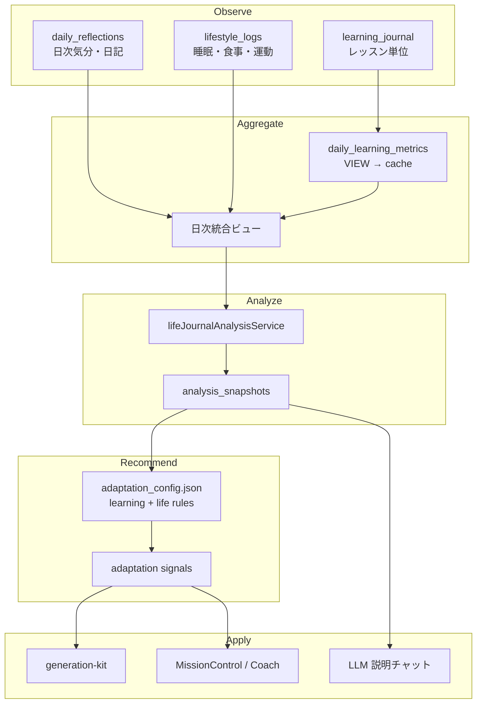

# Phase 16: 診断 × ダイアリー × 生活習慣分析 仕様書

> 作成日: 2026-06-22  
> 最終更新: 2026-06-22（v3: Hermes Agent + MCP + Skills、16-1〜16-5 実装済み）  
> ステータス: 仕様確定（**16-1〜16-5 実装済み** / **16-6 Hermes 版** 実装待ち）  
> LLM ランタイム: [`doc/architecture_v3_hermes_agent.md`](./architecture_v3_hermes_agent.md)
> 目的: 既存の AI 学習診断・学習ジャーナル基盤を拡張し、日々のダイアリー、食事・運動・睡眠などの生活習慣、学習成果を統合して可視化・分析し、ルールエンジンと LLM が根拠付きでアドバイスできるようにする。

---

## 1. 背景

既存コードには以下の基盤がある。

- AI 学習診断 UI
  - `components/features/dashboard/assessment/PersonalAssessmentView.tsx`
  - `components/features/dashboard/assessment/PersonalityAssessment.tsx`
  - `components/features/dashboard/profile/ProfileDiagnosisView.tsx`
- Big Five スコア計算
  - `components/features/dashboard/assessment/assessmentConstants.ts`
- 学習ジャーナル基盤
  - `server/services/journalService.js`
  - `tools/core/journal.js`
  - `server/migrations/003_learning_journal.sql`
- 学習適応シグナル（Phase 12）
  - `server/services/personalizationDeriver.js`
  - `server/services/adaptation_config.json`
  - `server/tests/adaptation.test.js`

ただし現在のジャーナルは lesson-level reflection 中心で、生活習慣・日次/月次の可視化・相関分析・LLM 対話までは未対応。

### 1.1 プロダクト上の位置づけ

Rise Path 本番版では、ライフジャーナルを **Phase 12 適応ループの Observe 層の拡張** として位置づける。

```
診断（性格・学習スタイル）→ learner_profiles
    ↓ 初期の学習方針
ライフジャーナル（日次の生活 + 気分 + 学習集計）
    ↓ 週次/月次の可視化・決定論的分析
ルールエンジン（adaptation_config.json）+ LLM（説明役）
    ↓ adaptation signals / generation-kit
学習適応（ペース・負荷・復習比率の自動調整）
```

**コアバリュー**

| レイヤー | ユーザーに届ける価値 |
|---|---|
| 記録 | 30秒で「今日」を残せる |
| 可視化 | 習慣と学習の関係が月間グラフで見える |
| 分析 | 集中できた/できなかった理由が言語化される |
| 行動 | 来週の具体的な 1〜3 アクションが出る |

---

## 2. 目指す体験

ユーザーは毎日または任意タイミングで以下を記録できる。

- 今日の気分・エネルギー・集中度・ストレス・自信度
- 睡眠時間・睡眠の質
- 食事の状態（朝/昼/夜、バランス、カフェイン等）
- 運動量
- 自由記述ダイアリー
- 学習時間・完了レッスン数（自動集計）

記録したデータを週次・月次でグラフ化し、ルールエンジンと LLM が以下のように教えてくれる。

> 「今月は睡眠が6時間未満の日に集中度が平均18%下がっています。特に夜の学習では低下が大きいです。来週は22:30以降の学習を復習タスクに寄せるのが良さそうです。」

> 「運動した翌日は mood=good/great の割合が高く、日記にも『頭がすっきり』という表現が多いです。運動日は重い新規学習、非運動日は復習中心がおすすめです。」

### 2.1 入力 UX の原則

- **1日1エントリ**を基本。未入力日はスキップ扱い（guilt-free）。
- 初回オンボーディングは **気分 + 睡眠 + 運動** の3項目のみ。
- **7回保存後**（または「詳細を追加」ボタン）で食事・詳細項目を段階的に解放。  
  > 当初案は14日連続だったが、MVP では保存回数ベース（`localStorage: rp_life_journal_save_count`）で先行実装。本番移行時に連続日数ベースへ切り替え可能。
- 前日の値をデフォルト表示（「昨日と同じ」ボタン）。
- `entry_date` は **クライアントがユーザーのローカル日付（`YYYY-MM-DD`）で指定**。サーバーは「今日」を決定しない。

---

## 3. ユースケース

### UC-1: 日次ダイアリーを書く

ユーザーは1日1件を基本として、自由記述とスコアを保存する。

```json
{
  "date": "2026-06-22",
  "mood": "good",
  "energy": 4,
  "focus": 3,
  "stress": 2,
  "confidence": 4,
  "diary_text": "今日は朝に運動したので集中しやすかった。夜は少し眠かった。"
}
```

### UC-2: 生活習慣を記録する

オプション項目として、食事・運動・睡眠・体調を記録する。

```json
{
  "sleep_hours": 7.2,
  "sleep_quality": 4,
  "exercise_min": 30,
  "exercise_intensity": "moderate",
  "exercise_type": "walking",
  "meals": {
    "breakfast": { "ate": true, "balance": 4 },
    "lunch":     { "ate": true, "balance": 3 },
    "dinner":    { "ate": true, "balance": 4, "late_meal": false }
  },
  "hydration_cups": 6,
  "caffeine": { "cups": 1, "after_15h": false },
  "alcohol": false,
  "screen_time_before_sleep_min": 45
}
```

**食事管理の分析焦点**（医療・栄養指導ではない）:

- 朝食あり/なし × 午前の focus
- 遅い夕食（21時以降）× 睡眠の質
- カフェイン15時以降 × 入眠時刻
- `meal_balance` 平均 × energy / confidence

### UC-3: 学習ログと紐づける

既存の `learning_journal` / `user_progress` と統合し、以下を日次に集計する。

- 学習時間（`time_spent_min` 合計）
- 完了レッスン数（`journal_entries`）
- 平均 confidence / mood
- course / module 別内訳

### UC-4: 月間グラフを見る

月間ビューで以下を表示する。

**MVP（Phase 16-3）**

- mood / energy / focus / stress の推移（Line / Area）
- 睡眠時間と集中度の重ねグラフ
- 学習時間（Bar）
- sleep_hours vs focus（Scatter）
- 記録連続日数（streak）: 現在連続 / 最長（90日ルックバック）/ 今月最長
- 「記録あり」判定: mood・スコア・日記・睡眠・運動・食事など **いずれか1項目** があればカウント（`lifeJournalMetrics.isDayLogged`）

**Phase 16-b（後続）**

- カレンダーヒートマップ（記録頻度 / mood / learning_min）
- RadarChart（Big Five + 月間習慣スコア）
- ユーザー定義習慣の streak / 週次達成率

### UC-5: 分析インサイトと LLM チャット

**Phase 16-5（ルールベース週次サマリ）**

- 決定論的分析 + `adaptation_config.json` の life ルールから週次サマリを自動生成
- LLM なしでも evidence 付きの提案を表示可能

**Phase 16-6（Hermes + MCP + Skills による分析チャット）**

ユーザーが質問する。

- 「今月集中できた日の共通点は？」
- 「睡眠と学習時間は関係ある？」
- 「運動すると学習効率は上がってる？」
- 「来週のおすすめ習慣を教えて」

**Hermes Agent** が `life-habit-analyst` Skill に従い、MCP ツール `daily-life-chat-context` で取得した集計済みコンテキストのみを根拠に回答する。Rise Path サーバー内に Gemini 直結のチャットルートは作らない。

---

## 4. データモデル

### 4.1 `daily_reflections`

日次の主観ログ。

```sql
create table daily_reflections (
  id uuid primary key default gen_random_uuid(),
  user_id uuid not null references auth.users(id) on delete cascade,
  entry_date date not null,

  -- learning_journal と同一の mood 値（§4.5 参照）
  mood text check (mood in ('great', 'good', 'okay', 'struggled')),
  energy int check (energy between 1 and 5),
  focus int check (focus between 1 and 5),
  stress int check (stress between 1 and 5),
  confidence int check (confidence between 1 and 5),

  diary_text text,
  tags text[] not null default '{}',

  created_at timestamptz not null default now(),
  updated_at timestamptz not null default now(),

  unique(user_id, entry_date)
);
```

### 4.2 `lifestyle_logs`

生活習慣ログ。`daily_reflections` と 1:1。食事詳細は `meals` jsonb に embed（別テーブルは作らない）。

```sql
create table lifestyle_logs (
  id uuid primary key default gen_random_uuid(),
  user_id uuid not null references auth.users(id) on delete cascade,
  entry_date date not null,

  sleep_hours numeric(4,2),
  sleep_quality int check (sleep_quality between 1 and 5),
  bedtime time,
  wake_time time,

  exercise_min int check (exercise_min >= 0),
  exercise_intensity text check (exercise_intensity in ('none', 'light', 'moderate', 'hard')),
  exercise_type text,  -- walking, running, strength, yoga, other
  steps int check (steps >= 0),

  -- 食事: 構造化 jsonb（§4.2.1 参照）
  meals jsonb not null default '{}'::jsonb,
  meal_balance int check (meal_balance between 1 and 5),  -- 日次サマリ（任意）
  hydration_cups int check (hydration_cups >= 0),
  caffeine jsonb not null default '{}'::jsonb,  -- { "cups": 1, "after_15h": false }
  alcohol boolean,

  screen_time_before_sleep_min int check (screen_time_before_sleep_min >= 0),
  health_note text,
  custom_metrics jsonb not null default '{}'::jsonb,

  created_at timestamptz not null default now(),
  updated_at timestamptz not null default now(),

  unique(user_id, entry_date)
);
```

#### 4.2.1 `meals` jsonb スキーマ

```json
{
  "breakfast": { "ate": true, "balance": 4, "note": "朝食を抜かなかった" },
  "lunch":     { "ate": true, "balance": 3 },
  "dinner":    { "ate": true, "balance": 4, "late_meal": false }
}
```

| フィールド | 型 | 説明 |
|---|---|---|
| `ate` | boolean | 食事を取ったか |
| `balance` | 1-5 | バランスの主観評価 |
| `late_meal` | boolean | 21時以降の食事（dinner のみ） |
| `note` | string | 任意メモ |

### 4.3 `daily_learning_metrics`

学習ログの日次集計。

**実装状況（16-1）**

| レイヤー | 役割 |
|---|---|
| `006_life_journal.sql` の VIEW | UTC 境界の**参照定義のみ**（API からは未使用） |
| `lifeJournalService.js` | **ランタイム正**: `buildLearningQuery(timezone)` でユーザー TZ の日次境界を計算し、daily/range で JOIN |
| クライアント | `resolveClientTimezone()` でブラウザ IANA TZ を `?timezone=` に付与 |

負荷が出たら materialized view または cache テーブルへ移行（§6.4 参照）。移行時も VIEW 出力スキーマと揃える。

```sql
-- 参照用 VIEW（migration 005 に定義。ランタイム API は使用しない）
create or replace view daily_learning_metrics as
select
  user_id,
  (created_at at time zone 'UTC')::date as entry_date,  -- 集計は user timezone で上書き（API 層）
  coalesce(sum(time_spent_min), 0) as total_learning_min,
  count(*) as journal_entries,
  round(avg(confidence)::numeric, 2) as avg_confidence,
  round(avg(
    case mood
      when 'great' then 5 when 'good' then 4
      when 'okay' then 3 when 'struggled' then 2
    end
  )::numeric, 2) as avg_mood_score
from learning_journal
group by user_id, (created_at at time zone 'UTC')::date;
```

> **Note**: 学習ログの日次境界は **サービス層 SQL**（`quoteTimezoneForSql` でクォート済み IANA TZ）で計算する。`entry_date`（生活ログ）はクライアント指定の `YYYY-MM-DD` をそのまま保存する。

### 4.4 `analysis_snapshots`

LLM に渡す前の決定論的分析結果をキャッシュする。

```sql
create table analysis_snapshots (
  id uuid primary key default gen_random_uuid(),
  user_id uuid not null references auth.users(id) on delete cascade,
  period_start date not null,
  period_end date not null,
  granularity text not null check (granularity in ('weekly', 'monthly', 'custom')),

  metrics jsonb not null,
  correlations jsonb not null default '[]'::jsonb,
  detected_patterns jsonb not null default '[]'::jsonb,
  data_quality jsonb not null default '{}'::jsonb,

  created_at timestamptz not null default now()
);
```

### 4.5 データ正規化ルール

#### mood スコア変換（全レイヤー共通）

| mood | 数値スコア |
|---|---:|
| great | 5 |
| good | 4 |
| okay | 3 |
| struggled | 2 |

- `daily_reflections.mood` と `learning_journal.mood` は **同一の4値**を使用する。
- 日次 mood とレッスン mood は別ソース。日次分析では `daily_reflections` を優先し、学習相関ではサービス層集計の `avg_mood_score`（2–5 尺度）を使う。
- **UI チャート用 mood スコア**（`lifeJournalMetrics.MOOD_SCORES`）は表示密度のため 1–4 尺度。学習側集計（2–5）とは別なので、16-4 以降の相関表示では尺度を揃えるか注釈を付ける。
- 将来 `bad` を追加する場合は `learning_journal` の CHECK 制約も同時に拡張する。

#### 日次データの関係

```
learning_journal（レッスン単位、複数件/日）
        ↓ 日次集計（lifeJournalService.buildLearningQuery + user timezone）
daily_learning_metrics（ランタイム集計 / VIEW は参照のみ）
        ↓ JOIN（entry_date + user_id）
daily_reflections + lifestyle_logs（1件/日）
        ↓
analysis_snapshots
```

#### entry_date とタイムゾーン

- API は `PUT /daily/:date` でクライアント指定の `YYYY-MM-DD` をそのまま `entry_date` に保存する。
- 学習ログの日次集計は、リクエストの `?timezone=`（クライアントは `Intl.DateTimeFormat().resolvedOptions().timeZone`、未設定時は `Asia/Tokyo`）で日付境界を計算する。
- `PUT /daily/:date` は **PATCH 型 upsert**: リクエストに含まれたフィールドのみ更新。明示的 `null` でクリア可能。未来日は `validateWritableEntryDate` で拒否。
- サーバーは UTC で保存し、表示・集計時にユーザーの timezone で変換する。

### 4.6 Phase 16-b で追加するテーブル（MVP 外）

| テーブル | 用途 |
|---|---|
| `user_habits` | ユーザー定義の習慣（目標日数/週） |
| `habit_completions` | 日次の習慣達成記録 |
| `advice_log` | ルール/LLM 提案の履歴（Phase 12 ⑤ Verify 用） |

MVP の streak 表示は **記録連続日数**（`daily_reflections` の存在日）で代替する。

---

## 5. API 仕様

### 5.1 日次ログ保存

```http
PUT /api/v2/life-journal/daily/:date?timezone=Asia/Tokyo
Authorization: Bearer <supabase_jwt>
Content-Type: application/json
```

`:date` はクライアントのローカル日付（`YYYY-MM-DD`）。`timezone` は学習ログ集計の日次境界に使用。未来日は 422。

Request:

```json
{
  "reflection": {
    "mood": "good",
    "energy": 4,
    "focus": 3,
    "stress": 2,
    "confidence": 4,
    "diary_text": "朝に運動して集中しやすかった。",
    "tags": ["exercise", "focused"]
  },
  "lifestyle": {
    "sleep_hours": 7.2,
    "sleep_quality": 4,
    "exercise_min": 30,
    "exercise_intensity": "moderate",
    "exercise_type": "walking",
    "meals": {
      "breakfast": { "ate": true, "balance": 4 },
      "lunch": { "ate": true, "balance": 3 },
      "dinner": { "ate": true, "balance": 4, "late_meal": false }
    },
    "hydration_cups": 6,
    "caffeine": { "cups": 1, "after_15h": false }
  }
}
```

Response:

```json
{
  "ok": true,
  "date": "2026-06-22",
  "entry": { "...": "reflection + lifestyle + learning 結合済み" }
}
```

デモモード（`VITE_DEMO_MODE !== 'false'`）では `localStorage` キー `rp_life_journal_v1` に PATCH 型で保存。

### 5.2 日次ログ取得

```http
GET /api/v2/life-journal/daily/:date
```

### 5.3 期間データ取得

```http
GET /api/v2/life-journal/range?from=2026-06-01&to=2026-06-30&timezone=Asia/Tokyo
```

- 最大 **366 日**（`MAX_RANGE_DAYS`）。超過は 422。
- range 用 learning 集計は `buildLearningQuery({ bounded: true })` で期間内に限定。

Response:

```json
{
  "ok": true,
  "days": [
    {
      "date": "2026-06-22",
      "mood": "good",
      "energy": 4,
      "focus": 3,
      "sleep_hours": 7.2,
      "exercise_min": 30,
      "total_learning_min": 45,
      "journal_entries": 2
    }
  ]
}
```

### 5.4 分析取得

```http
GET /api/v2/life-journal/analysis?from=2026-06-01&to=2026-06-30&granularity=monthly
```

Response:

```json
{
  "ok": true,
  "summary": {
    "days_logged": 21,
    "avg_sleep_hours": 6.8,
    "avg_focus": 3.4,
    "avg_energy": 3.6,
    "total_learning_min": 820,
    "record_streak": 5
  },
  "correlations": [
    {
      "x": "sleep_hours",
      "y": "focus",
      "method": "pearson",
      "r": 0.42,
      "strength": "moderate",
      "sample_size": 21,
      "confidence": "medium"
    }
  ],
  "patterns": [
    {
      "type": "habit_effect",
      "title": "Exercise days correlate with better mood",
      "evidence": "Mood good/great rate: exercise days 78%, non-exercise days 52%",
      "confidence": "medium"
    }
  ],
  "data_quality": {
    "sample_size": 21,
    "missing_days": 9,
    "correlations_shown": 3,
    "warning": "Correlation is directional evidence, not causation."
  }
}
```

### 5.5 週次アドバイス（ルールベース）

```http
POST /api/v2/life-journal/advice
```

Request:

```json
{
  "from": "2026-06-16",
  "to": "2026-06-22"
}
```

Response:

```json
{
  "ok": true,
  "advice": [
    {
      "rule_id": "sleep_focus_drop",
      "title": "睡眠と集中度の関係が見えています",
      "action": "今週は22:30以降の新規学習を避け、復習中心にしましょう",
      "evidence": "睡眠6h未満の日は集中度が平均0.7下がっています",
      "confidence": "medium",
      "difficulty": "easy"
    }
  ]
}
```

### 5.6 分析チャット（Phase 16-6 — Hermes 版）

> **廃止:** `POST /api/v2/life-journal/chat`（サーバー Gemini 直結）は作らない。  
> **採用:** 汎用 Agent Proxy + Hermes API Server + MCP + Skill。

#### Web UI エントリポイント

```http
POST /api/v2/agent/chat
```

認証: `requireBridgeOrAuth`（Supabase JWT / Bridge Token）  
レート制限: AI Heavy **10 req/min**（`system_spec_v4.md` §5.3 参照）

Request:

```json
{
  "skill": "life-habit-analyst",
  "message": "今月集中できた日の共通点は？",
  "context": {
    "from": "2026-06-01",
    "to": "2026-06-30",
    "timezone": "Asia/Tokyo",
    "ui_language": "jp"
  },
  "include_diary_excerpts": false
}
```

`context` フィールド（skill 共通）:

| フィールド | 必須 | 用途 |
|---|---|---|
| `from` / `to` | `life-habit-analyst` で必須 | 分析期間（`YYYY-MM-DD`） |
| `timezone` | 推奨 | IANA TZ（例: `Asia/Tokyo`） |
| `ui_language` | 任意（16-6e-R） | アプリ表示言語 `en` / `jp`。Hermes 入力に `UI language:` として付与 |

`learning-coach`（FloatingChatbot）は `from` / `to` 不要。`timezone` と `ui_language` のみ送る。

Express プロキシの内部動作:

1. JWT から `userId` を解決
2. Hermes `POST /v1/responses`（または `/api/sessions/{id}/chat/stream`）に転送
3. `conversation: "rp:user:{userId}:life-habit-analyst"` でセッション分離
4. `X-Hermes-Session-Key: rp:user:{userId}` を付与
5. Skill `/life-habit-analyst` を起動し、MCP `daily-life-chat-context` を呼ばせる

Response（ストリーミングまたは完了時）:

```json
{
  "ok": true,
  "answer": "今月は睡眠が7時間以上の日と、運動が20分以上ある日に集中度が高い傾向があります...",
  "evidence": [
    "sleep_hours vs focus: r=0.42, n=21",
    "exercise days avg_focus=3.8, non_exercise avg_focus=3.1"
  ],
  "caveats": [
    "相関であり因果関係ではありません。",
    "記録日数が21日なので、来月も継続して確認すると精度が上がります。"
  ],
  "privacy": { "diary_included": false }
}
```

#### MCP ツール（Hermes が直接呼ぶ）

`daily-life-chat-context` — LLM に渡す安全な JSON を生成:

```json
{
  "period": { "from": "2026-06-01", "to": "2026-06-30", "recorded_days": 21 },
  "metrics_summary": { "avg_sleep": 6.8, "avg_focus": 3.2, "exercise_days": 12 },
  "top_correlations": [{ "pair": "sleep_hours×focus", "r": 0.42, "n": 21, "confidence": "medium" }],
  "matched_patterns": ["exercise_days_better_mood"],
  "rule_advice": [{ "rule_id": "sleep_focus_drop", "evidence": "..." }],
  "assessment_profile": { "neuroticism": 35 },
  "diary_excerpts": [],
  "privacy": { "diary_included": false, "data_class": "aggregated_only" }
}
```

詳細: [`doc/architecture_v3_hermes_agent.md`](./architecture_v3_hermes_agent.md) §4–§5

### 5.7 デモモード fallback

`VITE_DEMO_MODE !== 'false'` のとき（`services/curriculumApi.ts` と同パターン）:

| 操作 | デモ時の挙動 |
|---|---|
| 保存/取得 | `localStorage` キー `rp_life_journal_v1` にキャッシュ |
| 学習集計 | `rp_learning_progress` からクライアント側で簡易集計 |
| 分析 | クライアント側の簡易統計（相関は表示しない or low confidence 固定） |
| 診断連携 | `localStorage` の `AssessmentProfile` をフォールバック（精度 low と表示） |

UI は本番/デモで同一。データソースのみ切り替える。

---

## 6. 分析ロジック仕様

### 6.1 決定論的分析を先に行う

LLM に生データを丸投げしない。まず `server/services/lifeJournalAnalysisService.js` で以下を計算する。

- 平均値・合計値・中央値
- 週次/月次推移
- 記録 streak（連続記録日数）
- 欠損率
- Pearson correlation（欠損は listwise deletion）
- exercise day vs non-exercise day 比較
- sleep threshold comparison（6h / 7h 閾値）
- meals 関連（朝食あり率、late_meal 率）
- text tag frequency（diary_text の頻出語）

LLM はこの分析結果を説明・質問応答・仮説提示に使う。

### 6.2 相関の扱い

| r の絶対値 | 表示 |
|---:|---|
| 0.0 - 0.2 | very weak |
| 0.2 - 0.4 | weak |
| 0.4 - 0.6 | moderate |
| 0.6 - 0.8 | strong |
| 0.8 - 1.0 | very strong |

信頼度ルール:

- `n < 7`: 相関分析を非表示。「もう少し記録を続けましょう」
- `7 ≤ n < 14`: low confidence
- `n ≥ 14`: medium/high
- **同時表示は上位3件まで**（多重比較による偶然の相関を抑制）
- 常に「相関であり因果ではない」「複数指標を同時に見ているため偶然の可能性あり」と表示

### 6.3 因果と断定しない

LLM prompt で必ず以下を守らせる。

- 相関を因果として断定しない
- 医療・栄養・心理診断行為をしない
- 生活改善は一般的・低リスクな提案に留める
- 強い不調・睡眠障害・摂食問題などは専門家相談を促す

### 6.4 集計ジョブ戦略

| 段階 | 方式 | 移行条件 |
|---|---|---|
| MVP | サービス層 SQL（`buildLearningQuery` + `quoteTimezoneForSql`）。VIEW は参照のみ | — |
| 負荷増 | MATERIALIZED VIEW（日次 refresh） | range API p95 > 500ms |
| 大規模 | cache テーブル + レッスン記録時 upsert | ユーザー数 > 1000 |

`daily_learning_metrics` の cache テーブル化は VIEW の出力スキーマと同一にし、移行時の API 変更を最小化する。

### 6.5 ルールエンジン（adaptation_config.json 拡張）

別ファイル `life_advice_rules.json` は作らず、既存 `adaptation_config.json` に namespace を追加する。

```json
{
  "version": "2026-06-22",
  "learning_adaptation_rules": [ "...既存6ルール..." ],
  "life_habit_rules": [
    {
      "id": "sleep_focus_drop",
      "conditions": [
        { "field": "sleep_under_6h_days_pct", "op": ">", "value": 0.4 },
        { "field": "avg_focus", "op": "<", "value": 3.0 }
      ],
      "priority": "high",
      "group": "conservative",
      "advice": {
        "title": "睡眠と集中度の関係が見えています",
        "action": "今週は22:30以降の新規学習を避け、復習中心にしましょう",
        "evidence_template": "睡眠6h未満の日は集中度が平均{{focus_delta}}下がっています",
        "difficulty": "easy"
      }
    }
  ],
  "conflict_resolution": "conservative_wins"
}
```

`personalizationDeriver.js` の `deriveAdaptationSignals` を拡張し、学習シグナルと生活シグナルを同一パイプラインで返す。Phase 12 の Recommend → Apply に接続する。

---

## 7. アーキテクチャ



---

## 8. UI 仕様

### 8.1 新規ページ

| URL | 画面 | フェーズ |
|---|---|---|
| `/life-journal` | 今日のダイアリー入力 | 16-2 |
| `/life-journal/monthly` | 月間グラフ | 16-3 |
| `/life-journal/insights` | 分析インサイト + 週次アドバイス | 16-4/5 |
| `/life-journal/chat` | LLM 分析チャット | 16-6 |
| `/life-journal/habits` | 習慣設定 | 16-b |

### 8.2 入力フォーム

1. **今日の状態** — mood, energy, focus, stress, confidence
2. **自由記述** — diary_text, tags
3. **生活習慣** — sleep, exercise, meals（jsonb）, caffeine, hydration
4. **学習サマリ** — 自動表示（手入力不要）
5. **カスタム指標** — custom_metrics（任意）

### 8.3 グラフ（MVP）

Recharts で実装:

- LineChart: sleep_hours / focus / energy / **stress**
- BarChart: learning_min per day
- AreaChart: mood score trend（`MOOD_SCORES` 1–4 尺度）
- ScatterChart: sleep_hours vs focus（空データ時 i18n メッセージ）
- Summary cards: 月平均（睡眠・集中・学習・ストレス）、streak 3種

Phase 16-b: Calendar heatmap, RadarChart

### 8.4 既存画面との導線

- `ProfileDiagnosisView` → 「生活習慣と学習の関係を見る」
- `MissionControlDashboard` → 今週の記録率・睡眠平均ウィジェット
- `LessonReflectionModal` 完了後 → 「今日のライフジャーナルも書きますか？」

### 8.5 多言語対応

既存の `LanguageContext`（en / jp / fr）に合わせ、ライフジャーナル UI も全ラベル・免責文言を i18n 対応する。

### 8.6 LLM チャット UI（Hermes 経由）

既存 `ChatInterface` を再利用。UI は **薄いチャット** — LLM ロジックは持たない。

```text
components/features/life-journal/LifeJournalChatView.tsx
```

- `POST /api/v2/agent/chat` を呼ぶ（`skill: "life-habit-analyst"`）
- 期間選択 UI（from / to）と `include_diary_excerpts` トグル（デフォルト OFF）
- ストリーミング応答を表示（Hermes SSE 中継）
- 免責文言: 医療アドバイスではない旨

分析コンテキストの注入は **UI では行わない**。Hermes → MCP `daily-life-chat-context` がサーバー側で生成する。

### 8.7 FloatingChatbot（`learning-coach`）— Phase 16-6e 完了

```text
components/common/FloatingChatbot.tsx
```

| 項目 | 仕様 |
|---|---|
| API | `POST /api/v2/agent/chat`（`skill: "learning-coach"`） |
| ストリーム | `stream: true` → 失敗時または空応答時 `stream: false` で再試行（`LifeJournalChatView` と同型） |
| `context` | `{ timezone, ui_language? }` のみ（期間・日記抜粋なし）。`ui_language` は 16-6e-R で両チャット UI から送信 |
| 表示制御 | `/life-journal/chat` では **非表示**（専用画面と二重化しない） |
| 導線 | 空状態に「生活習慣×学習チャット」リンク → `/life-journal/chat` |
| 外部起動 | `open-rise-path-chat` カスタムイベント（用語集など）を維持 |
| 廃止 | Gemini SDK 直結（`createChatSession` / `sendMessageStream`） |

**エラー表示（UI 側）:**

| 条件 | ユーザー向け文言 |
|---|---|
| `error_type: hermes_not_configured` / `hermes_unreachable` | Hermes / `HERMES_API_KEY` 確認を促す |
| `error_type: api_disabled` | デモモードでは API 必須 |
| HTTP 401 | `mapAgentChatError` → en: "Please sign in…" / jp: "ログインが必要です" |
| HTTP 429 | レート制限 |

### 8.8 Phase 16-6e-R — レビュー修正仕様（2026-06-24）✅

> 対象: `1839c9e` レビュー指摘のフォローアップ。**実装済み。**

#### 共有エラーマップ（R4）

`services/agentApi.ts` に `AgentChatErrorCopy` と `mapAgentChatError(err, copy)` を定義:

```ts
interface AgentChatErrorCopy {
  genericError: string;
  hermesUnavailable: string;
  rateLimited: string;
  loginRequired: string;
  demoUnavailable?: string;  // FloatingChatbot のみ
}
```

| 条件 | 返却 |
|---|---|
| `hermes_not_configured` / `hermes_unreachable` | `hermesUnavailable` |
| `api_disabled` | `demoUnavailable`（あれば） |
| HTTP 401 | `loginRequired` |
| HTTP 429 | `rateLimited` |
| `detail` あり | ``${message}: ${detail}`` |
| その他 `AgentApiError` | `message` |
| 非 AgentApiError | `genericError` |

401 は **本番**（`requireBridgeOrAuth` が dev フォールバックしない環境）でのみ発生。検証はトークンなし本番相当リクエストで行う。

#### 修正一覧

| # | 状態 | 修正方針 | 対象ファイル |
|---|---|---|---|
| R1 | ✅ | 空 streaming バブル非表示。ローダーは `lastMessage?.isStreaming && !lastMessage.text` | `FloatingChatbot.tsx` |
| R2 | ✅ | `handleSend` 先頭で `if (isLoading \|\| !text.trim()) return` | `FloatingChatbot.tsx` |
| R3 | ✅ | **両チャット UI** が `context.ui_language`（`LanguageContext.language` = `en`/`jp`。`fr` 選択時は UI `en`）を送信。サーバー `buildHermesInput` + `DEFAULT_INSTRUCTIONS` + `learning-coach/SKILL.md` | `FloatingChatbot.tsx`, `LifeJournalChatView.tsx`, `agentApi.ts`, `hermesAgentService.js` |
| R4 | ✅ | 上記共有ヘルパー | `agentApi.ts`, 両チャット UI |
| R5 | ✅ | `learning-coach` で `Period:` なし、`ui_language` 行あり/なし、`validate` で `fr` 拒否 | `agentProxy.test.js` |
| R6 | ✅ | エラー時 `setMessages` を 1 回に統合 | `FloatingChatbot.tsx` |
| R7 | ✅ | EOF 改行 | `FloatingChatbot.tsx` |
| R8 | ✅（doc） | `env.local.template` コメント修正済（`4695d76`） | — |

**実装順序:** R4 → R2 → R1 → R3 → R5 → R6/R7（R8 は doc のみ先行完了）

**テスト:** `agentProxy.test.js` 拡張 + 全件 `npm test` パス。手動: FloatingChatbot 送信・用語集トリガー・`/life-journal/chat` 非表示。

---

## 9. 診断機能との統合

### 9.1 診断データの正（source of truth）

| 環境 | 診断データソース | 生活分析での扱い |
|---|---|---|
| 本番 | `learner_profiles`（`POST /api/v2/learner-profiles/assessments`） | 必須入力。性格連携ルールを適用 |
| デモ | `localStorage` の `AssessmentProfile` | フォールバック可。UI に「分析精度: low」表示 |
| 診断未実施 | — | 生活習慣分析のみ。性格連携ルールはスキップ |

`ProfileDiagnosisView` は API 利用時 `GET /api/v2/learner-profiles/latest` を正とし、未接続時は `localStorage` にフォールバックする（§9.1 のデモ注記を表示）。

### 9.2 統合ルール例

| 診断特性 | 生活データ | 提案 |
|---|---|---|
| neuroticism 高 + stress 高 + 睡眠不足 | 学習負荷を下げる、短いセッション推奨 |
| openness 高 + focus 高い日 | 探索型・新規トピックを提案 |
| conscientiousness 高 + 運動日 | 計画型タスク・週次目標を提案 |
| extraversion 低 + 孤立感の日記表現 | コミュニティ学習・ペア復習を提案 |

分析入力:

```json
{
  "assessment_profile": {
    "openness": 80,
    "conscientiousness": 65,
    "extraversion": 40,
    "agreeableness": 70,
    "neuroticism": 35
  },
  "monthly_life_metrics": {},
  "monthly_learning_metrics": {}
}
```

### 9.3 generation-kit 連携（Phase 16-6g）✅

`get-generation-kit`（MCP / `tools/core/curriculum.js` `getKit`）で `userId` 指定時、直近 30 日のライフジャーナル分析から `personalization.habit_signals` を注入する。LLM 不要・決定論的。

```json
{
  "personalization": {
    "habit_signals": {
      "avg_sleep_hours": 6.8,
      "exercise_days_per_week": 3,
      "record_streak": 5,
      "top_pattern": "exercise_mood_boost",
      "days_logged": 21,
      "period_days": 30
    }
  }
}
```

| フィールド | 算出元 |
|---|---|
| `avg_sleep_hours` | `analysis.metrics.avg_sleep_hours` |
| `exercise_days_per_week` | `exercise_days / (period_days / 7)` |
| `record_streak` | `metrics.record_streak` |
| `top_pattern` | `life_habit_rules` 先頭 `rule_id`（priority ソート済）→ なければ `patterns[0].id` |
| `insufficient_data` | 7 日未満ログ時。`days_logged` / `record_streak` のみ |

実装: `buildHabitSignalsForKit()`（`personalizationDeriver.js`）、`loadHabitSignalsForKit()`（`curriculum.js`）。

---

## 10. LLM 方針（Hermes + Skill）

LLM プロンプトは Rise Path サーバーに埋め込まない。**Skill + MCP コンテキスト** で制御する。

| 層 | 場所 | 役割 |
|---|---|---|
| ペルソナ | `agents/rise-path-tutor.yaml` → Hermes `instructions` | ルミナの口調・原則 |
| 振る舞い | `skills/life-habit-analyst/SKILL.md` | 手順・禁止事項・出力形式 |
| データ | MCP `daily-life-chat-context` | 集計済み JSON のみ渡す |
| 推論 | Hermes Agent | プロバイダー選択・ツールループ |

### 10.1 Skill 内の原則（`life-habit-analyst`）

```text
Use only data from daily-life-chat-context MCP tool.
Do not claim medical, nutritional, or psychological diagnosis.
Explain correlations as hypotheses, not causation.
Give practical, low-risk learning habit suggestions.
When data is sparse, say that confidence is low.
Always include evidence and caveats in the response.
```

### 10.2 Response format

```json
{
  "summary": "...",
  "patterns": [
    {
      "title": "...",
      "evidence": "...",
      "confidence": "low|medium|high"
    }
  ],
  "recommendations": [
    {
      "action": "...",
      "why": "...",
      "difficulty": "easy|medium|hard"
    }
  ],
  "caveats": ["..."],
  "questions_to_user": ["..."]
}
```

---

## 11. MCP Tool 拡張（Phase 16-6a）

既存 `journal-log`（レッスン単位）と混同しないよう、`daily-life-*` プレフィックスを使う。

`tools/core/lifeJournal.js` は Express / MCP の dual use（**実装済み**）。Phase 16-6a で `mcp-server/index.js` に登録する。

| Tool | 目的 | data_class | Hermes 登録名（例） |
|---|---|---|---|
| `daily-life-log` | 日次ダイアリー/生活習慣保存 | learner_private | `mcp_rise_path_daily_life_log` |
| `daily-life-range` | 期間データ取得 | aggregated | `mcp_rise_path_daily_life_range` |
| `daily-life-analysis` | 決定論的分析取得 | aggregated | `mcp_rise_path_daily_life_analysis` |
| `daily-life-advice` | ルールベース週次アドバイス | aggregated | `mcp_rise_path_daily_life_advice` |
| `daily-life-chat-context` | LLM 用安全コンテキスト生成 | aggregated | `mcp_rise_path_daily_life_chat_context` |

Hermes 設定: [`hermes/config.example.yaml`](../hermes/config.example.yaml) の `tools.include` allowlist。

---

## 12. Privacy / Security

生活習慣・日記はセンシティブデータとして扱う。

必須仕様:

- `user_id` scope を必ず付与
- 他ユーザーのログを取得不可（API + RLS の二重防御）
- raw diary text の LLM 送信はユーザー opt-in（デフォルト: excerpt / summary のみ）
- export / delete 機能を用意（Issue #29）
- 医療アドバイスではない旨を UI に表示

### 12.2 Phase 16-7 — Privacy UI + API ✅

| 項目 | 実装 |
|---|---|
| 設定 UI | `/settings/privacy` — `SettingsPrivacyView` |
| 日記抜粋 opt-in | `preferences.privacy.life_journal.allow_diary_excerpts_in_ai`（デフォルト `false`） |
| サーバー強制 | `POST /api/v2/agent/chat` で `include_diary_excerpts: true` かつ opt-in なし → **403** `diary_excerpts_not_allowed` |
| エクスポート | `GET /api/v2/life-journal/export?timezone=`（最大 366 日、JSON）。`entry_count` = 記録あり日数、`total_days_in_range` = カレンダー全日数、`days` = 全日分（空日含む） |
| 削除 | `DELETE /api/v2/life-journal/data` — body `{ confirm: "DELETE", scope: "all" \| "range", from?, to? }` |
| プライバシー取得 | `GET /api/v2/life-journal/privacy` |
| デモ | `localStorage` export/delete + `rp_life_journal_privacy_v1` |

チャット UI（`LifeJournalChatView`）の日記トグルはセッションごとにデフォルト OFF。設定で `allow_diary_excerpts_in_ai` が OFF のときはトグル無効＋プライバシー設定への導線を表示する。

**Export JSON フィールド（`schema_version: 2026-06-24`）**

| フィールド | 意味 |
|---|---|
| `from` / `to` | エクスポート期間（YYYY-MM-DD） |
| `entry_count` | ジャーナルデータが1件以上ある日数 |
| `total_days_in_range` | 期間内のカレンダー日数（`from`〜`to`  inclusive） |
| `days` | 全日分の配列（未記入日は空オブジェクトに近い形） |

### 12.1 RLS ポリシー（Phase 16-1 必須）

```sql
alter table daily_reflections enable row level security;
alter table lifestyle_logs enable row level security;
alter table analysis_snapshots enable row level security;

create policy "users_own_daily_reflections"
  on daily_reflections for all
  using (auth.uid() = user_id)
  with check (auth.uid() = user_id);

create policy "users_own_lifestyle_logs"
  on lifestyle_logs for all
  using (auth.uid() = user_id)
  with check (auth.uid() = user_id);

create policy "users_own_analysis_snapshots"
  on analysis_snapshots for select
  using (auth.uid() = user_id);
```

Express API は service_role で DB に接続するため、API 層でも JWT の `user_id` とリクエストの `user_id` を照合する（Phase 11 パターン）。

---

## 13. 段階的実装計画

### 13.0 MVP 境界

| 含む（MVP） | 含まない（Phase 16-b） |
|---|---|
| daily_reflections + lifestyle_logs（meals jsonb） | user_habits / habit_completions |
| RLS + デモモード fallback | advice_log（Verify ループ） |
| daily/range/analysis API | Calendar heatmap |
| 入力 UI + Line/Bar/Scatter グラフ | RadarChart |
| 決定論的分析 + adaptation_config 拡張 | 音声入力 |
| ルールベース週次サマリ | 習慣 CRUD UI |

### Phase 16-1: DB/API 最小実装 ✅

- migration: `006_life_journal.sql`（daily_reflections, lifestyle_logs, analysis_snapshots；RLS は nexloom-gce では未使用）
- VIEW: `daily_learning_metrics`（参照のみ。ランタイムは `lifeJournalService.js`）
- `PUT/GET /api/v2/life-journal/daily/:date` + `bridgeAuth` ミドルウェア
- `GET /api/v2/life-journal/range`（366日制限、bounded learning 集計）
- デモモード `localStorage` fallback（`services/lifeJournalApi.ts`）
- テスト: バリデーション・TZ SQL・PATCH upsert 契約（`server/tests/lifeJournal.test.js`、119 tests）
- 未着手: HTTP 統合テスト、RLS の実 DB 統合テスト

### Phase 16-2: UI 入力画面 ✅

- `/life-journal` → `LifeJournalView.tsx`
- 気分 + 睡眠 + 運動 + 食事（meals jsonb）+ diary_text
- オンボーディング（3項目）+ **7回保存**で段階的開示
- 昨日コピー、学習サマリ自動表示、en/jp i18n
- 導線: Dashboard / ProfileDiagnosis / Layout サイドバー

### Phase 16-3: 月間グラフ ✅

- `/life-journal/monthly` → `LifeJournalMonthlyView.tsx`
- Recharts: Line（睡眠/集中/エネルギー/ストレス）/ Area（mood）/ Bar（学習）/ Scatter（睡眠×集中）
- streak: 現在連続 + 最長（90日ルックバック）+ 今月最長
- `lifeJournalMetrics.ts` で集計、`getLifeJournalRange` ×2（当月 + 90日）並列取得

### Phase 16-4: 決定論的分析 ✅

- `tools/core/lifeJournalAnalysis.js`（Pearson・パターン・metrics）
- `GET /api/v2/life-journal/analysis` + `deriveLifeHabitSignals`
- `adaptation_config.json` に `life_habit_rules` 4件
- `/life-journal/insights` → `LifeJournalInsightsView.tsx`
- unit tests: `server/tests/lifeJournalAnalysis.test.js`（136 tests total）

### Phase 16-5: ルールベース週次サマリ ✅

- `tools/core/lifeJournalWeekly.js` + `POST /api/v2/life-journal/advice`
- `getLifeJournalAdvice`（デモ対応）
- `LifeJournalWeeklyWidget` → MissionControl（記録率・睡眠・top advice）
- インサイト画面: 今週 / 直近30日 切替

### Phase 16-6: Hermes + MCP + Skills（分析チャット）

| Step | 内容 | 状態 |
|---|---|---|
| 16-6a | MCP `daily-life-*` 5ツールを `mcp-server/index.js` に登録 | ✅ |
| 16-6b | `skills/life-habit-analyst/SKILL.md` | ✅ 仕様・Skill 作成済 |
| 16-6c | `hermes/config.example.yaml` + セットアップ手順 | ✅ |
| 16-6d | `server/routes/agent.js` — Express → Hermes プロキシ | ✅ |
| 16-6e | `/life-journal/chat` + `FloatingChatbot` → Hermes プロキシ | ✅ |
| 16-6e-R | 16-6e レビュー修正（§8.8） | ✅ |
| 16-6f | `daily-life-chat-context` に `learner_profiles` 注入 | ✅ |
| 16-6g | `habit_signals` → generation-kit（§9.3） | ✅ |

### Phase 16-6g: habit_signals → generation-kit ✅

- `buildHabitSignalsForKit` + `loadHabitSignalsForKit` → `getKit` が `personalization.habit_signals` を注入
- 直近 30 日・`analyzeLifeJournal` + `deriveLifeHabitSignals` ベース

### Phase 16-6b（残）: 診断連携

- `learner_profiles` を正とした診断連携（`ProfileDiagnosisView` DB 化）— 別タスク

### Phase 16-b: 拡張（データ蓄積後）

- `user_habits` / `habit_completions` + `/life-journal/habits`
- Calendar heatmap / RadarChart
- `advice_log` + Phase 12 ⑤ Verify ループ
- 音声入力 → 構造化
- materialized view / cache テーブル移行

---

## 14. GitHub Issue 候補

1. [#23 `[Phase 16] Add daily reflection and lifestyle log schema/API`](https://github.com/t012093/rise-path-demo-game-Integration-/issues/23)
2. [#24 `[Phase 16] Build Life Journal input UI`](https://github.com/t012093/rise-path-demo-game-Integration-/issues/24)
3. [#25 `[Phase 16] Add monthly habit and learning analytics dashboard`](https://github.com/t012093/rise-path-demo-game-Integration-/issues/25)
4. [#26 `[Phase 16] Implement deterministic correlation and pattern analysis service`](https://github.com/t012093/rise-path-demo-game-Integration-/issues/26)
5. [#27 `[Phase 16] Add LLM habit analytics chat with evidence and caveats`](https://github.com/t012093/rise-path-demo-game-Integration-/issues/27)
6. [#28 `[Phase 16] Integrate diagnosis profile with habit analytics and generation kit`](https://github.com/t012093/rise-path-demo-game-Integration-/issues/28)
7. [#29 `[Phase 16] Add privacy controls for diary/health-adjacent data`](https://github.com/t012093/rise-path-demo-game-Integration-/issues/29)

---

## 15. Done 定義

### MVP（Phase 16-1 〜 16-5）

- [x] 日次ダイアリーを保存/更新/取得できる（本番 API + デモ localStorage）
- [x] 睡眠・食事（meals jsonb）・運動・集中度などを保存できる（PATCH upsert、未来日拒否）
- [ ] RLS ポリシーが適用され、他ユーザーのデータにアクセスできない（**マイグレーション定義済み / 実 DB 統合テスト未**）
- [x] mood スキーマが `learning_journal` と統一されている
- [x] 月間グラフ（Line/Bar/Area/Scatter）で主要指標を確認できる
- [x] 学習時間が日次 API に自動結合される（サービス層 TZ 集計 + range JOIN）
- [x] 7日以上のデータで相関分析が表示される（上位3件、confidence ラベル付き）
- [x] ルールベース週次アドバイスが evidence 付きで表示される（MissionControl + POST /advice）
- [x] 医療/心理診断として断定しない安全ガードがある（UI 免責文言）

### 本番完全版（Phase 16-6 追加 — Hermes 版）

- [ ] Hermes + `life-habit-analyst` Skill で evidence/caveat 付き説明ができる
- [ ] MCP `daily-life-chat-context` が集計済み JSON のみを返す（生データ非送信）
- [ ] `POST /api/v2/agent/chat` プロキシが JWT user scope を強制する
- [x] 診断結果（`learner_profiles`）が chat-context に注入される（16-6f）
- [x] `generation-kit` に `habit_signals` が注入される（16-6g、LLM 不要）
- [x] diary text の LLM 送信が opt-in で制御できる（UI トグル + サーバー強制）