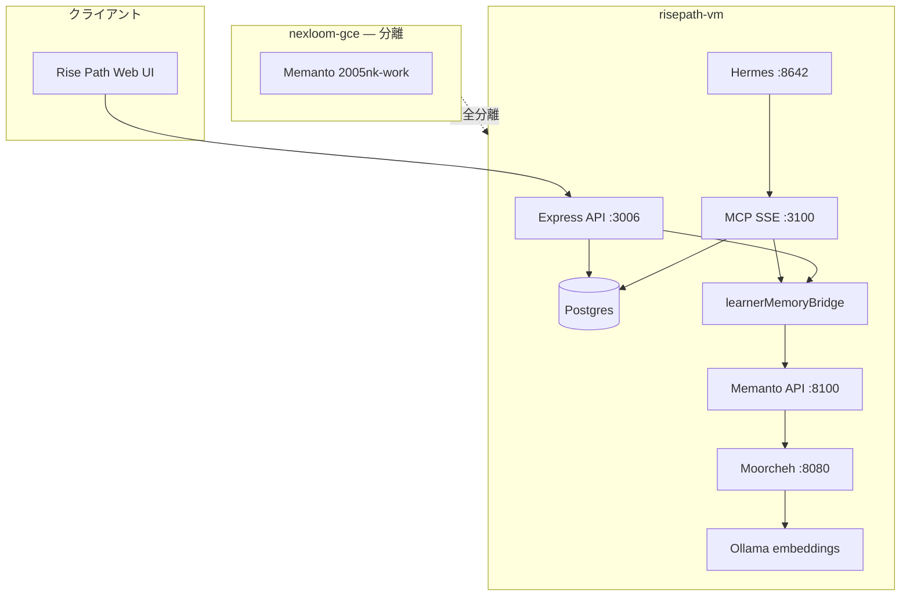
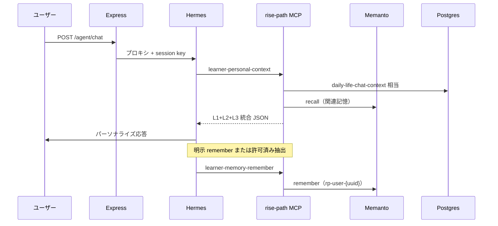

# Phase 19: 学習者セマンティックメモリ（Memanto 連携）仕様書

> 作成日: 2026-06-24  
> 最終更新: 2026-06-24（レビュー反映: migration 009、opt-in ポリシー、compose 連携、coach 除外）  
> ステータス: **実装済み**（2026-06-24 VM smoke + E2E 通過）
> 関連: [`architecture_v3_hermes_agent.md`](./architecture_v3_hermes_agent.md), [`phase16_life_journal_analytics_spec.md`](./phase16_life_journal_analytics_spec.md), [`phase11_user_isolation_spec.md`](./phase11_user_isolation_spec.md), [`risepath_vm_deployment.md`](./risepath_vm_deployment.md)  
> 前提: 開発者個人用 Memanto（`agent_id: 2005nk-work`、nexloom-gce）とは **完全分離** する

---

## 1. 背景

### 1.1 現状のギャップ

Rise Path は学習者向けの **構造化データ** と **決定論的コンテキスト** は整っているが、**汎用セマンティックメモリ**（ChatGPT Memory 相当）は未実装。

| 既存（Phase 12〜18） | 役割 | Memanto 相当の機能 |
|---|---|---|
| `learner_profiles` | 診断結果（Big Five → 9軸） | 構造化プロファイル（正） |
| `daily_reflections` / `lifestyle_logs` | 日次気分・生活ログ | 構造化ログ（正） |
| `daily-life-chat-context` | LLM 向け集計 JSON | 集計コンテキスト（正） |
| `habit_signals` → `get-generation-kit` | 決定論的習慣シグナル | 派生シグナル（正） |
| `rag-search` | 教材チャンク検索 | **教材 RAG のみ**（ユーザー記憶ではない） |

**不足している能力:**

- 会話から「図解が好き」「短いセッション向き」などを **自由文で remember**
- 次のチャットで **意味検索 recall**（質問に関連する過去の傾向のみ）
- 診断結果を **一度きりの JSON 注入** ではなく、**記憶として蓄積・更新**
- ユーザーが「覚えておいて」と明示した事実の永続化

### 1.2 目的

1. 学習者ごとに **汎用セマンティックメモリ** を提供する（ローンチ向け）
2. 診断・生活ログ・会話の傾向を **統合されたパーソナルコンテキスト** として Hermes チャットに渡す
3. 開発者個人 Memanto（`2005nk-work`）と **データ・インフラを混在させない**
4. Postgres の RLS / export / delete 設計と整合する

### 1.3 非目的（本 Phase の範囲外）

- Memanto ソースコードのフォーク・埋め込み
- nexloom-gce 上の個人 Memanto インスタンスとの共有
- 学習者データを開発者 `2005nk-work` namespace に書き込むこと
- 会話全文の自動保存（Hermes `auto_capture` 相当の無制限記録）
- 医療・メンタルヘルス診断の代替

---

## 2. 設計方針

### 2.1 三層モデル（Source of Truth）

```text
L1 構造化（Postgres）     … 日記・睡眠・診断 JSON・進捗・RLS・export/delete の正
L2 セマンティック（Memanto） … 会話・明示 remember・診断要約・習慣インサイト（recall 用）
L3 集計（決定論的）       … daily-life-chat-context / habit_signals（既存維持）
```

**原則:** L1/L3 を Memanto に移さない。L2 は L1 から **要約を同期** するのみ。数値の正は常に Postgres。

### 2.2 Memanto の位置づけ

| 項目 | 開発者 Memanto | Rise Path プロダクト Memanto |
|---|---|---|
| ホスト | nexloom-gce | **risepath-vm**（専用 overlay） |
| agent_id | `2005nk-work` | `rp-user-{supabase-uuid}` |
| 用途 | Hermes / Cursor 開発記憶 | 学習者パーソナル記憶 |
| volume | `moorcheh_data`（nexloom） | **別 volume**（risepath 専用） |

**「クローン」= Docker Compose overlay の複製。** Memanto パッケージは公式イメージ / `Dockerfile.memanto` をそのまま利用する（ソースフォークしない）。

### 2.3 既存アーキテクチャとの整合

- LLM 実行は引き続き **Hermes Agent**（Rise Path サーバーにプロンプトを埋め込まない）
- 学習者データは **MCP ツール** 経由で取得・保存（v3 原則維持）
- 新規ルート `POST /api/v2/life-journal/chat` は作らない → `POST /api/v2/agent/chat` に統合

---

## 3. システムアーキテクチャ

### 3.1 全体構成



### 3.2 データフロー（チャット時）



---

## 4. Memanto 本番デプロイ（risepath-vm）

### 4.1 追加ファイル

```text
deploy/risepath-vm/
  docker-compose.memanto.yml    # overlay（nexloom-gce から複製・調整）
  Dockerfile.memanto            # memanto-onprem:0.2.3 ビルド（既存を流用可）
  stack.env.example             # MEMANTO_* / MOORCHEH_* 追記
```

### 4.2 起動

```bash
cd /opt/risepath/deploy/risepath-vm
docker compose \
  -f docker-compose.yml \
  -f docker-compose.memanto.yml \
  --env-file stack.env \
  --profile full \
  up -d
```

| サービス | ホストポート | 備考 |
|---|---|---|
| `moorcheh` | `127.0.0.1:8080` + Tailscale IP | 学習者 namespace 専用 |
| `memanto` | `127.0.0.1:8100` + Tailscale IP | Rise Path bridge から HTTP（Compose 内は `http://memanto:8000`） |
| `ollama` | ホスト `11434` または compose サービス | **`nomic-embed-text` 必須**（19-0 完了条件）。初回: `ollama pull nomic-embed-text` |

**19-0 ブロッカー（Q1 確定）:** risepath-vm に Ollama が無い場合は `docker-compose.memanto.yml` に `ollama` サービスを追加する。nexloom-gce のホスト Ollama 共有は **しない**（運用分離）。

### 4.2.1 Compose 連携（`api` / `mcp`）

bridge は **Hermes ではなく `api` と `mcp` コンテナ**から呼ぶ。`docker-compose.yml` に追記:

```yaml
# api / mcp の environment（共通）
MEMANTO_ENABLED: ${MEMANTO_ENABLED:-true}
MEMANTO_API_URL: http://memanto:8000
MEMANTO_SECRET_KEY: ${MEMANTO_SECRET_KEY:?set in stack.env}
MEMANTO_SESSION_DURATION_HOURS: ${MEMANTO_SESSION_DURATION_HOURS:-24}

# mcp / api の depends_on（推奨）
depends_on:
  memanto:
    condition: service_healthy
```

- `api` と `mcp` は同一 Compose ネットワーク上の `memanto` ホスト名で解決する
- Memanto 未起動時: `MEMANTO_ENABLED=false` で degraded 運用（§4.4）。`depends_on` は本番 `full` プロファイルでは有効化
- `hermes` は引き続き `http://mcp:3100/sse` のみ（Memanto 直接接続なし）

### 4.3 リソース要件

| 項目 | 目安 |
|---|---|
| 追加 RAM | +1.5〜2.5 GiB（Moorcheh + Memanto + embedding バッファ） |
| ディスク | `moorcheh_data` / `memanto_onprem_data` volume（ユーザー数に比例） |
| ネットワーク | **Tailscale 内のみ**。GCP ファイアウォールで 8080/8100 を公開しない |

### 4.4 障害時フォールバック

Memanto オフライン時:

- `learner-personal-context` は L3（集計）+ L1 注入分のみ返す（`semantic_memory_status: degraded`）
- `learner-memory-remember` は **503** + キューしない（サイレント欠落を避けるため UI に通知）
- チャット自体は継続可能（セマンティック記憶なしモード）

---

## 5. 学習者 ↔ Memanto マッピング

### 5.1 agent_id 規則

```text
agent_id = "rp-user-" + {supabase_user_uuid}
例: rp-user-14fe15a2-bc4a-4449-afca-f39196f383b1
```

- UUID は小文字・ハイフン付き（Supabase `auth.users.id` と同一）
- **1 ユーザー = 1 agent_id**（共有禁止）
- namespace: `memanto_agent_rp-user-{uuid}`（Memanto 自動生成）

### 5.2 Postgres メタデータ（migration 009）

Memanto 側の状態を Rise Path から追跡するため、軽量メタテーブルを追加する。

> **注意:** `008_seed_learning_portals.sql` が既存のため、本 migration は **009** とする。

```sql
-- server/migrations/009_learner_memory_meta.sql

create table if not exists learner_memory_meta (
  user_id uuid primary key references auth.users(id) on delete cascade,
  memanto_agent_id text not null,
  assessment_seed_version int,
  last_assessment_seed_at timestamptz,
  last_habit_sync_at timestamptz,
  memory_count_estimate int default 0,
  created_at timestamptz not null default now(),
  updated_at timestamptz not null default now()
);

create index if not exists learner_memory_meta_agent_idx
  on learner_memory_meta (memanto_agent_id);
```

**RLS:** Express は `service_role` 接続のため API 層で `req.userId` 照合（Phase 11 / 16 パターン）。Supabase 直結クライアント向けに RLS を足す場合は `auth.uid() = user_id` を追加する（Phase 19 v1 では API ガードを正とする）。

**正:** 記憶本文は Memanto。`learner_memory_meta` は同期状態・削除連携用のみ。

### 5.3 セッション発行（bridge 内部）

Rise Path Express / MCP は Memanto REST API を呼ぶ。各リクエストで:

1. `learner_memory_meta` から `memanto_agent_id` を取得（なければ作成）
2. Memanto `POST /agents/{agent_id}/activate`（または内部 session 作成）で `X-Session-Token` 取得
3. `remember` / `recall` / `delete` を session スコープで実行

セッショントークンは **プロセス内メモリキャッシュ**（TTL: `MEMANTO_SESSION_DURATION_HOURS`、デフォルト 24h）。ユーザーごとにキャッシュキー = `user_id`。

> **v1 制約:** `api` と `mcp` は別コンテナのため activate が二重化しうる。許容する。将来は bridge 呼び出しを `mcp` に集約するか共有キャッシュを検討。

---

## 6. learnerMemoryBridge サービス

### 6.1 配置

```text
server/services/learnerMemoryBridge.js   # HTTP クライアント + マッピング
tools/core/learnerMemory.js              # MCP/Express dual use
```

### 6.2 環境変数

| 変数 | 必須 | 説明 |
|---|---|---|
| `MEMANTO_API_URL` | 本番は必須 | 例: `http://memanto:8000`（Compose 内）/ `http://risepath-vm:8100`（Tailscale） |
| `MEMANTO_SECRET_KEY` | 必須 | Memanto JWT 署名（`stack.env` のみ） |
| `MEMANTO_ENABLED` | 任意 | `true` で有効。未設定時 dev は `false`、本番は `true` 推奨 |
| `MEMANTO_SESSION_DURATION_HOURS` | 任意 | デフォルト `24` |
| `MEMANTO_RECALL_LIMIT` | 任意 | デフォルト `8` |
| `MEMANTO_MIN_CONFIDENCE_WRITE` | 任意 | 自動抽出の保存閾値。デフォルト `0.7` |

### 6.3 公開関数（bridge API）

```javascript
// server/services/learnerMemoryBridge.js（契約）

export async function ensureLearnerAgent({ pool, userId })
export async function rememberForLearner({ pool, userId, content, type, confidence, tags, provenance, source })
export async function recallForLearner({ pool, userId, query, limit, type, minSimilarity })
export async function listRecentMemories({ pool, userId, limit, type })  // Memanto POST /{agent_id}/recall/recent
export async function deleteLearnerMemory({ pool, userId, memoryId })
export async function purgeLearnerMemories({ pool, userId })  // namespace 全削除
export async function seedAssessmentMemories({ pool, userId, profile })  // 診断保存後
export async function syncHabitInsightMemories({ pool, userId })       // 週次バッチ（P4）
```

### 6.4 Memanto memory type マッピング

| Rise Path 用途 | Memanto `type` |
|---|---|
| 診断スコア要約 | `fact` |
| 派生学習スタイル | `learning` |
| ユーザー明示の好み | `preference` |
| 「こう説明して」等の指示 | `instruction` |
| 学習目標 | `goal` |
| 会話から推定した傾向 | `observation` |
| 生活ログからの週次要約 | `learning` |
| ユーザー訂正 | `preference` + `provenance: corrected` |

**保存禁止 type（自動抽出）:** `event`（会話ログ丸ごと）、`relationship`、`commitment`（v1）

---

## 7. MCP ツール

`tools/core/learnerMemory.js` を dual use。`mcp-server/tool-registry.json` に登録。

### 7.1 ツール一覧

| tool_id | 目的 | risk | data_class | exposure_profiles |
|---|---|---|---|---|
| `learner-memory-recall` | 意味検索で学習者記憶を取得 | read | learner_private | learner, admin |
| `learner-memory-remember` | 1 件の記憶を保存 | write | learner_private | learner, admin |
| `learner-personal-context` | L1+L2+L3 統合コンテキスト | read | aggregated | learner, admin |

> **v1:** `coach` プロファイルは **除外**（自由文のセマンティック記憶漏洩リスク）。コーチ向けは L3 集計ツール（`daily-life-analysis` 等）のみ継続。

**Hermes 本番 allowlist に追加:** `learner-memory-recall`, `learner-personal-context`  
**`learner-memory-remember`:** allowlist に含めるが、Skill から **明示トリガー時のみ** 呼ぶ（自動連打禁止）

**含めない:** `learner-memory-answer`（Memanto RAG answer は Ollama LLM 依存が不安定。v1 は recall のみ）

### 7.2 `learner-memory-recall`

**入力:**

```json
{
  "user_id": "optional — SSE/JWT で自動解決",
  "query": "ユーザーはどんな説明スタイルを好むか",
  "limit": 8,
  "type": ["preference", "learning", "instruction"],
  "min_similarity": 0.35
}
```

**出力:**

```json
{
  "ok": true,
  "agent_id": "rp-user-14fe15a2-...",
  "count": 3,
  "memories": [
    {
      "id": "uuid",
      "type": "preference",
      "title": "Visual explanations preferred",
      "content": "ユーザーは図解・ステップ分割の説明を好む（明示）",
      "confidence": 0.95,
      "tags": ["learning-style"],
      "score": 0.61,
      "created_at": "2026-06-20T10:00:00Z"
    }
  ],
  "semantic_memory_status": "ok"
}
```

### 7.3 `learner-memory-remember`

**入力:**

```json
{
  "content": "ユーザーは夕方より朝の学習セッションを好む",
  "type": "preference",
  "confidence": 0.9,
  "tags": ["schedule"],
  "provenance": "explicit_statement",
  "source": "life-habit-analyst-chat"
}
```

**制約:**

- `content` 最大 2000 文字（Memanto 10k より厳しめ。1 原子事実）
- `confidence < MEMANTO_MIN_CONFIDENCE_WRITE` → 422
- opt-in `ai_memory.enabled === false` → 403 `ai_memory_not_allowed`
- cron / subagent コンテキストからの書き込み → スキップ（Hermes memanto プラグインと同様）

### 7.4 `learner-personal-context`

`daily-life-chat-context` を拡張せず **別ツール** とする（責務分離）。内部で並列取得:

1. `getChatContext()` — 既存ライフジャーナル集計（Phase 16）。`assessment_profile` 含む
2. `recallForLearner()` — セマンティック記憶（top N）。`query` 未指定時は汎用クエリ `"user learning preferences habits and goals"`

**入力（期間）:**

| フィールド | 必須 | デフォルト |
|---|---|---|
| `from` / `to` | `life-habit-analyst` 利用時は推奨 | **直近 30 日**（未指定時。`learning-coach` は期間を送らないためこのデフォルトが必須） |
| `timezone` | 推奨 | `Asia/Tokyo` |
| `query` | 任意 | ユーザーメッセージ要約または汎用クエリ（recall 用） |
| `include_diary_excerpts` | 任意 | サーバー側 opt-in 強制（Phase 16 と同じ） |

**出力スキーマ（v1）:**

```json
{
  "ok": true,
  "period": { "from": "2026-05-25", "to": "2026-06-24", "recorded_days": 18, "timezone": "Asia/Tokyo" },
  "metrics_summary": { "avg_sleep_hours": 6.9, "avg_focus": 3.4, "record_streak": 5 },
  "top_correlations": [],
  "rule_advice": [],
  "assessment_profile": { "openness": 80, "conscientiousness": 65 },
  "assessment_available": true,
  "semantic_memories": [
    { "type": "preference", "content": "...", "confidence": 0.9, "score": 0.55 }
  ],
  "semantic_memory_status": "ok",
  "privacy": {
    "diary_included": false,
    "ai_memory_included": true,
    "data_class": "aggregated_with_semantic_memory"
  }
}
```

**Skill 更新:** `life-habit-analyst` / `learning-coach` は `daily-life-chat-context` の代わりに、Phase 19 以降 **`learner-personal-context` を優先**（後方互換: 旧ツールは 2 リリース維持）。

---

## 8. REST API（Web UI 用）

MCP 以外に Express ルートを追加。認証: `requireBridgeOrAuth`（JWT `req.userId`）。

### 8.1 エンドポイント

| Method | Path | 説明 |
|---|---|---|
| `GET` | `/api/v2/learner-memory` | 記憶一覧（recent + ページング） |
| `POST` | `/api/v2/learner-memory` | 明示 remember（UI から） |
| `DELETE` | `/api/v2/learner-memory/:memoryId` | 1 件削除 |
| `DELETE` | `/api/v2/learner-memory` | 全削除（`confirm: "DELETE"`） |
| `GET` | `/api/v2/learner-memory/privacy` | opt-in 設定取得 |
| `PUT` | `/api/v2/learner-memory/privacy` | opt-in 設定更新 |

### 8.2 プライバシー設定（`user_profiles.preferences` 拡張）

```json
{
  "privacy": {
    "life_journal": {
      "allow_diary_excerpts_in_ai": false
    },
    "ai_memory": {
      "enabled": false,
      "allow_conversation_capture": false
    }
  }
}
```

| キー | デフォルト | 意味 |
|---|---|---|
| `ai_memory.enabled` | `false` | セマンティック記憶の recall / remember 全般 |
| `ai_memory.allow_conversation_capture` | `false` | チャット後の自動傾向抽出（P2） |

**サーバー強制（opt-in ポリシー — 確定）:**

| `ai_memory.enabled` | remember | recall / personal-context の semantic 部分 | 診断 seed（§9.1） |
|---|---|---|---|
| `false`（デフォルト） | **403** `ai_memory_not_allowed` | **空配列** + `semantic_memory_status: "disabled"`（エラーにしない） | **スキップ**（Memanto に書かない） |
| `true` | 許可 | recall 実行 | 初回有効化時または診断保存時に seed |

- `enabled === true` かつ `allow_conversation_capture === false` のとき、明示「覚えて」以外の自動 remember → スキップ（エラーにしない）
- 診断の数値・集計は **opt-in 無関係**で L3（`assessment_profile` in `getChatContext`）から常に注入可能
- ユーザーが opt-in を ON にした直後: `seedAssessmentMemories` を lazy 実行（最新 `learner_profiles` があれば）

### 8.3 export / delete 連携（Phase 16-7 拡張）

`GET /api/v2/life-journal/export` の JSON に `semantic_memories` セクションを追加（opt-in 時のみ）:

```json
{
  "schema_version": "2026-06-24-memory-v1",
  "semantic_memories": {
    "exported_at": "2026-06-24T12:00:00Z",
    "count": 12,
    "items": []
  }
}
```

`DELETE /api/v2/life-journal/data`:

| scope | Postgres ジャーナル | Memanto purge |
|---|---|---|
| `all` | 削除（既存） | `purgeLearnerMemories` + `learner_memory_meta` 削除 |
| `range` | 期間削除（既存） | **しない**（セマンティック記憶は期間削除の対象外） |

`DELETE /api/v2/learner-memory`（`confirm: "DELETE"`）は Memanto のみ全削除。ジャーナルには触れない。

---

## 9. 診断・生活ログとの統合

### 9.1 診断保存時（P1 必須）

`POST /api/v2/learner-profiles/assessments`（`server/routes/chatgptCurriculum.js`）成功後:

- `ai_memory.enabled === true` のときのみ、非同期で `seedAssessmentMemories()`
- `false` のときは seed しない（診断は Postgres + L3 注入で十分。§8.2 参照）

| 記憶 | type | content 例 |
|---|---|---|
| Big Five スコア | `fact` | `Big Five (big_five_v1 v3): O=80 C=65 E=40 A=70 N=35` |
| 派生学習プロファイル | `learning` | `Prefers visual step-by-step explanations; moderate structure; quiz_and_light_practice` |
| 適用ルール要約 | `learning` | `Generation rules: visual_aids=high, session_length=medium, ...` |

- `confidence`: 1.0（fact）/ 0.9（learning）
- `provenance`: `validated`
- `assessment_seed_version` を `learner_memory_meta` に記録。同一 version の再 seed はスキップ

### 9.2 生活ログ週次同期（P4）

週 1 回（cron または API 起動時 lazy）`syncHabitInsightMemories()`:

- 入力: `daily-life-analysis`（直近 30 日）
- 出力: 最大 3 件の `learning` / `observation` タイプ
- 例: `Exercise days correlate with higher focus (r=0.38, n=21)`
- 同一 `rule_id` の記憶が既にあれば `provenance: corrected` で更新

### 9.3 会話からの傾向抽出（P2）

Hermes Skill 手順に追加（`learning-coach` / `life-habit-analyst`）:

1. 応答完了後、ユーザーが `allow_conversation_capture === true` なら
2. サブステップ: 保存候補を 0〜2 件抽出（`preference` / `instruction` / `goal` のみ）
3. `confidence >= 0.7` のみ `learner-memory-remember`
4. ユーザーに「○○を記憶しました」と 1 行通知（透明性）

**禁止:** 日記全文・健康情報の詳細・第三者の個人情報の自動 remember

---

## 10. UI（Phase 19-3）

### 10.1 設定画面拡張（`SettingsPrivacyView`）

既存 `/settings/privacy` に **AI 記憶** セクションを追加:

| UI 要素 | 動作 |
|---|---|
| 「AI に個人的な傾向を覚えさせる」トグル | `ai_memory.enabled` |
| 「会話から傾向を自動で記憶する」トグル | `allow_conversation_capture`（親トグル ON 時のみ有効） |
| 「覚えていること一覧」リンク | `/settings/ai-memory` |
| 全削除ボタン | `DELETE` 確認 → Memanto purge |

### 10.2 記憶一覧画面（`/settings/ai-memory`）

- 直近 50 件表示（type, title, content 抜粋, 日付）
- 1 件削除
- 空状態: 「まだ記憶がありません。チャットで『覚えておいて』と伝えるか、診断を完了してください」

### 10.3 チャット UI

- `ai_memory.enabled === false` のとき、記憶機能の説明リンクのみ
- 明示 remember 成功時: トースト「記憶しました」

---

## 11. Hermes 設定

### 11.1 `deploy/risepath-vm/hermes/config.yaml` 追記

```yaml
mcp_servers:
  rise_path:
    tools:
      include:
        # 既存 ...
        - learner-memory-recall
        - learner-memory-remember
        - learner-personal-context
```

**含めない:** nexloom 個人 Memanto MCP（Hermes から直接 `2005nk-work` を触らない）

### 11.2 Skill 更新

| Skill | 変更 |
|---|---|
| `life-habit-analyst` | 必須ツールを `learner-personal-context` に変更 |
| `learning-coach` | セッション開始時 `learner-memory-recall`（query=ユーザー質問要約）を推奨 |
| **新規** `personal-memory-curator`（P2） | 会話後の remember 判断専用（小さな Skill） |

---

## 12. セキュリティ

| 項目 | 対策 |
|---|---|
| user_id 詐称 | MCP: `requireScopedUser`（Phase 11）。API: JWT のみ |
| 他ユーザー namespace | agent_id に UUID 埋め込み + session スコープ検証 |
| 個人 Memanto 混在 | 別 VM / 別 volume / 別 `MEMANTO_SECRET_KEY` |
| 秘密情報 | `MEMANTO_SECRET_KEY` は `stack.env` のみ。Git 禁止 |
| 監査 | `learner-memory-remember` は `audit: true`（tool-registry） |
| レート制限 | remember: 10/session, recall: 30/session |

---

## 13. 段階的実装計画

### Phase 19-0: Memanto overlay（インフラ）✅

- [x] `deploy/risepath-vm/docker-compose.memanto.yml`（`ollama` + `moorcheh` + `memanto`）
- [x] `deploy/risepath-vm/Dockerfile.memanto`
- [x] `stack.env.example` に `MEMANTO_*` 追記
- [x] `docker-compose.yml` の `api` / `mcp` に `MEMANTO_*` 環境変数（§4.2.1）
- [x] `scripts/init-memanto-ollama.sh` + `deploy-stack.sh` 連携
- [x] `scripts/smoke-vm-stack.mjs` — Memanto `/ready`（`--require-memanto`）
- [x] risepath-vm 実機で `ollama pull` + `/ready` 通過（`init-memanto-ollama.sh`、SSH `curl 127.0.0.1:8100/ready`）
- [x] `doc/risepath_vm_deployment.md` §7 Phase 19 節

### Phase 19-1: Bridge + 診断 seed ✅

- [x] migration `009_learner_memory_meta.sql`
- [x] `server/services/learnerMemoryBridge.js`
- [x] `tools/core/learnerMemory.js`
- [x] MCP: `learner-memory-recall`, `learner-memory-remember`
- [x] `chatgptCurriculum.js` 診断保存後 `seedAssessmentMemories` フック（opt-in 時のみ）
- [x] テスト: bridge mock + assessment seed 契約

### Phase 19-2: 統合コンテキスト ✅

- [x] MCP: `learner-personal-context`
- [x] Skill 更新（`life-habit-analyst`, `learning-coach`）
- [x] Hermes config allowlist 更新
- [x] Memanto 障害時 degraded フォールバック
- [x] テスト: `learner-personal-context` 契約

### Phase 19-3: プライバシー UI + REST ✅

- [x] `GET/PUT /api/v2/learner-memory/privacy`
- [x] `GET/POST/DELETE /api/v2/learner-memory`
- [x] `SettingsPrivacyView` 拡張 + `/settings/ai-memory`
- [x] export/delete 連携
- [x] テスト: opt-in 403 契約

### Phase 19-4: 会話キャプチャ + 習慣同期 ✅

- [x] Skill `personal-memory-curator` または既存 Skill 内抽出
- [x] `syncHabitInsightMemories` 週次
- [x] E2E: `scripts/smoke-learner-memory-e2e.mjs`（VM bridge auth、remember + list）

---

## 14. テスト方針

| 層 | ファイル | 内容 |
|---|---|---|
| Unit | `server/tests/learnerMemoryBridge.test.js` | agent_id 生成、opt-in gate、seed 重複防止 |
| Unit | `server/tests/learnerMemoryMcp.test.js` | recall/remember ペイロード検証 |
| Unit | `server/tests/learnerPersonalContext.test.js` | L1+L2+L3 マージ、degraded |
| Integration | `server/tests/learnerMemoryPrivacy.test.js` | 403 / export / purge |
| Smoke | `scripts/smoke-vm-stack.mjs` 拡張 | Memanto `/ready` + bridge ping |
| E2E | `scripts/smoke-learner-memory-e2e.mjs` | REST privacy / remember / list（VM） |

**モック:** ユニットテストは Memanto HTTP を nock / injectable client でモック。CI では `MEMANTO_ENABLED=false` でスキップ可能。

---

## 15. 関連ドキュメント更新（実装時）

| ファイル | 追記内容 |
|---|---|
| `doc/risepath_vm_deployment.md` | Memanto overlay 手順 |
| `doc/system_spec_v4.md` | learner_memory_meta、MCP 3 ツール |
| `doc/architecture_v3_hermes_agent.md` | §5 MCP 拡張に Phase 19 行 |
| `hermes/README.md` | allowlist 追記 |
| `env.local.template` | `MEMANTO_API_URL`（dev: 空 = 無効） |

---

## 16. 未決事項（実装前に確認）

| # | 論点 | 推奨デフォルト |
|---|---|---|
| Q1 | risepath-vm に Ollama を新設 vs 既存ホスト流用 | **確定:** compose `ollama` 追加（nexloom 共有しない） |
| Q2 | `answer` ツールを v2 で入れるか | v1 は recall のみ（Ollama 不安定のため） |
| Q3 | デモモード（`VITE_DEMO_MODE`）での Memanto | 無効。`localStorage` 擬似記憶は v2 |
| Q4 | Memanto cloud フォールバック | なし。on-prem のみ（データ主権） |

---

## 17. 成功基準（ローンチ判定）

- [x] 学習者 A の記憶が学習者 B に漏れない（`requireScopedUser` + agent_id 単位テスト）
- [x] 診断完了後、チャットで学習スタイルに言及した応答が可能（`seedAssessmentMemories` + `learner-personal-context`）
- [x] 「覚えておいて」→ 次セッション recall で反映（REST remember + list E2E 通過）
- [x] opt-in OFF 時は remember が 403、recall は空（`disabled`）でチャット継続（ユニットテスト）
- [x] life-journal delete `scope: all` で Memanto purge + `learner_memory_meta` 削除
- [x] `DELETE /api/v2/learner-memory` で Memanto のみ全削除可能
- [x] 個人 `2005nk-work` と namespace が共有されていない（別 VM / volume / secret）

**将来（Phase 19 v2）:** アカウント削除 API 実装時に `purgeLearnerMemories` をフックする。v1 では life-journal delete all で代替。

---

*Phase 19 完了後、本仕様のステータスを「実装済み」に更新し、`doc/implementation_progress.md` に記録する。*