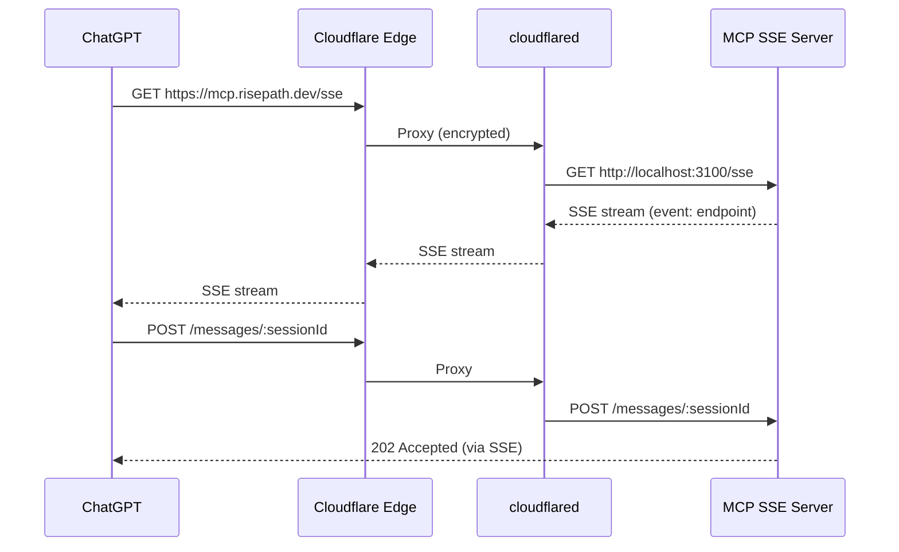

# Phase 9: MCP Server 外部公開 (Cloudflare Tunnel)

> Created: 2026-05-01
> Status: 仕様策定
> Depends on: Phase 6 (MCP Server), Phase 7/8 (認証・Rate Limit)

---

## 1. 概要

MCP SSE Server をインターネットに公開し、ChatGPT Apps & Connectors および
外部 MCP クライアントから接続可能にする。

### 選定理由: Cloudflare Tunnel

| 比較項目 | Cloudflare Tunnel | ngrok | Cloud Run |
|:--|:--|:--|:--|
| 料金 | **完全無料** | 無料枠あり (URL変動) | 無料枠あり |
| 固定URL | ✅ サブドメイン指定可 | ❌ (有料$8/月) | ✅ |
| SSE 対応 | ✅ ネイティブ | ✅ | ⚠️ タイムアウトあり |
| 認証連携 | ✅ Cloudflare Access | ✅ | ✅ |
| セットアップ | `cloudflared` CLI | `ngrok` CLI | Docker + gcloud |
| 永続稼働 | ✅ サービスとして常駐 | ❌ ターミナル依存 | ✅ |

---

## 2. アーキテクチャ

```
┌──────────────┐     HTTPS      ┌──────────────────┐    localhost:3100    ┌─────────────────┐
│  ChatGPT     │ ──────────────▶│  Cloudflare Edge │ ──────────────────▶ │  MCP SSE Server │
│  (MCP Client)│                │  (Tunnel)        │                     │  (Node.js)      │
└──────────────┘                └──────────────────┘                     └─────────────────┘
                                         │
                                    mcp.risepath.dev
                                    (サブドメイン例)
```

### 接続フロー



---

## 3. セットアップ手順

### 3.1 前提条件

- Cloudflare アカウント (無料)
- ドメイン (Cloudflare DNS 管理下) ※ `risepath.dev` 等
- `cloudflared` CLI

### 3.2 インストール

```bash
# macOS
brew install cloudflared

# 認証 (初回のみ — ブラウザが開く)
cloudflared tunnel login
```

### 3.3 トンネル作成

```bash
# トンネル作成 (名前は任意)
cloudflared tunnel create rise-path-mcp

# → トンネルID (UUID) が出力される
# 例: a1b2c3d4-e5f6-7890-abcd-ef1234567890
```

### 3.4 DNS レコード設定

```bash
# サブドメインを指定
cloudflared tunnel route dns rise-path-mcp mcp.risepath.dev

# → Cloudflare DNS に CNAME レコードが自動作成される
```

### 3.5 設定ファイル作成

```yaml
# ~/.cloudflared/config.yml
tunnel: a1b2c3d4-e5f6-7890-abcd-ef1234567890
credentials-file: /Users/<user>/.cloudflared/a1b2c3d4-e5f6-7890-abcd-ef1234567890.json

ingress:
  # MCP SSE Server
  - hostname: mcp.risepath.dev
    service: http://localhost:3100
    originRequest:
      # SSE: 長時間接続を許可
      noTLSVerify: false
      connectTimeout: 10s
      # SSE keep-alive (デフォルト90秒を延長)
      keepAliveTimeout: 300s
      # HTTP/2 を無効化 (SSE は HTTP/1.1 が安定)
      http2Origin: false

  # Catch-all (必須)
  - service: http_status:404
```

### 3.6 起動

```bash
# ターミナル 1: MCP SSE Server
NODE_ENV=production node mcp-server/index.js --sse 3100

# ターミナル 2: Cloudflare Tunnel
cloudflared tunnel run rise-path-mcp

# → https://mcp.risepath.dev/sse でアクセス可能
```

### 3.7 永続化

#### cloudflared (macOS launchd)

```bash
# サービスとして登録 (Mac 再起動後も自動起動)
cloudflared service install

# 確認
launchctl list | grep cloudflared
```

#### MCP Server (pm2)

```bash
# pm2 インストール
npm install -g pm2

# MCP Server をデーモン化
pm2 start mcp-server/index.js --name rise-path-mcp -- --sse 3100
pm2 save
pm2 startup  # OS 再起動時の自動起動

# ログ確認
pm2 logs rise-path-mcp
```

---

## 4. ChatGPT Apps & Connectors 設定

### 4.1 MCP Server 登録

ChatGPT → Settings → Apps & Connectors → Add MCP Server

| 項目 | 値 |
|:--|:--|
| Name | `Rise Path Learning` |
| Server URL | `https://mcp.risepath.dev/sse` |
| Auth Type | `Bearer Token` |
| Token | `RISE_PATH_BRIDGE_TOKEN` の値 (固定トークン) |

> **重要**: ChatGPT は固定トークンしか設定できないため、期限付き Supabase JWT ではなく
> Bridge Token を使用する。MCP Server 側の `resolveUserId()` が Bridge Token を
> `RISE_PATH_BRIDGE_TOKEN` と照合し、共有ユーザー (PHASE1_USER_ID) として認証する。

### 4.2 認証フロー

```
ChatGPT が Bearer token を送信
  ↓
resolveUserId() が 4段階で認証:
  1. x-nexloom-bridge-token ヘッダー → Bridge Token 照合
  2. Bearer token = Bridge Token → Bridge 認証 (← ChatGPT はここ)
  3. Bearer token = Supabase JWT → JWT 検証 → userId 取得
  4. dev mode → PHASE1_USER_ID fallback
  ↓
session.userId に格納
  ↓
ツール実行時に resolveToolUserId() が自動注入
```

### 4.3 利用可能ツール (9個)

ChatGPT が自動検出するツール一覧:

| ツール | 説明 |
|:--|:--|
| `learner-state-get` | 学習進捗取得 |
| `learner-state-update` | 進捗更新 |
| `journal-log` | 学習ジャーナル記録 |
| `journal-summary` | ジャーナル集計 |
| `journal-recent` | 最近のジャーナル |
| `rag-search` | コンテンツ検索 |
| `get-generation-kit` | カリキュラム生成キット |
| `validate-intake` | 学習要件バリデーション |
| `save-curriculum-draft` | カリキュラム保存 |

---

## 5. セキュリティ設計

### 5.1 多層防御

```
Layer 1: Cloudflare WAF        → DDoS/Bot 防御 (自動)
Layer 2: Cloudflare Access     → オプション: IP/Email 制限
Layer 3: Rate Limit            → 30 req/min/session (Phase 8)
Layer 4: JWT 認証              → Supabase (Phase 7)
Layer 5: userId スコープ       → resolveToolUserId (Phase 8)
```

### 5.2 Cloudflare Access (推奨)

本番では Cloudflare Access で追加の認証レイヤーを設定:

```
Cloudflare Dashboard → Zero Trust → Access → Applications
  - Application name: Rise Path MCP
  - Domain: mcp.risepath.dev
  - Policy: Allow
    - Include: Email ends with @risepath.dev
    - OR: Service Token (ChatGPT 用)
```

### 5.3 環境変数 (本番)

```bash
# .env (production)
NODE_ENV=production

# JWT 検証に必須
SUPABASE_URL=https://xxx.supabase.co
SUPABASE_SERVICE_ROLE_KEY=eyJ...

# DB 接続
DATABASE_URL_PHASE1=postgresql://...

# Bridge Token (ChatGPT カスタム GPT 用)
RISE_PATH_BRIDGE_TOKEN=<secure-random-token>
```

---

## 6. 運用

### 6.1 ヘルスチェック

```bash
# SSE 接続テスト
curl -N https://mcp.risepath.dev/sse

# 期待出力:
# event: endpoint
# data: /messages/<sessionId>?sessionId=<transportSessionId>
```

### 6.2 監視

```bash
# Cloudflare Tunnel 状態確認
cloudflared tunnel info rise-path-mcp

# 接続中のセッション数 (MCP Server ログ)
# [MCP] Session xxxx connected user=yyyy (N active)
```

### 6.3 トラブルシューティング

| 症状 | 原因 | 対処 |
|:--|:--|:--|
| `502 Bad Gateway` | MCP Server が未起動 | `node mcp-server/index.js --sse 3100` |
| SSE が即切断 | `keepAliveTimeout` 不足 | config.yml で 300s に延長 |
| `401 Authentication required` | JWT 不正/期限切れ | トークンを再取得 |
| `429 Too Many Requests` | Rate Limit 到達 | 1分待つ or 制限値調整 |
| ツールが見えない | ChatGPT の MCP 設定ミス | Server URL が `/sse` で終わるか確認 |

---

## 7. タスク一覧

| # | タスク | 工数 | 備考 |
|:--|:--|:--|:--|
| 9-1 | `cloudflared` インストール + 認証 | 5分 | `brew install cloudflared && cloudflared tunnel login` |
| 9-2 | トンネル作成 + DNS 設定 | 10分 | ドメインが必要 |
| 9-3 | `config.yml` 作成 (SSE 最適化) | 10分 | keepAliveTimeout 延長が重要 |
| 9-4 | 本番モードで MCP Server 起動 | 5分 | `NODE_ENV=production` |
| 9-5 | 外部 SSE 接続テスト | 10分 | curl + ブラウザ |
| 9-6 | ChatGPT Apps & Connectors 登録 | 10分 | Bearer Token 設定 |
| 9-7 | ChatGPT からツール実行テスト | 15分 | 全9ツールの動作確認 |
| 9-8 | Cloudflare Access 設定 (任意) | 15分 | 追加セキュリティ |

**合計工数: ~1.5 時間**

---

## 8. 代替案: ngrok (テスト用)

ドメインがない場合や一時テスト:

```bash
# インストール
brew install ngrok

# MCP Server 起動
NODE_ENV=development node mcp-server/index.js --sse 3100

# トンネル開通 (別ターミナル)
ngrok http 3100

# → https://xxxx-xxx.ngrok-free.app が発行される
# → ChatGPT にこの URL + /sse を設定
```

| 項目 | ngrok 無料版 |
|:--|:--|
| URL | 毎回変わる |
| 接続数 | 同時40 |
| 帯域 | 制限なし |
| 有効期間 | セッション中のみ |

**注意**: ngrok はテスト用。本番は Cloudflare Tunnel を推奨。
