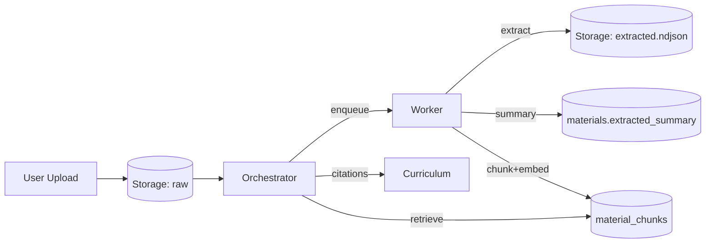
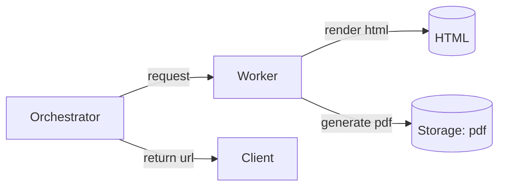

# アーキテクチャ

## 全体構成（Cloud Run + Supabase）
```mermaid
flowchart LR
  subgraph Client
    Browser[React SPA]
  end

  subgraph Supabase
    Auth[Auth]
    DB[(Postgres + pgvector)]
    Storage[(Storage)]
  end

  subgraph CloudRun
    Orchestrator[LangGraph Orchestrator API]
    Worker[Ingest/Embed/PDF Worker]
  end

  subgraph AI
    Gemini[Gemini API]
    Claude[Claude (optional)]
  end

  Browser --> Auth
  Browser --> Storage
  Browser --> Orchestrator

  Orchestrator --> DB
  Orchestrator --> Gemini
  Orchestrator --> Claude
  Orchestrator --> Worker

  Worker --> Storage
  Worker --> DB
  Worker --> Gemini
```

## 素材取り込み + RAGフロー


## オンデマンドPDF生成


## 役割分担
- Cloud Run Orchestrator
  - LangGraphの状態遷移
  - 承認判定（UIボタンの入力のみ）
  - RAG検索とプロンプト組み立て
  - DB保存、ジョブ投入
- Cloud Run Worker
  - PDF/Audio/YouTube/TXT解析
  - 埋め込み生成
  - PDF出力生成
- Supabase
  - Auth + RLSでユーザー単位のアクセス制御
  - DB（curricula/versions/progress/materials/chunks/jobs/sessions）
  - Storage（原本/抽出テキスト/PDF/音声）

## 運用上の注意
- ジョブは `jobs` テーブルをキューとして扱い、Workerがポーリングまたはイベント駆動で処理
- Workerは `FOR UPDATE SKIP LOCKED` でジョブをclaimし、重複実行を防ぐ
- 生成コスト管理のため、RAGや生成は Cloud Run に集約

## 関連計画

- `Vercel frontend + 常駐 backend + canonical URL` の段階移行計画は `13_delivery_separation_plan.md` を参照
