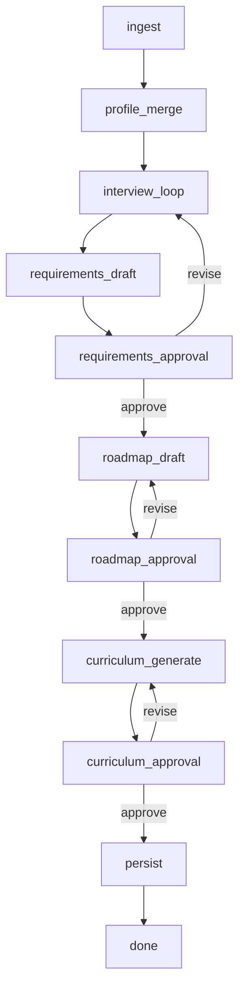

# LangGraph設計（v0.1）

## State（最小）
```ts
type SessionState = {
  session_id: string;
  user_id: string;
  ui_template_id: "vibe_coding";

  user_profile: any;   // Big5/履歴
  learning_style: any; // パーソナル配分の派生

  materials: Array<{ id: string; type: string; status: string }>;
  requirements: { draft?: any; approved?: any };
  roadmap: { draft?: any; approved?: any };
  curriculum: { draft?: any; approved?: any };
  curriculum_version_id?: string;

  content_mix?: Record<string, number>;
  assessment_mix?: Record<string, number>;

  pending_approval: "none" | "requirements" | "roadmap" | "curriculum";
  last_user_message?: string;
  attachments?: any[];
  jobs?: any[];
  citations?: any[];
  phase: "collecting" | "proposing" | "generating" | "done";
};
```

## ノード一覧と責務
- `ingest`
  - 添付/URLの登録 → `materials` 追加
  - 重い処理は `jobs` に enqueue して終了
- `profile_merge`
  - Big5から `learning_style` と配分初期値を生成
- `interview_loop`
  - Requirements の不足点を質問
  - 2案提案 + 選択肢UI
- `requirements_draft`
  - 要件要約を作り `pending_approval=requirements`
  - curriculum_versions を初回作成し、version_id を状態に保持
- `requirements_approval`
  - UIボタンのみで遷移
- `roadmap_draft`
  - 2案のロードマップを生成
  - 既存 version に roadmap を更新
- `roadmap_approval`
  - UIボタンのみで遷移
- `curriculum_generate`
  - RAG取得 → VibeCodingテンプレに整形
  - `ui_hints` / `unlock_rule` / `retry_policy` / `citations` を付与
  - 既存 version に content_json を更新
- `curriculum_approval`
  - UIボタンのみで遷移
- `persist`
  - approvals記録
  - curriculum_versions.status 更新（`stage=curriculum` の approved 時）
  - curricula.current_version_id更新（同上）

## 状態遷移


## ガードルール
- `pending_approval != none` の間は新しい質問を生成しない
- 承認は UI ボタンでのみ判定する
- `jobs` が `running` の間は進捗のみ返す

## 失敗時のリトライ
- `jobs` は `dedupe_key` で冪等化
- 生成の失敗は `revise` で再生成に戻す
