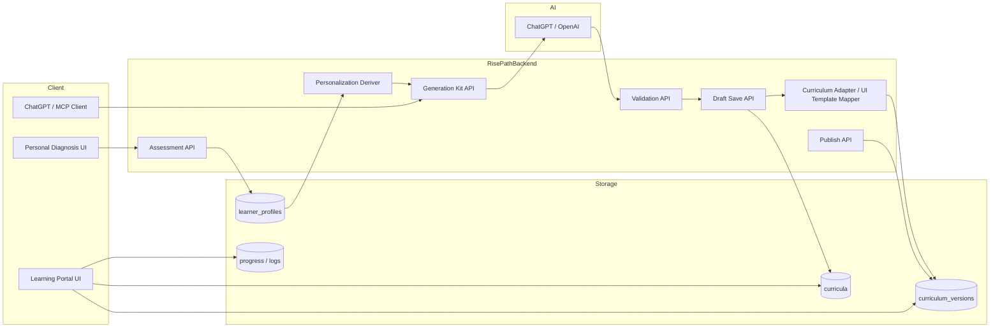

# パーソナル診断ベースのカリキュラム生成仕様

- 更新日: 2026-03-10
- 担当: Codex
- ステータス: Draft
- 文書種別: internal

## 目的 / 結論 / 次アクション

- 目的: `Big Five`、生活習慣、学習選好にもとづいて、その人向けに表現と学習導線を変える `Rise Path` の個人化生成仕様を定義する。
- 結論: 個人化は `raw_profile -> derived_learning_profile -> generation_rules` の3層で扱い、`ChatGPT` は本文生成、`Rise Path` は診断解釈・品質ゲート・表示変換・継続導線を担当する。
- 次アクション:
1. `generation_kit` に `personalization` ブロックを追加する。
2. `learner_profile` 保存 API と `personalization derive` API を追加する。
3. `save_curriculum_draft` に `personalization_meta` と品質 rubric を導入する。

## 1. 背景

### 1.1 Confirmed Facts

- `Rise Path` には既に `Big Five + learningStyle + motivation` の型がある。[../../ai-personal-insights-pro/types.ts]
- `generation_kit` は現在 `required_slots / constraints / output_schema / content_blueprint` を返すが、個人化 profile は含んでいない。[../../server/services/curriculumGenerationKit.js]
- `save_curriculum_draft` は `content_json._meta` に generation metadata を保存しているが、診断起点の学習スタイル metadata は未定義である。[../../server/routes/chatgptCurriculum.js]
- `ChatGPT` 単体でも汎用カリキュラム生成はできるため、`Rise Path` の差別化は「その人向けにどう学習体験を変えるか」に置く必要がある。

### 1.2 Assumptions

- 診断結果だけで学習方針を決め打ちせず、本人の明示選好を優先する。
- 個人化は `内容のテーマ` だけではなく、`説明の仕方 / 課題の形 / 進捗導線 / 表示の順番` に反映する。
- `Big Five` は deterministic な一次変換で `derived_learning_profile` に要約し、LLM には生の traits と派生 profile の両方を渡してよい。

## 2. 目指す価値

- `ChatGPT で十分` と思われないために、`Rise Path` は以下を提供する。
- その人に合う説明順序
- その人が続けやすい課題量
- 不安を高めない表現調整
- 資格志向 / 実践志向 / 問題演習志向の出し分け
- 復習、記録、進捗、次アクションの継続導線

## 3. 決定事項

### 3.1 3層モデル

#### `raw_profile`

- 診断・申告の生データ
- 例:
  - `big_five`
  - `learning_style`
  - `motivation`
  - `lifestyle`
  - `declared_preferences`

#### `derived_learning_profile`

- 生成や UI が直接使う要約 profile
- 例:
  - `credential_orientation`
  - `problem_solving_orientation`
  - `example_first_preference`
  - `structure_need`
  - `reassurance_need`
  - `practice_intensity`
  - `pace_preference`
  - `social_learning_preference`
  - `feedback_style`

#### `generation_rules`

- 生成・保存・UI が使う最終ルール
- 例:
  - `explanation_style`
  - `assessment_style`
  - `curriculum_voice`
  - `weekly_load_policy`
  - `quality_rubric`
  - `ui_emphasis`

### 3.2 優先順位

1. `declared_preferences`
2. `lifestyle`
3. `motivation`
4. `big_five`
5. system default

`Big Five` は強い推定材料だが、本人が `資格重視ではない` と明示した場合は override される。

### 3.3 内容と表現を分ける

- `content layer`: 何を学ぶか
- `presentation layer`: どう説明し、どう課題化し、どう見せるか

同じテーマでも、個人化により以下を変える。

- 例から入るか、定義から入るか
- 小テストを多めにするか、実践タスクを多めにするか
- チェックリスト中心か、自由記述中心か
- 進捗率や達成条件を強く出すか

## 4. アーキテクチャ



### 4.1 役割分担

- `Assessment API`
  - 診断結果と生活習慣・選好を保存
- `Personalization Deriver`
  - 生データから学習 profile を派生
- `Generation Kit API`
  - template rule と personalization rule を合成
- `ChatGPT`
  - 本文生成
- `Validation / Save`
  - 品質検査と保存
- `Curriculum Adapter`
  - `doc_chapter` などの UI JSON に変換

## 5. 個人化軸

| 軸 | 用途 | 主な入力 | 出力への影響 |
| --- | --- | --- | --- |
| `credential_orientation` | 資格・到達証明を重視するか | motivation, declared_preferences, conscientiousness | ゴール、達成条件、チェック項目、模擬問題 |
| `problem_solving_orientation` | 問題形式で学びたいか | declared_preferences, learning_style | 小テスト、ケース問題、確認問題 |
| `example_first_preference` | 例から学びたいか | learning_style, openness | `具体例 -> 原理` の順序 |
| `structure_need` | 週次計画や手順の明確さが必要か | conscientiousness, lifestyle | 進捗表、ToDo、週次計画 |
| `reassurance_need` | 不安を下げる説明が必要か | neuroticism, lifestyle | やさしいトーン、課題量抑制、注意点明示 |
| `practice_intensity` | 実践をどれだけ入れるか | lifestyle, learning_style | 演習量、課題数、軽実践の頻度 |
| `social_learning_preference` | 他者共有を好むか | extraversion | 共有タスク、対話課題、内省中心か |
| `pace_preference` | 進行速度 | weekly_capacity_min, session_length, conscientiousness | module 数、lesson 長、週次課題量 |
| `feedback_style` | フィードバックの出し方 | motivation, neuroticism | 厳密 / コーチ型 / やさしい |

## 6. trait からの派生ルール

### 6.1 Big Five の基本解釈

- `openness` 高:
  - 背景説明、比較、発展学習を増やす
- `openness` 低:
  - 実用先行、選択肢を絞る
- `conscientiousness` 高:
  - チェックリスト、完了条件、進捗率を強める
- `conscientiousness` 低:
  - 小さなステップ、再開しやすい設計
- `extraversion` 高:
  - 観察共有、対話タスク、外界との接点を増やす
- `extraversion` 低:
  - 個人完結、静かな実践、自己記録中心
- `agreeableness` 高:
  - 共感的トーン、他者配慮の文脈
- `neuroticism` 高:
  - 不安を煽らない、注意点を明示、分量を抑える

### 6.2 重要なガードレール

- traits から職業適性や能力を断定しない
- `Big Five` 単独で `資格重視` を決め打ちしない
- `生活習慣` と `本人選好` を強く反映する

## 7. データモデル

### 7.1 `raw_profile`

```json
{
  "big_five": {
    "openness": 72,
    "conscientiousness": 48,
    "extraversion": 35,
    "agreeableness": 61,
    "neuroticism": 68
  },
  "learning_style": "example_first",
  "motivation": "credential_and_progress",
  "lifestyle": {
    "weekly_capacity_min": 90,
    "preferred_session_length_min": 15,
    "best_time": "night",
    "device": "mobile"
  },
  "declared_preferences": {
    "assessment_preference": "quiz_and_practice",
    "explanation_style": "step_by_step",
    "tone": "gentle"
  }
}
```

### 7.2 `derived_learning_profile`

```json
{
  "credential_orientation": "high",
  "problem_solving_orientation": "medium",
  "example_first_preference": "high",
  "structure_need": "medium",
  "reassurance_need": "high",
  "practice_intensity": "light",
  "pace_preference": "steady_small_steps",
  "social_learning_preference": "low",
  "feedback_style": "coach_gentle"
}
```

### 7.3 保存先

`curriculum_versions.content_json._meta.personalization`

```json
{
  "learner_profile_id": "lp_xxx",
  "profile_version": 3,
  "raw_profile_snapshot": {},
  "derived_learning_profile": {},
  "generation_rules_snapshot": {},
  "applied_overrides": {
    "assessment_preference": "quiz_and_practice"
  }
}
```

## 8. `generation_kit` 仕様

### 8.1 応答に追加するブロック

- `personalization.supported_diagnosis`
- `personalization.raw_profile_schema`
- `personalization.derived_profile_schema`
- `personalization.personalization_axes`
- `personalization.adaptation_rules`
- `personalization.quality_rubric`

### 8.2 返却例

```json
{
  "portal_id": "general",
  "template_id": "default",
  "locale": "ja-JP",
  "schema_version": "2026-03-10",
  "policy_version": "2026-03-10.a",
  "required_slots": ["target_audience", "goal", "current_level", "duration_weeks"],
  "optional_slots": ["constraints", "tone", "delivery_style", "materials", "success_metric"],
  "content_blueprint": {
    "ui_template_id": "doc_chapter"
  },
  "personalization": {
    "supported_diagnosis": [
      "big_five",
      "learning_style",
      "motivation",
      "lifestyle",
      "declared_preferences"
    ],
    "raw_profile_schema": {
      "required_slots": ["big_five", "learning_style", "motivation"],
      "optional_slots": ["lifestyle", "declared_preferences"]
    },
    "derived_profile_schema": {
      "required_fields": [
        "credential_orientation",
        "problem_solving_orientation",
        "example_first_preference",
        "structure_need",
        "reassurance_need",
        "practice_intensity",
        "pace_preference",
        "feedback_style"
      ]
    },
    "quality_rubric": {
      "lesson_min_sections": 6,
      "lesson_required_blocks": [
        "overview",
        "key_points",
        "practice",
        "cautions",
        "takeaway"
      ],
      "lesson_min_explanation_chars": 220,
      "lesson_min_practice_items": 2,
      "require_cautions": true
    }
  }
}
```

### 8.3 JSON Schema

- schema file: `schemas/personalized_generation_kit.schema.json`

この schema は `generation_kit` の response 契約を表す。

## 9. API 仕様

### 9.1 `POST /api/v2/learner-profiles/assessments`

目的:

- 診断結果と生活習慣、本人選好を保存する

request:

```json
{
  "assessment_type": "big_five_v1",
  "raw_profile": {
    "big_five": {
      "openness": 72,
      "conscientiousness": 48,
      "extraversion": 35,
      "agreeableness": 61,
      "neuroticism": 68
    },
    "learning_style": "example_first",
    "motivation": "credential_and_progress",
    "lifestyle": {
      "weekly_capacity_min": 90,
      "preferred_session_length_min": 15,
      "best_time": "night",
      "device": "mobile"
    },
    "declared_preferences": {
      "assessment_preference": "quiz_and_practice",
      "explanation_style": "step_by_step",
      "tone": "gentle"
    }
  }
}
```

response:

```json
{
  "ok": true,
  "learner_profile_id": "lp_xxx",
  "profile_version": 1,
  "derived_learning_profile": {
    "credential_orientation": "high",
    "problem_solving_orientation": "medium",
    "example_first_preference": "high",
    "structure_need": "medium",
    "reassurance_need": "high",
    "practice_intensity": "light",
    "pace_preference": "steady_small_steps",
    "feedback_style": "coach_gentle"
  }
}
```

### 9.2 `POST /api/v2/ai/personalization/derive`

目的:

- 保存前または preview 用に `raw_profile` から `derived_learning_profile` を生成する

request:

```json
{
  "raw_profile": {
    "big_five": {
      "openness": 72,
      "conscientiousness": 48,
      "extraversion": 35,
      "agreeableness": 61,
      "neuroticism": 68
    },
    "learning_style": "example_first",
    "motivation": "credential_and_progress",
    "declared_preferences": {
      "assessment_preference": "quiz_and_practice"
    }
  }
}
```

response:

```json
{
  "ok": true,
  "derived_learning_profile": {
    "credential_orientation": "high",
    "problem_solving_orientation": "medium",
    "example_first_preference": "high",
    "structure_need": "medium",
    "reassurance_need": "high",
    "practice_intensity": "light",
    "pace_preference": "steady_small_steps",
    "feedback_style": "coach_gentle"
  },
  "applied_rules": [
    "declared_preferences.assessment_preference overrides trait-only inference",
    "high neuroticism increases reassurance_need"
  ]
}
```

### 9.3 `POST /api/v2/ai/generation-kit`

目的:

- template rule と personalization rule をまとめて返す

request:

```json
{
  "portal_id": "general",
  "template_id": "default",
  "locale": "ja-JP",
  "learner_profile_id": "lp_xxx",
  "include_personalization": true
}
```

response:

```json
{
  "portal_id": "general",
  "template_id": "default",
  "schema_version": "2026-03-10",
  "policy_version": "2026-03-10.a",
  "required_slots": ["target_audience", "goal", "current_level", "duration_weeks"],
  "content_blueprint": {
    "ui_template_id": "doc_chapter"
  },
  "personalization": {
    "derived_learning_profile": {
      "credential_orientation": "high",
      "problem_solving_orientation": "medium",
      "example_first_preference": "high",
      "structure_need": "medium",
      "reassurance_need": "high",
      "practice_intensity": "light",
      "pace_preference": "steady_small_steps",
      "feedback_style": "coach_gentle"
    },
    "generation_rules": {
      "explanation_style": "example_then_principle",
      "assessment_style": "quiz_and_light_practice",
      "curriculum_voice": "gentle_and_reassuring",
      "weekly_load_policy": {
        "target_minutes_per_week": 60,
        "max_actions_per_lesson": 2
      }
    },
    "quality_rubric": {
      "lesson_min_sections": 6,
      "lesson_required_blocks": [
        "overview",
        "key_points",
        "practice",
        "cautions",
        "takeaway"
      ],
      "lesson_min_explanation_chars": 220,
      "lesson_min_practice_items": 2,
      "require_cautions": true
    }
  }
}
```

### 9.4 `POST /api/v2/ai/validate-intake`

目的:

- intake と learner profile の整合性を検証する

request:

```json
{
  "template_id": "default",
  "policy_version": "2026-03-10.a",
  "learner_profile_id": "lp_xxx",
  "intake": {
    "target_audience": "個人学習者",
    "goal": "ハーブを安全に生活へ取り入れる",
    "current_level": "初学者",
    "duration_weeks": 12
  }
}
```

response:

```json
{
  "valid": true,
  "missing_fields": [],
  "conflicts": [],
  "quality_warnings": [],
  "normalized_intake": {
    "target_audience": "個人学習者",
    "goal": "ハーブを安全に生活へ取り入れる",
    "current_level": "初学者",
    "duration_weeks": 12
  },
  "normalized_personalization": {
    "credential_orientation": "high",
    "problem_solving_orientation": "medium",
    "example_first_preference": "high",
    "reassurance_need": "high"
  }
}
```

### 9.5 `POST /api/v2/ai/curriculum-drafts`

目的:

- 個人化 metadata を含む draft を保存する

request:

```json
{
  "portal_id": "general",
  "template_id": "default",
  "policy_version": "2026-03-10.a",
  "learner_profile_id": "lp_xxx",
  "intake": {},
  "derived_learning_profile": {},
  "curriculum": {},
  "generation_meta": {
    "provider": "openai",
    "model": "gpt-5",
    "source_connector": "chatgpt_mcp"
  }
}
```

response:

```json
{
  "ok": true,
  "curriculum_id": "curr_xxx",
  "curriculum_version_id": "ver_xxx",
  "status": "draft",
  "saved_at": "2026-03-10T12:00:00Z"
}
```

保存時に `content_json._meta.personalization` へ snapshot を残す。

## 10. 品質ゲート

### 10.1 最低基準

- 各 lesson は最低 `6 sections`
- `overview / key_points / practice / cautions / takeaway` を必須
- `explanation` は `220 chars` 以上
- `practice` は最低 `2 items`
- `cautions` は安全性が関わる教材では必須

### 10.2 追加検査

- `credential_orientation=high`
  - 到達基準か確認項目が lesson ごとに必要
- `problem_solving_orientation=high`
  - 小テストまたはケース課題を module ごとに最低1つ
- `reassurance_need=high`
  - 脅し表現、断定表現、課題過多を抑制

## 11. UI 出し分け例

### 11.1 資格重視

- 冒頭に `このコースでできるようになること`
- 各 lesson に `確認ポイント`
- module の最後に `模擬問題 / 到達チェック`

### 11.2 問題形式重視

- `例題 -> 原理 -> 練習`
- lesson 冒頭に小問
- 正誤より `なぜそうなるか` の解説を付ける

### 11.3 不安が高い学習者

- lesson の最初に `今日はここまでで十分`
- 軽い実践は 1〜2 個
- `注意点` と `安心材料` をセットで出す

## 12. リスク / ブロッカー

- 診断結果の解釈を固定しすぎると、ユーザーが窮屈に感じる
- 個人化 rule が多すぎると `generation_kit` が肥大化する
- `Big Five` を説明責任のないブラックボックスにしないため、`applied_rules` の記録が必要

## 13. 追加アイデア

### 13.1 失敗パターン予防

個人化は「得意を伸ばす」だけでなく、「続かなくなるパターンを先回りして防ぐ」方向にも使う。

- `conscientiousness` が低め:
  - 再開しやすい lesson 長
  - `途中離脱しても戻りやすい` CTA
  - 1回で終わらない前提の micro progress
- `neuroticism` が高め:
  - 脅し表現を減らす
  - `今日はここまでで十分` を出す
  - 課題数と選択肢を絞る
- `openness` が高め:
  - 枝分かれ学習
  - 発展トピック
  - 比較や背景知識を増やす

### 13.2 学習モード切替

同じテーマでも、ユーザーが選ぶ学習モードで見せ方を変える。

- `資格モード`
  - 到達基準
  - 確認問題
  - 修了チェック
- `実践モード`
  - すぐ試せる行動
  - 観察ログ
  - 実践記録
- `問題演習モード`
  - 小テスト
  - ケース問題
  - 解説つき確認
- `やさしい理解モード`
  - 例から入る
  - 定義を減らす
  - 一度に扱う論点を絞る

### 13.3 週次の自動再設計

`save_curriculum_draft` 時点の個人化だけで固定せず、進捗に応じて次週の lesson 密度を再調整する。

- 進捗遅れ:
  - lesson を短くする
  - 課題を軽くする
  - 復習を優先
- 進捗順調:
  - 発展課題を追加
  - 例題数を増やす
  - 自己説明を求める
- 継続不安:
  - `再開パック` を出す
  - 次にやることを1つだけ提示

### 13.4 理解タイプ別 explanation engine

`Big Five` と `declared_preferences` から、説明の順番を出し分ける。

- `example_then_principle`
  - 例 -> 原理 -> 応用
- `principle_then_example`
  - 定義 -> 要点 -> 例
- `compare_then_choose`
  - 複数案の比較 -> 選び方
- `story_then_structure`
  - ストーリー -> 構造化

### 13.5 証明欲求への対応

`credential_orientation` が高いユーザーには、本文だけでなく達成の見える化を出す。

- lesson ごとの到達条件
- module ごとの確認テスト
- 修了バッジ
- ポートフォリオ出力
- `このコースで説明できるようになること` の明示

### 13.6 生活導線最適化

`lifestyle` を UI と課題量に反映する。

- `朝型 / 夜型`
  - 通知時間
  - おすすめ学習時間帯
- `平日5分型 / 週末集中型`
  - lesson 分割
  - weekly load
- `mobile / desktop`
  - 1画面の情報量
  - 記録 UI

### 13.7 学習の鏡

診断結果を単に hidden metadata にせず、本人へ返す。

- `あなたは例から入る方が理解しやすい`
- `今週は量より継続を優先した方がよい`
- `不安が強いときは次の1つだけで十分`

このレイヤは `Rise Path` 固有価値になりやすい。

### 13.8 content 以外の personalization

個人化は本文以外にもかける。

- CTA 文言
- 進捗表示
- 通知頻度
- 最初に表示するカード
- `厳密 / やさしい / コーチ型` のフィードバック文面

## 14. フェーズ別導入計画

### 14.1 MVP

- `learner_profile` 保存
- `derived_learning_profile` 生成
- `generation_kit.personalization` 追加
- `quality_rubric` 導入
- `資格重視 / 問題演習重視 / やさしい理解` の最低3モード

### 14.2 Phase 2

- 週次の自動再設計
- 失敗パターン予防
- 生活導線に応じた weekly load 最適化
- UI の CTA / 進捗 / フィードバック出し分け

### 14.3 将来拡張

- 学習履歴からの再推定
- portal ごとの個人化ルール
- 学習者クラスター分析
- `coach mode` と `exam mode` のリアルタイム切替

## 15. ChatGPT 連携の旨みを最大化する設計

### 15.1 基本方針

`ChatGPT` を単なる生成 UI として使うのではなく、`Rise Path` を学習の正本・継続基盤として使う。

- `ChatGPT`
  - 会話
  - 要件整理
  - 一時的な説明
  - 下書き生成
- `Rise Path`
  - 個人化 profile
  - 保存
  - 進捗
  - 再設計
  - 復習
  - 成果物
  - 修了条件

### 15.2 `ChatGPT で別にいい` と思われないための軸

#### 記憶

- 診断結果
- 学習履歴
- 詰まりやすい箇所
- 生活パターン
- どの説明スタイルで理解しやすかったか

#### 適応

- 毎週の進捗で lesson 密度を変える
- 続いていないときは再開しやすい lesson へ短縮する
- 順調なときは発展課題を出す

#### 実行

- 読むだけで終わらず、`今週やること` を確定する
- 実践ログと復習カードへ変換する
- 通知や再開導線を持つ

#### 証明

- lesson の到達条件
- module 完了
- 修了バッジ
- ポートフォリオ出力

### 15.3 会話から学習OSへの変換

理想的な flow は以下。

```text
ChatGPT conversation
  -> intake / learner profile
  -> curriculum draft
  -> Rise Path save
  -> weekly plan
  -> daily action
  -> progress log
  -> review / resume
```

この変換があると、`ChatGPT の一回性` に対して `Rise Path の継続性` が価値になる。

## 16. アイデア整理

### 16.1 MVP

MVP では `生成して保存するだけ` から脱却する最低限の差別化を持つ。

- `個人化 generation_kit`
  - 診断結果と生活習慣を反映した rule を返す
- `学習モード切替`
  - `資格モード`
  - `問題演習モード`
  - `やさしい理解モード`
- `品質ゲート`
  - lesson の薄さを自動検出する
- `進捗保存`
  - lesson ごとの完了状態
- `成果物`
  - ミニ図鑑
  - 要点カード
  - 週次まとめ

### 16.2 差別化機能

`Rise Path` が `ChatGPT の保存先` ではなく `学習体験の制御面` を持つ段階。

- `週次の自動再設計`
  - 遅れたら軽くする
  - 進んだら発展課題
- `再開導線`
  - 3日空いたら `戻るための1枚`
  - 7日空いたら `再開パック`
- `Explain Like Me`
  - 例から
  - 定義から
  - 比較から
  - ストーリーから
- `証明欲求への対応`
  - 到達条件
  - 模擬問題
  - 修了チェック
- `生活導線最適化`
  - 朝型 / 夜型
  - 平日短時間 / 週末集中
  - mobile / desktop

### 16.3 将来の moat

ここまで行くと、`ChatGPT の便利機能` ではなく `Rise Path 固有の学習基盤` になる。

- `学習履歴からの再推定`
  - trait より行動ログを重視
- `失敗予測`
  - 離脱しやすい週を事前に検出
- `伴走者モード`
  - 親、先生、メンター向けの伴走 UI
- `成果物ネットワーク`
  - 学習成果の共有、再利用、比較
- `coach persona`
  - portal ごとに一貫したコーチ人格

## 17. 具体アイデア

### 17.1 `Conversation -> Curriculum -> Habit -> Evidence`

会話をその場で終わらせず、必ず次の形へ変換する。

- `Curriculum`
- `Habit`
- `Evidence`

例:

- `ChatGPT` で学習テーマを決める
- `Rise Path` で weekly plan に落とす
- 毎週の行動をログ化する
- 最後に成果物と修了条件を残す

### 17.2 `Explain Like Me`

同じ lesson でも profile ごとに表現を変える。

- `example_then_principle`
- `principle_then_example`
- `compare_then_choose`
- `story_then_structure`

これにより、`内容は同じでも理解しやすさが違う` という価値を作る。

### 17.3 再開に強い設計

多くのユーザーは「始める」より「戻る」で詰まる。

- `resume_card`
  - 前回やったこと
  - 今回はこれだけ
  - 5分で終わる
- `recovery_mode`
  - 量を一時的に減らす
  - 復習から再開する

### 17.4 学習の鏡

診断結果を hidden metadata にせず、本人が調整できる形で返す。

- `あなたは例から入る方が理解しやすい`
- `今週は量より継続を優先`
- `不安が高いときは課題を1つに絞る`

これにより、AI による一方的な決めつけではなく、自己理解支援になる。

### 17.5 content 以外の personalization

個人化対象を教材本文に閉じない。

- CTA 文言
- 通知の強さ
- 最初に表示するカード
- 進捗率の見せ方
- lesson card の情報量
- `厳密 / やさしい / コーチ型` のフィードバック文面

## 18. 実装優先順位

### 18.1 最優先

1. `generation_kit.personalization`
2. `derived_learning_profile`
3. `quality_rubric`
4. `学習モード切替`

### 18.2 次点

1. `週次の自動再設計`
2. `再開導線`
3. `Explain Like Me`
4. `成果物 / 修了条件`

### 18.3 後続

1. 行動ログベース再推定
2. 失敗予測
3. 伴走者モード
4. portal 別 coach persona

## 19. ToDo

1. `personalization` を含む `generation_kit` response を実装する
2. `learner_profiles` 系 API を追加する
3. `quality_rubric` を `validate` と `save` に実装する
4. `content_json._meta.personalization` 保存を実装する
5. UI 側で `credential / problem / reassurance` の出し分けを反映する
