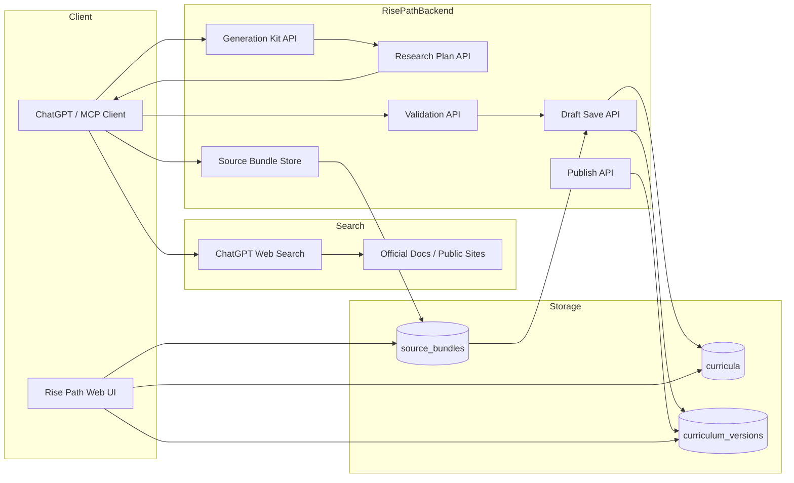

# 情報源付きカリキュラム生成仕様

- 更新日: 2026-03-10
- 担当: Codex
- ステータス: Draft
- 文書種別: internal

## 目的 / 結論 / 次アクション

- 目的: `ChatGPT` が必要に応じて web search や一次情報参照を行い、その情報源を保持したまま `Rise Path` にカリキュラム保存できる仕様を定義する。
- 結論: `ChatGPT` の暗黙検索に依存せず、`Rise Path` が `research_policy -> source_bundle -> citation-aware curriculum` の流れを制御する方が監査性、再現性、品質が高い。
- 次アクション:
1. `generation_kit` に `research_policy` を追加する。
2. `research-plan / source-bundle` API を追加する。
3. `save_curriculum_draft` に `source_bundle` と `citations` の保存を追加する。

## 1. 背景

### 1.1 Confirmed Facts

- `ChatGPT` は web 検索や外部情報の整理ができるが、何を検索し、何を採用したかをそのまま `Rise Path` の正本には残していない。
- `Rise Path` は `generation_kit -> validate -> save draft -> publish` の `GPT-native` 保存フローを持っている。[10_chatgpt_mcp_integration.md]
- テーマによっては最新性・出典・法的正確性が重要であり、教材本文だけ保存しても再検証できない。

### 1.2 Assumptions

- すべてのカリキュラムで web search は不要である。
- 検索が必要なのは `最新性`, `制度`, `資格`, `料金`, `安全`, `バージョン` など、時間変動や一次情報が重要なテーマである。
- 情報源は `source_bundle` として保存し、後から再生成・監査・更新判定に使えるようにする。

## 2. 基本方針

- `ChatGPT` に検索をやらせること自体は可能
- ただし、`Rise Path` は「検索が必要か」「どの種類の情報源を優先するか」「何を保存するか」を明示的に管理する
- そのため、`search by default` ではなく `policy-driven search` を採用する

## 3. 目指す価値

- どの情報源で作ったか追跡できる
- 最新性が必要なテーマだけ検索できる
- `公式サイト優先` や `公的PDF優先` のルールを固定できる
- 後から `情報が古い` と判定して再生成できる
- lesson 単位で `根拠` と `確認日` を表示できる

## 4. アーキテクチャ



### 4.1 役割分担

- `ChatGPT`
  - ヒアリング
  - 必要時のみ web search
  - source bundle の候補作成
- `Rise Path`
  - 研究方針 (`research_policy`) の正本
  - source bundle の保存
  - source validation
  - citations 付き保存
- `Web UI`
  - lesson ごとの参照元表示
  - `確認日` と `must_verify` 表示

## 5. 研究対象の分類

### 5.1 検索が必要なテーマ

- 資格試験
- 法律 / 制度 / 規程
- 自治体情報
- 料金 / 申請要件
- 医療安全 / 公衆衛生
- ソフトウェア version / 公式仕様

### 5.2 検索が不要または任意のテーマ

- 一般的な入門教材
- 原理学習
- 時間変動の少ない概念学習
- 生活導入型のやさしい入門コンテンツ

## 6. `generation_kit` への追加

### 6.1 `research_policy`

```json
{
  "research_policy": {
    "enabled": true,
    "required_when": [
      "laws",
      "fees",
      "certifications",
      "software_versions",
      "medical_safety",
      "local_public_information"
    ],
    "preferred_sources": [
      "official_html",
      "official_pdf",
      "official_docs",
      "peer_reviewed"
    ],
    "freshness_days": 30,
    "citation_required": true,
    "store_source_bundle": true
  }
}
```

### 6.2 意味

- `required_when`
  - このカテゴリに当たるテーマでは検索を必須にする
- `preferred_sources`
  - 採用優先順位
- `freshness_days`
  - 情報の再確認が必要になる目安
- `citation_required`
  - lesson または claim に citation が必要か
- `store_source_bundle`
  - 保存時に source bundle を必須にするか

## 7. `source_bundle` データモデル

### 7.1 source record

```json
{
  "source_id": "src_xxx",
  "title": "Official Exam Guide 2026",
  "url": "https://example.com/guide",
  "source_type": "official_html",
  "publisher": "Official Body",
  "published_at": "2026-02-01",
  "checked_at": "2026-03-10",
  "freshness_state": "fresh",
  "used_for": [
    "eligibility_requirements",
    "exam_outline"
  ]
}
```

### 7.2 bundle 全体

```json
{
  "bundle_id": "sb_xxx",
  "topic": "herbal safety basics",
  "research_scope": [
    "medical_safety"
  ],
  "sources": [],
  "must_verify": [],
  "summary_notes": [
    "公式な医療効果の断定は避ける"
  ]
}
```

## 8. citations モデル

`curriculum_versions.content_json._meta.citations`

```json
[
  {
    "lesson_id": "m1-l1",
    "claim": "受験資格は18歳以上",
    "source_id": "src_xxx",
    "source_url": "https://example.com/guide",
    "checked_at": "2026-03-10"
  }
]
```

## 9. API 仕様

### 9.1 `POST /api/v2/ai/research-plan`

目的:

- intake とテーマから、検索が必要かどうかと検索対象カテゴリを決める

request:

```json
{
  "portal_id": "general",
  "template_id": "default",
  "topic": "ハーブを安全に学ぶ",
  "intake": {
    "target_audience": "初学者",
    "goal": "安全に生活へ取り入れる"
  }
}
```

response:

```json
{
  "ok": true,
  "research_required": true,
  "research_scope": [
    "medical_safety"
  ],
  "search_queries": [
    "official herbal safety beginner guidance",
    "public health herb safety allergy pregnancy medication"
  ],
  "preferred_sources": [
    "official_html",
    "official_pdf",
    "peer_reviewed"
  ],
  "citation_required": true
}
```

### 9.2 `POST /api/v2/ai/source-bundles`

目的:

- `ChatGPT` が集めた情報源を bundle として保存する

request:

```json
{
  "topic": "資格試験入門",
  "research_scope": ["certifications"],
  "sources": [
    {
      "title": "Official Exam Guide",
      "url": "https://example.com",
      "source_type": "official_html",
      "publisher": "Official Body",
      "published_at": "2026-02-01",
      "checked_at": "2026-03-10",
      "used_for": ["exam_outline"]
    }
  ],
  "must_verify": []
}
```

response:

```json
{
  "ok": true,
  "bundle_id": "sb_xxx",
  "source_count": 1
}
```

### 9.3 `POST /api/v2/ai/source-bundles/validate`

目的:

- 情報源の鮮度と source type を検証する

request:

```json
{
  "bundle_id": "sb_xxx",
  "research_scope": ["certifications"]
}
```

response:

```json
{
  "ok": true,
  "valid": true,
  "must_verify": [],
  "warnings": []
}
```

### 9.4 `POST /api/v2/ai/curriculum-drafts`

追加フィールド:

```json
{
  "source_bundle_id": "sb_xxx",
  "source_bundle": {
    "topic": "資格試験入門",
    "sources": []
  },
  "citations": [
    {
      "lesson_id": "m1-l1",
      "claim": "受験資格",
      "source_id": "src_xxx"
    }
  ]
}
```

保存時には以下を保持する。

- `source_bundle_id`
- `source_bundle_snapshot`
- `citations`
- `must_verify`

## 10. MCP tool 構想

- `rise_path.get_research_plan`
- `rise_path.save_source_bundle`
- `rise_path.validate_source_bundle`

推奨 flow:

```text
get_generation_kit
  -> get_research_plan
  -> ChatGPT web search
  -> save_source_bundle
  -> validate_source_bundle
  -> save_curriculum_draft
  -> publish_curriculum
```

## 11. source priority

優先順:

1. `official_html`
2. `official_pdf`
3. `official_docs`
4. `peer_reviewed`
5. `secondary`

低優先 source は discovery 用には使ってよいが、最終根拠にはしない。

## 12. lesson UI での見せ方

- `確認日`
- `参照元`
- `must_verify`
- `制度や料金は変更される可能性があります`

これにより、`教材本文` と `情報源` を分けて見せられる。

## 13. リスク / ガードレール

- 毎回検索すると遅く高コストになる
- 低品質な source を混ぜると教材の信頼性が落ちる
- 変動情報を本文へハードコードするとすぐ古くなる

ガードレール:

- 検索は `research_required=true` のときだけ
- 最新性が必要な claim は citation 必須
- 保存時に `must_verify` を残す

## 14. ToDo

1. `generation_kit.research_policy` を実装する
2. `research-plan` API を追加する
3. `source_bundle` 保存と validation API を追加する
4. `curriculum-drafts` に `source_bundle / citations` を追加する
5. UI に `確認日 / 出典 / must_verify` を出す
