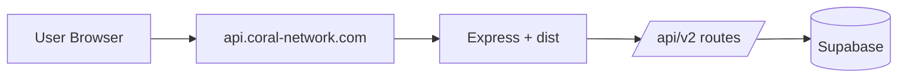
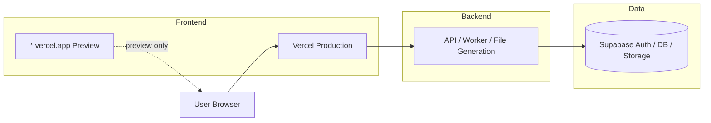

# 配信分離・正規URL計画

- 更新日: 2026-03-10
- 担当: Codex
- ステータス: Planned
- 文書種別: internal

## 目的 / 結論 / 次アクション

- 目的: `Rise Path` の `Frontend UI` と `API / worker` を段階的に分離しつつ、ユーザーに見せる正規URLを整理する。
- 結論: 理想形は `見せるURLは1つ、配信基盤は分離` である。`UI` は `Vercel`、`API / worker` は常駐系基盤、`DB / Auth` は `Supabase` に分け、`vercel.app` は preview 専用に留める。
- 次アクション:
1. 残っている相対 `fetch('/api/v2/...')` を `API_BASE_URL` 経由に統一する。
2. 本番用の canonical frontend URL を `api` ドメイン配下の path から分離する。
3. `Vercel preview / production / backend API` の環境変数表を確定する。

## 1. 背景

### 1.1 Confirmed Facts

- 現在の `Rise Path` は `Express` が `dist/` を静的配信し、同時に `/api/v2` を提供する構成で運用できる。
- 公開アプリは現在 `https://api.coral-network.com/rise-path/`、公開 API は `https://api.coral-network.com/rise-path/api/v2` で運用されている。
- `VITE_API_BASE_URL` と `VITE_APP_BASE_PATH` は既に導入済みで、`Vercel` など別配信先へ寄せるための基礎はある。[../../services/apiClient.ts] [../../services/curriculumApi.ts] [../../vite.config.ts] [../../index.tsx]
- 一方で、まだ一部の UI は `fetch('/api/v2/...')` を直接呼んでおり、完全な API 分離には未達である。
- `Rise Path` は `ChatGPT / MCP` 連携も持つため、`UI のURL`, `API のURL`, `MCP のURL` を意識的に分離した方が説明しやすい。

### 1.2 Assumptions

- `Rise Path` は `Nexloom` の関連プロダクトとして見せたいが、体験上は独立した学習アプリとして扱いたい。
- `vercel.app` は preview / QA 向けに残し、本番の対外案内では使わない。
- `API` は `worker`, `file generation`, `RAG`, `bridge token` など常駐/秘密情報を含むため、`Vercel` 単独運用より常駐基盤の方が適している。

## 2. 現状と理想形

### 2.1 現状

- 長所:
  - 構成が単純
  - 早く公開できる
  - `Rise Path UI` と `API` の同期が取りやすい
- 弱点:
  - `api` ドメインでアプリを見せる構成が長期的には不自然
  - frontend build が backend インスタンスに寄りやすい
  - `Vercel preview` と本番構成の差分が分かりづらい

### 2.2 理想形

- canonical frontend URL:
  - 例: `https://rise-path.coral-network.com`
- canonical API URL:
  - 例: `https://rise-path-api.coral-network.com/api/v2`
- preview URL:
  - `https://*.vercel.app`
  - 対外案内では使わない

## 3. 設計原則

### 3.1 見せるURLは1つ

- ユーザー向けの正規URLは `1つ` に固定する。
- 本番のヘルプ、共有リンク、サポート説明、認証説明はすべてこのURL基準にする。
- `preview URL` や内部 path proxy は運用者だけが使う。

### 3.2 配信基盤は分離する

- `UI` は `Vercel` のような静的/SPA 配信に寄せる。
- `API / worker / PDF / RAG / bridge token` は常駐系基盤に置く。
- これにより frontend の更新と backend の更新を分けられる。

### 3.3 `vercel.app` は preview 専用

- `vercel.app` を本番URLとして配らない。
- 本番は独自ドメイン化し、`DNS / SSL / 認証説明 / ブランド` を固定する。

### 3.4 `API_BASE_URL` を唯一の入口にする

- frontend は `API` を相対 path で決め打ちしない。
- `services/apiClient.ts` と `services/curriculumApi.ts` に寄せ、そこを唯一の `API` 解決点にする。
- `fetch('/api/v2/...')` の散在は段階的に廃止する。

## 4. 段階移行計画

### 4.1 Phase 0: 現在

- `api.coral-network.com/rise-path/` 配下で UI と API を同居
- `Nexloom MCP` からは `Rise Path backend` を bridge 呼び出し

### 4.2 Phase 1: UI を Vercel へ出す

- `Vercel` に `Rise Path UI` を deploy する
- `VITE_API_BASE_URL` を backend の公開 API に向ける
- `VITE_APP_BASE_PATH` は `/` にする
- `*.vercel.app` は preview / QA 用に使う

完了条件:
- `Rise Path` の主要画面が `Vercel` 上で動く
- `generated-course`, `profile`, `assessment`, `learning mirror` が backend と通信できる

### 4.3 Phase 2: 本番の canonical URL を frontend 専用ドメインへ移す

- `rise-path.coral-network.com` を canonical frontend URL にする
- backend は `rise-path-api.coral-network.com` などへ分ける
- 既存の `api.coral-network.com/rise-path/` は redirect または internal route に下げる

完了条件:
- 対外リンクが frontend 専用URLで統一される
- `vercel.app` が対外資料や共有に出ない

### 4.4 Phase 3: UI/API の完全分離

- すべての frontend API 呼び出しを `API_BASE_URL` 経由に統一する
- frontend は backend の static 配信に依存しない
- backend の `dist/` 配信は optional にする

完了条件:
- frontend build artifact が backend に不要
- backend は `JSON API / worker` に集中できる

## 5. 最小実装項目

### 5.1 いま優先度が高いもの

1. `fetch('/api/v2/...')` 残存箇所の除去
2. `Vercel production` 用 env と `preview` 用 env の分離
3. canonical frontend domain の決定

### 5.2 現時点で直接見直すべき箇所

- `components/wrappers/GeneratedCourseViewWrapper.tsx`
- `ai-personal-insights-pro/components/PersonalizedAssessment.tsx`
- `components/features/dashboard/profile/LearningMirrorView.tsx`
- `components/features/dashboard/LearningInsightsWidget.tsx`
- `components/features/ai/EncyclopediaView.tsx`

これらは `fetch('/api/v2/...')` を直接呼んでいるため、`services/apiClient.ts` または共通 client に寄せる。

## 6. 推奨URL戦略

### 6.1 本番

- Frontend:
  - `https://rise-path.coral-network.com`
- API:
  - `https://rise-path-api.coral-network.com/api/v2`

### 6.2 preview

- Frontend preview:
  - `https://<deployment>.vercel.app`
- API:
  - staging または shared backend

### 6.3 当面の暫定運用

- Frontend:
  - `https://api.coral-network.com/rise-path/`
- API:
  - `https://api.coral-network.com/rise-path/api/v2`

これは短期運用としては有効だが、canonical URL としては最終形にしない。

## 7. 環境変数方針

### 7.1 Frontend

- `VITE_API_BASE_URL`
- `VITE_APP_BASE_PATH`
- `VITE_SUPABASE_URL`
- `VITE_SUPABASE_ANON_KEY`
- `VITE_API_ENABLED`
- `VITE_DEMO_MODE`

### 7.2 Backend

- `PORT`
- `DATABASE_URL_PHASE1`
- `RISE_PATH_BRIDGE_TOKEN`
- `SUPABASE_SERVICE_ROLE_KEY` 系の server-only secrets

## 8. リスク / ブロッカー

### 8.1 Confirmed Risks

- frontend に相対 `fetch` が残っているため、`Vercel` 切り出し時に一部画面だけ動かない可能性がある。
- `api` ドメイン上の app 配信は、将来のドメイン設計で再整理が必要になる。
- `worker` と `RAG` を `Vercel` に持ち込む構成は難しい。

### 8.2 Must Verify

- `rise-path.coral-network.com` と `rise-path-api.coral-network.com` を切るか、別の naming にするか
- `Supabase Auth` の redirect / cookie / CORS 方針
- `Nexloom` とのブランド見せ方をどこまで寄せるか

## 9. 判断

- `Vercel に UI を出す` こと自体は妥当
- ただし `vercel.app` を本番の見せ先にしない
- 理想は `見せるURLは1つ、配信基盤は分離`
- そのための最初の必須作業は `API_BASE_URL` への統一である
