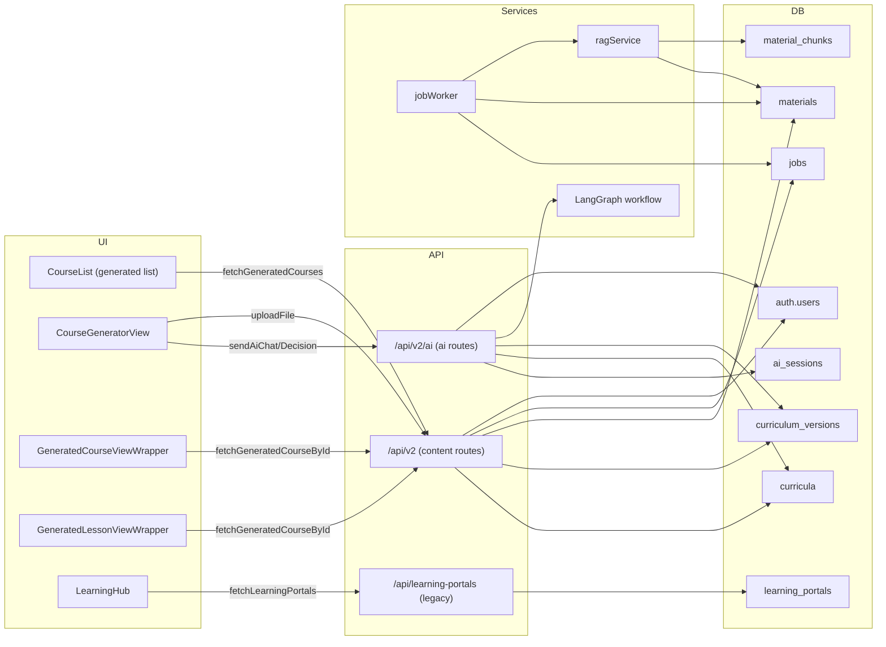
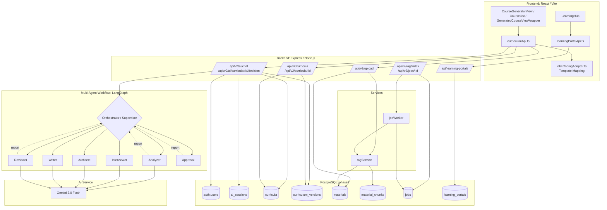
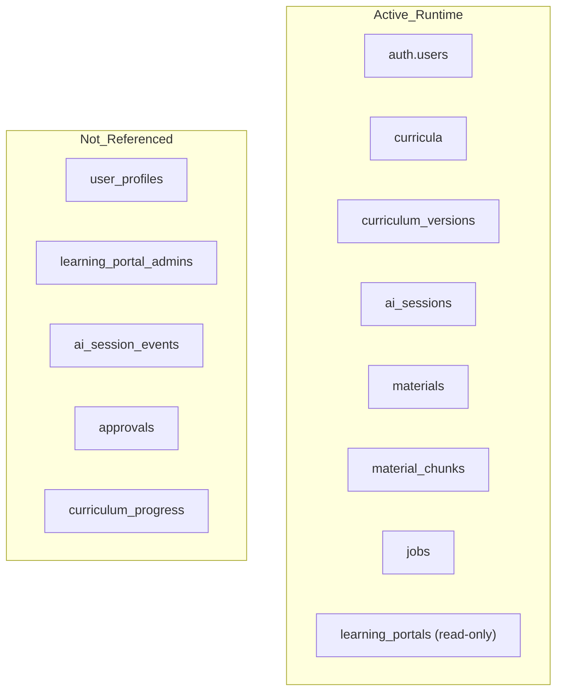

# Current DB and Curriculum UI Map

This document captures the current runtime structure and DB usage (as-is).
Source scan: `server/**`, `services/**`, `scripts/**`, and `doc/ai-curriculum-spec/local_postgres_phase1.sql`.

## Runtime structure (current)

## Simplified layer view (TB)

## DB tables: active vs unused (current)

### Active tables (runtime)
- `auth.users`: created by `ensurePhase1User` on demand.
- `curricula`, `curriculum_versions`: created/updated by AI flow and read by content API.
- `ai_sessions`: stores AI session state.
- `materials`, `material_chunks`: used by upload + ingestion + RAG retrieval.
- `jobs`: ingest queue for `jobWorker`.
- `learning_portals`: read via legacy `GET /api/learning-portals`.

### Not referenced in code (current scan)
- `user_profiles`
- `learning_portal_admins`
- `ai_session_events`
- `approvals`
- `curriculum_progress`

## Endpoint to DB mapping (current)
- `/api/v2/curricula` -> `curricula`
- `/api/v2/curricula/:id` -> `curricula` + `curriculum_versions`
- `/api/v2/ai/chat` -> `ai_sessions` + `curricula` + `curriculum_versions`
- `/api/v2/ai/curricula/:id/decision` -> `ai_sessions` + `curricula` + `curriculum_versions`
- `/api/v2/upload` -> `materials` (then `ragService` -> `material_chunks`)
- `/api/v2/rag/index` -> `jobs` (then `jobWorker` -> `materials`/`material_chunks`)
- `/api/v2/jobs/:id` -> `jobs`
- `/api/learning-portals` -> `learning_portals`

## Schema mismatches / drift (current)
- `curricula` columns used by code (`category`, `thumbnail`, `color`, `total_lessons`, `content`)
  are not in `local_postgres_phase1.sql`; they are added by `scripts/migrate_curricula.js`.
- `server/routes/content.js` tries a legacy fallback `SELECT content FROM curricula`,
  which depends on the `content` column added by the migration script.
- `curricula.visibility` and `curricula.ui_template_id` exist in SQL but are not read by API routes.
- `curriculum_versions.content_mix`, `assessment_mix`, `ui_hints`, `created_by` are not referenced
  in runtime code.

## UI boundary (current)
- UI uses `services/curriculumApi.ts` for `/api/v2/*`.
- UI uses `services/learningPortalApi.ts` for `/api/learning-portals` and PATCH endpoints,
  but the server currently only implements the GET endpoint.
